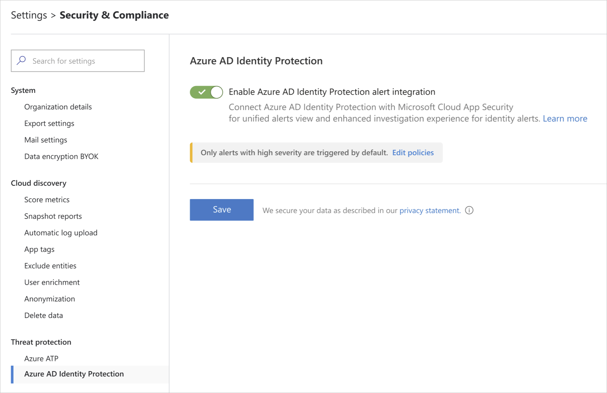

# Azure Active Directory Identity Protection integration

*Applies to: Microsoft Cloud App Security*

Microsoft Cloud App Security integrates with Azure Active Directory Identity Protection (Identity Protection) to provide user entity behavioral analytics (UEBA) across a hybrid environment. For more information about the machine learning and behavioral analytics provided by Identity Protection, see [What is Identity Protection?](/azure/active-directory/identity-protection/overview-identity-protection).

## Prerequisites

- A Cloud App Security Admin account to enable integration between Identity Protection and Cloud App Security.

## Enable Identity Protection

> [!NOTE]
> The Identity Protection feature is enabled by default. However, if the feature was disabled, you can use these steps to enable it.

To enable Cloud App Security integration with Identity Protection:

1. In Cloud App Security, under the settings cog, select **Settings**.

    

1. Under **Threat Protection**, select **Azure AD Identity Protection**.

    

1. Select **Enable Azure AD Identity Protection alert integration** and then click **Save**.

After enabling Identity Protection integration, you'll be able to see alerts for all the users in your organization.

## Disable Identity Protection

To disable Cloud App Security integration with Identity Protection:

1. In Cloud App Security, under the settings cog, select **Settings**.

1. Under **Threat Protection**, select **Azure AD Identity Protection**.

1. Clear **Enable Azure AD Identity Protection alert integration** and then click **Save**.

> [!NOTE]
> When the integration is disabled, existing Identity Protection alerts are kept in accordance with Cloud App Security retention policies.

## Configure Identity Protection Policies

The Identity Protection policies can fine-tuned to your organization's need using the severity slider. The sensitivity slider allows you to impact the algorithm and define how strict the detection logic is. The higher the sensitivity level, the lower the suppression that is applied as part of the detection logic. In this way, you can adapt the detection according to your coverage needs and your (SNR) targets.

The following policies are available:

|Policy|Description|Default state|Default Severity|
|---|---|---|---|
|Leaked Credentials|Shows leaked credentials alerts, user's valid credentials have been leaked|Enabled|Low|
|Risky sign-in|Aggregates multiple risky sign-in detections, sign-ins that weren't performed by the user|Disabled|High|

## Next steps

> [!div class="nextstepaction"]
> [Control cloud apps with policies](control-cloud-apps-with-policies.md)

[!INCLUDE [Open support ticket](includes/support.md)]
