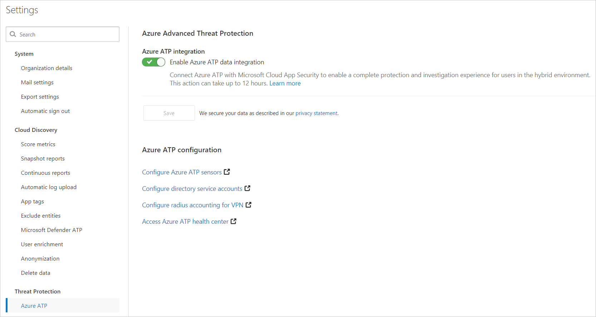

---
# required metadata

title: Integrate Azure Advanced Threat Protection with Cloud App Security
description: This article provides information about how to leverage Azure Advanced Threat Protection insights in Cloud App Security for hybrid risk detection.
keywords:
author: rkarlin
ms.author: rkarlin
manager: rkarlin
ms.date: 6/27/2019
ms.topic: conceptual
ms.collection: M365-security-compliance
ms.prod:
ms.service: cloud-app-security
ms.technology:
ms.assetid: 63e82b47-bb08-4614-af55-f85d04edfc5a

# optional metadata

#ROBOTS:
#audience:
#ms.devlang:
ms.reviewer: reutam
ms.suite: ems
#ms.tgt_pltfrm:
ms.custom: seodec18

---

# Azure Advanced Threat Protection integration

*Applies to: Microsoft Cloud App Security*

Microsoft Cloud App Security integrates with Azure Advanced Threat Protection (Azure ATP) to provide user entity behavioral analytics (UEBA) across a hybrid environment - both cloud app and on-premises, for more information, see [Tutorial: Investigate risky users]() For more information about the machine learning and behavioral analytics provided by Azure ATP, see [What is Azure ATP?](https://docs.microsoft.com/azure-advanced-threat-protection/what-is-atp).

## Prerequisites

For complete user investigation across a hybrid environment, you must have:

- A valid license for Azure ATP connected to your Active Directory instance
- You must be a global admin to enable integration between Azure ATP and Microsoft Cloud App Security 
- If do not have Azure ATP, try it now

>[!NOTE]
>If you don't have a subscription for Microsoft Cloud App Security, you will still be able to use the Cloud App Security portal to get Azure ATP insights.

## Enable Azure Advanced Threat Protection

To enable Cloud App Security to integrate with Azure ATP:

1. In Cloud App Security, under the settings cog, select **Settings**.
    
   

1. Under **Threat Protection**, select **Azure ATP**.
   
    

3. Select the checkbox to **Connect Azure ATP data including alerts and activities with Cloud App Security**.

> [!NOTE]
> It may take up to 12 hours until the integration takes effect.
 
After enabling Azure Advanced Threat Protection integration, you'll be able to see on-premises activities for all the users in your organization. You will also get advanced insights on your users that combine alerts and suspicious activities across your cloud and on-prem environments.

## Next steps 
[Control cloud apps with policies](control-cloud-apps-with-policies.md)   

[Premier customers can also create a new support request directly in the Premier Portal.](https://premier.microsoft.com/)  
  
