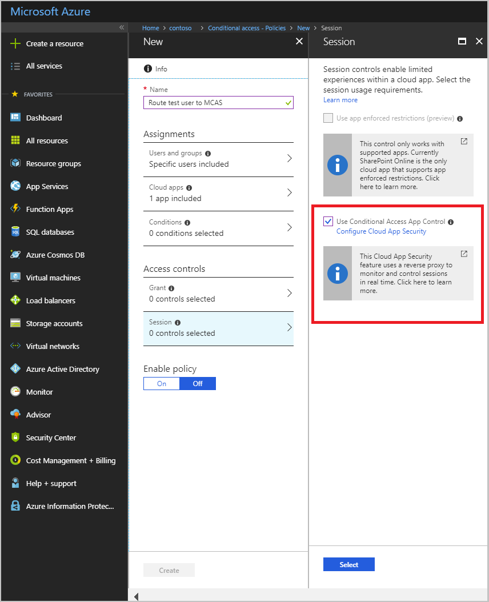
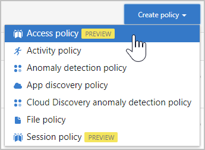
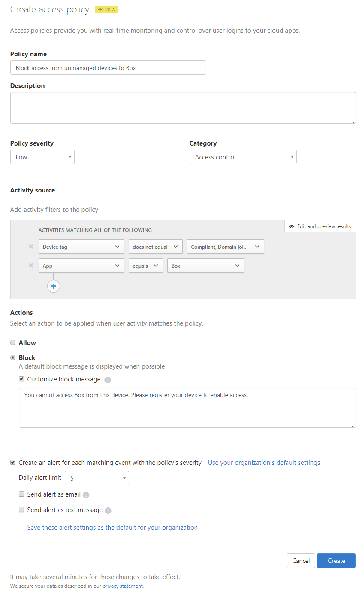
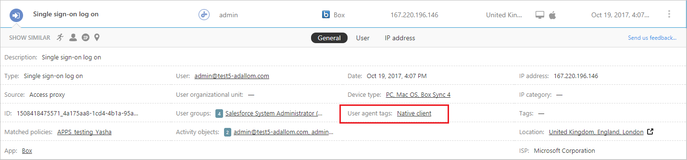

---
# required metadata

title: Create Cloud App Security access policies to allow and block access | Microsoft Docs
description: This topic describes the procedure for setting up a Cloud App Security Proxy access policy to allow and block access to apps connected through Azure AD.
keywords:
author: rkarlin
ms.author: rkarlin
manager: mbaldwin
ms.date: 12/19/2017
ms.topic: article
ms.prod:
ms.service: cloud-app-security
ms.technology:
ms.assetid: 9095cff1-f8b0-44a7-b1df-a83e674abbc6

# optional metadata

#ROBOTS:
#audience:
#ms.devlang:
ms.reviewer: reutam
ms.suite: ems
#ms.tgt_pltfrm:
#ms.custom:

---

# Access policies 

> [!NOTE]
> This is a preview feature.

Cloud App Security access policies enable real-time monitoring and control over access to cloud apps. You can monitor and control access based on user, location, device and app. For example, you can decide to block access from unmanaged devices, or from specific locations.

## Prerequisites to using access policies

- Azure AD Premium P2 license
- The relevant apps should be [deployed with proxy](proxy-deployment-aad.md)
- An [Azure AD conditional access policy](https://docs.microsoft.com/azure/active-directory/active-directory-conditional-access-azure-portal) should be in place that redirects users to the Cloud App Security proxy, as described below.

## Create an Azure AD conditional access policy

Azure Active Directory conditional access policies and Cloud App Security session policies work in tandem to examine each user session and make policy decisions for each app. To set up a conditional access policy in Azure AD, follow this procedure:

1. Configure an [Azure AD conditional access policy](https://docs.microsoft.com/azure/active-directory/active-directory-conditional-access-azure-portal) with assignments for user or group of users and the SAML app you want to control with the Cloud App Security proxy. 

  > [!NOTE]
  > Only apps that were [deployed with proxy](proxy-deployment-aad.md) will be affected by this policy.

2. Route users to the Cloud App Security proxy by selecting the **Use proxy enforced restrictions** in the **Session** blade.

 

## Create a Cloud App Security access policy 

To create a new access policy, follow this procedure:

1. In the portal, select **Control** followed by **Policies**.
2. In the **Policies** page, click **Create policy** and select **Access policy**.  

 

3. In the **Access policy** window, assign a name for your policy, such as *Block access from unmanaged devices*.

 

4. Under **Activity source** in the **Activities matching all of the following** section, select additional activity filters to apply to the policy. These can include the following options: 
     
   - **Device tags**: Use this filter to identify unmanaged devices.

   - **Location**: Use this filter to identify unknown (and therefore risky) locations. 

   - **IP address**: Use this filter to filter per IP addresses or use previously assigned IP address tags. 

   - **User agent tag**: Use this filter to enable the heuristic to identify mobile and desktop apps. This filter can be set to equals or does not equal **Native client** and should be tested against your mobile and desktop apps for each cloud app.
  
   

5. Under **Actions**, select one of the following: 

    - **Allow**: Set this action to explicitly allow access according to the policy filters you set.

    - **Block**: Set this action to explicitly block access according to the policy filters you set. 

6. You can **Create an alert for each matching event with the policy's severity** and set an alert limit and select whether you want the alert as an email, a text message or both.

 
## See Also  
[Blocking downloads on unmanaged devices using Azure AD proxy capabilities](use-case-proxy-block-session-aad.md)   
[For technical support, visit the Cloud App Security assisted support page.](http://support.microsoft.com/oas/default.aspx?prid=16031)   
[Premier customers can also choose Cloud App Security directly from the Premier Portal.](https://premier.microsoft.com/)  
  
  