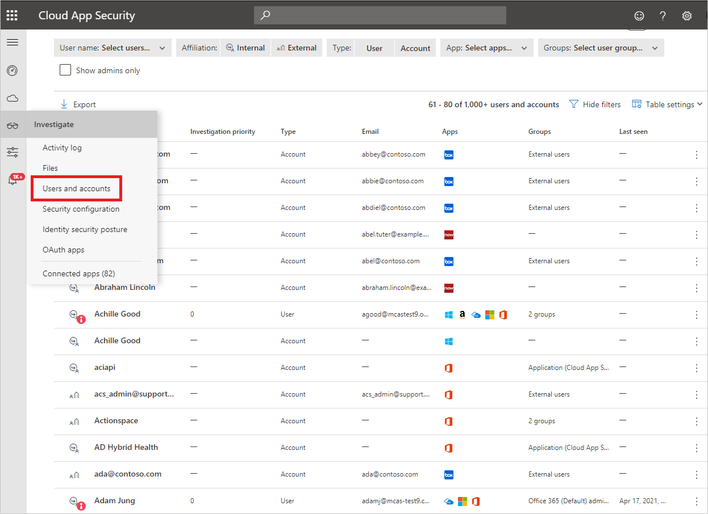
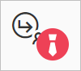

# Accounts

[!INCLUDE [Banner for top of topics](includes/banner.md)]

Microsoft Defender for Cloud Apps gives you visibility into the accounts from your connected apps. After you connect Defender for Cloud Apps to an app using the App connector, Defender for Cloud Apps reads account information associated with connected apps. The Accounts page enables you to investigate those accounts, permissions, the groups they're members of, their aliases, and the apps they're using. Additionally, when Defender for Cloud Apps detects a new account that wasn't previously seen in one of the connected apps - for example, in activities or file sharing - the account is added to the accounts list of that app. This enables you to have visibility into the activity of external users interacting with your cloud apps.

Admins can search for a specific user's metadata or user's activity. The **Identities** page provides you with comprehensive details about the entities that are pulled from connected cloud applications. It also provides the user's activity history and security alerts related to the user.

The **Identities** page can be [filtered](#identities-filters) to enable you to find specific accounts and to deep dive into different types of accounts, for example, you can filter for all External accounts that haven't been accessed since last year.

The **Identities** page enables you to easily investigate your accounts, including the following issues:

* Check if any accounts have been inactive in a particular service for a long time (Maybe you should revoke the license for that user to that service)

* You can filter for the list of users with admin permissions
* You can search for users who are no longer part of your organization but may still have active accounts
* You can take [governance actions](#governance-actions) on the accounts, such as suspending an app or going to the account settings page.
* You can see which accounts are included in each user group  
* You can see which apps are accessed by each account and which apps are deleted for specific accounts

    

## Identities filters

Following is a list of the account filters that can be applied. Most filters support multiple values as well as NOT, in order to provide you with a powerful tool for policy creation.  

* **Affiliation**: The affiliation is either **Internal** or **External**. To set which users and accounts are internal, under **Settings** make sure to set the **IP address range** of your internal organization. If the account has admin permissions the icon in the Accounts table appears with the addition of the red tie:

    

* **App**: You can filter for any API connected app being used by accounts in your organization.
* **Domain**: This enables you to filter for users in specific domains.
* **Groups**: Enables you to filter for members of user groups in Defender for Cloud Apps - both built-in user groups and imported user groups.
* **Instance**: This enables you to filter for members of a specific app instance.
* **Last seen**: The **last seen** filter enables you to find accounts that are dormant and whose users haven't performed any activities in a while.
* **Organization**: This enables you to filter for members of specific organizational groups defined in your connected apps.
* **Show Admins only**: Filters for accounts and users that are admins.
* **Status**: Filter based on user account status of N/A, staged, active, suspended, or deleted. A status of not available (N/A) is normal and may appear, for example, for anonymous accounts.
* **Type**: This enables you to filter to either the user or the account type.
* **User name**: Enables you to filter specific users.

## Governance actions

From the **Users and account** page, you can take governance actions such as suspending an app or going to the account settings page. For a full list of governance actions, see the [governance log](governance-actions.md).

For example, if you identify a user that is compromised, you can apply the **Confirm user compromised** action to set the user risk level to high, causing the relevant policy actions defined in Azure Active Directory to be enforced. The action can be applied manually or using relevant [policies that support governance actions](governance-actions.md).

### To manually apply a user or account governance action

From the **Users and account** page, on the row where the relevant user or account appears, choose the three dots at the end of the row, then select **Confirm user compromised**.

## Next steps

> [!div class="nextstepaction"]
> [Best practices for protecting your organization](best-practices.md)

[!INCLUDE [Open support ticket](includes/support.md)]
