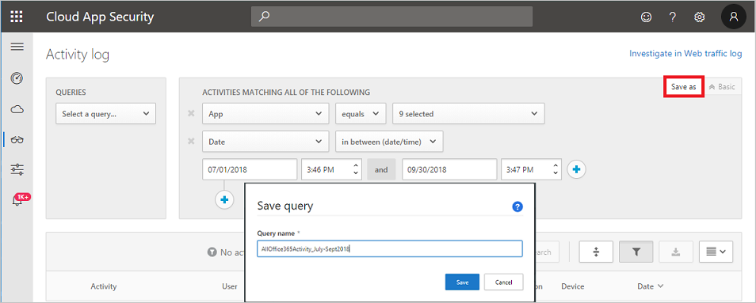
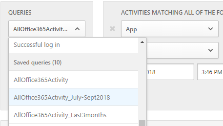
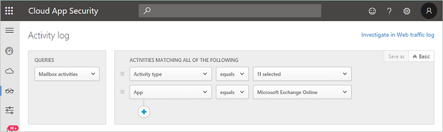
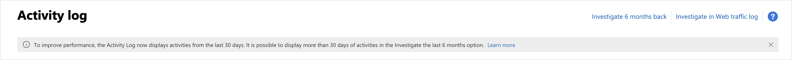
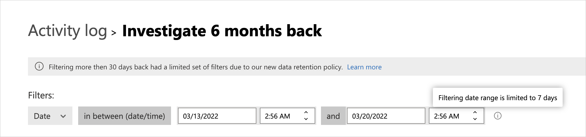

# Activity filters and queries

[!INCLUDE [Banner for top of topics](includes/banner.md)]

This article provides descriptions and instructions for Defender for Cloud Apps activity filters and queries.

## Activity filters

Below is a list of the activity filters that can be applied. Most filters support multiple values as well as *NOT* to provide you with a powerful tool for policy creation.

- Activity ID - Search only for specific activities by their ID. This filter is useful when you connect Microsoft Defender for Cloud Apps to your SIEM (using the SIEM agent), and you want to further investigate alerts within the Defender for Cloud Apps portal.

- Activity objects – Search for the objects the activity was done on. This filter applies to file, folder, user, or app objects.
  - Activity object ID - the ID of the object (file, folder, user, or app ID).
  - Item - Enables you to search by the name or ID of any activity object (for example: user names, files, parameters, sites). For the **Activity object Item** filter, you can select whether you want to filter for items that **Contain**, **Equal**, or **Starts with** the specific item.

- Action type - Search for a more specific action performed in an app.
- Activity type - Search for the app activity.
  > [!NOTE]
  > Apps are added to the filter only if there is activity for that app.

- Administrative activity – Search only for administrative activities.

  >[!NOTE]
  >Defender for Cloud Apps can't mark Google Cloud Platform (GCP) administrative activities as administrative activities.

- Alert ID - Search by alert ID.

- App – Search only for activities within specific apps.

- Applied action - Search by governance action applied: Blocked, Bypass proxy, Decrypted, Encrypted, Encryption failed, No action.

- Date – The date when the activity occurred. Filter supports before/after dates and a date range.

- Device tag - Search by **Intune compliant**, **Hybrid Azure AD joined** or **Valid client certificate**.

- Device type - Search only for activities that were done using a specific device type. For example, search all activities from mobile devices, PCs, or Tablets.

- Files and folders - Search for files and folders the activity was performed on.
  - File ID - Enables you to search by the File ID the activity was performed on.
  - Name - Filters on the name of files or folders. You can select if the name  **ends with**, **equals**, or **starts with** your search value.
  - Specific files or folders - Allows you to include or exclude specific files or folders. When selecting files or folders, you can filter the list by **App**, **Owner**, or partial **File Name**.

- IP address – The raw IP address, category, or tag from which the activity was performed.
  - Raw IP address - Enables you to search for activities that were performed on or by raw IP addresses. The raw IPs can equal, don't equal, start with, or don't start with a particular sequence.
  - IP category - The category of the IP address from which the activity was performed, for example, all activities from administrative IP address range. The categories need to be configured to include the relevant IP addresses. Some IPs may be categorized by default. for example, there are IP addresses that are considered by Microsoft threat intelligence sources will be categorized as risky. To learn how to configure the IP categories, see [Organize the data according to your needs](ip-tags.md).
  - IP tag - The tag of the IP address from which the activity was performed, for example, all activities from anonymous proxy IP addresses. Defender for Cloud Apps creates a set of built-in IP tags that aren't configurable. Additionally, you can configure your own IP tags. For more information about configuring your own IP tags, see [Organize the data according to your needs](ip-tags.md).
  The built-in IP tags include:
    - Microsoft apps (14 of them)
    - Anonymous proxy
    - Botnet (you'll see that the activity was performed by a botnet with a link to learn more about the specific botnet)
    - Darknet scanning IP
    - Malware C&C server
    - Remote Connectivity Analyzer
    - Satellite providers
    - Smart proxy and access proxy (left out on purpose)
    - Tor exit nodes
    - Zscaler

- Impersonated activity – Search only for activities that were performed in the name of another user.

- Instance - The app instance where the activity was or wasn't performed.

- Location – The country/region from which the activity was performed.

- Matched policy – Search for activities that matched on a specific policy that was set in the portal.

- Registered ISP – The ISP from which the activity was performed.

- Source - Search by the source from which the activity was detected. Source can be any of the following:
  - App connector - logs coming directly from the app's API connector.
  - App connector analysis - Defender for Cloud Apps enrichments based on information scan by the API connector.

- User – The user who performed the activity, which can be filtered into domain, group, name, or organization. In order to filter activities with no specific user, you can use the 'is not set' operator.
  - User domain - Search for a specific user domain.
  - User organization – The organizational unit of the user who performed the activity, for example, all activities performed by EMEA_marketing users. This is only relevant for connected Google Workspace instances using organizational units.
  - User group – Specific user groups that you can import from connected apps, for example, Office 365 administrators.
  - User name - Search for a specific username. To see a list of users in a specific user group, in the **Activity drawer**, select the name of the user group. Clicking will take you to the Accounts page that lists all the users in the group. From there, you can drill down into the details of the accounts of specific users in the group.
  - The **User group** and **User name** filters can be further filtered by using the **As** filter, and selecting the role of the user, which can be any of the following:
    - Activity object only - meaning that the user or user group selected didn't perform the activity in question, they were the object of the activity.
    - Actor only - meaning that the user or user group performed the activity.
    - Any role - Meaning that the user or user group were involved in the activity, either as the person who performed the activity or as the object of the activity.

- User agent – The user agent of from with the activity was performed.

- User agent tag – Built-in user agent tag, for example, all activities from outdated operating systems or outdated browsers.

## Activity queries

To make investigation even simpler, you can now create custom queries and save them for later use.

1. In the **Activity log** page, use the filters as described above to drill down into your apps as necessary.

  :::image type="content" source="media/activity-log-query.png" alt-text="Use filters to make query.":::

1. After you've finished building your query, select the **Save as** button.

1. In the **Save query** pop-up, name your query.

   

1. To use this query again in the future, under **Queries**, scroll down to **Saved queries** and select your query.

   

Defender for Cloud Apps also provides you with **Suggested queries**. Suggested queries provide you with recommended avenues of investigation that filter your activities. You can edit these queries and save the as custom queries. The following are optional suggested queries:

- Admin activities - filters all your activities to display only those activities that involved admins.

- Download activities - filters all your activities to display only those activities that were download activities, including download user list as a .csv file, downloading of shared content, and downloading a folder.

- Failed log in - filters all your activities to display only failed log-ons and failed sign in via SSO

- File and folder activities - filters all your activities to display only those activities that involved files and folders. The filter includes upload, download, and accessing folders, along with creating, deleting, uploading, downloading, quarantining, and accessing files, and transferring content.

- Impersonation activities - filters all your activities to display only impersonation activities.

- Password changes and reset requests - filters all your activities to display only those activities that involving password reset, change password, and force user to change password on next sign-in.

- Sharing activities - filters all your activities to display only those activities that involve sharing folders and files, including creating a company link, creating an anonymous link and granting read/write permissions.

- Successful log in - filters all your activities to display only those activities that involve successful log-ins, including impersonate action, impersonate log on, single sign-on log-on, and log on from a new device.

Additionally, you can use the suggested queries as a starting point for a new query. First, select one of the suggested queries. Then, make changes as needed and finally select **Save as** to create a new **Saved query**.

### Query activities six months back

To investigate activities older than 30 days, you can navigate to the **Activity log** and select **Investigate 6 months back** in the top right-hand corner of the screen:

From there you can define the filters as is normally done with the **Activity Log**, but with two differences:

1. The date filter is mandatory and is limited to a one week span.
1. In addition, the following filers will be supported:
    - Activity ID
    - Activity type
    - Action type
    - Application
    - IP address
    - Location
    - User name

## Next steps

> [!div class="nextstepaction"]
> [Best practices for protecting your organization](best-practices.md)

