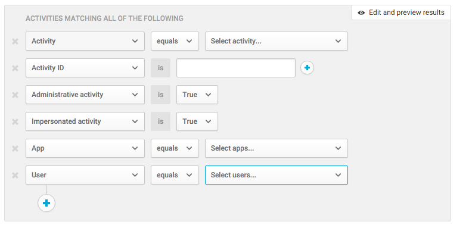
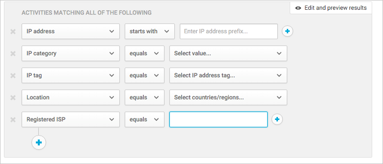
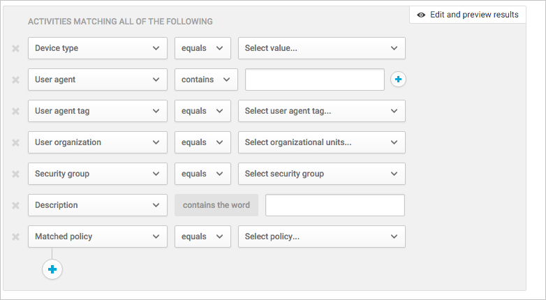

# Activity filters
  Below is a list of the file filters that can be applied. Most filters support multiple values as well as NOT, in order to provide you with a very powerful tool for policy creation.  
  
-   Activity – Search only for specific activities, for example, all file uploads, logins from a new device and failed logins  
  
-   Activity ID - Search only for specific activities by their ID. This filter is very useful when you connect MCAS to your SIEM (using the SIEM agent), and you want to further investigate alerts within the MCAS portal.  
  
-   Administrative activity – Search only for administrative activities.  
  
-   Impersonated activity – Search only for activities that were performed in the name of another user.  
  
-   App – Search only for activities within specific apps.  
  
-   Date – The date when the activity occurred. Filter supports before/after dates as well as date range.  
  
-   User – The user who performed the activity. In order to filter activities with no specific user, you can use the ‘is not set’ operator.  
  
       
  
-   IP address – The IP address from which the activity was performed.  
  
-   IP category – The category of the IP address from which the activity was performed, for example, all activities from administrative IP address range. For more information about IP categories, see [Organize the data according to your needs](../migration/general-setup.md#IPtagsandRanges).  
  
-   IP tag - The tag of the IP address from which the activity was performed, for example, all activities from anonymous proxy IP addresses. For more information about IP tags, see [Organize the data according to your needs](../migration/general-setup.md#IPtagsandRanges).  
  
-   Location – The country from which the activity was performed.  
  
-   Registered ISP – The ISP from which the activity was performed.  
  
       
  
-   Device type - Search only for activities that were performed using a specific device type, for example, all activities from mobile devices.  
  
-   User agent – The user agent of from with the activity was performed.  
  
-   User agent tag – Built-in user agent tag, for example, all activities from outdated browser or outdated operating systems.  
  
-   User organization – The organizational unit of the user who performed the activity, for example, all activities performed by EMEA_marketing users.  
  
- Target object - Enables you to select a specific file. 

-   User Group – Specific user groups that are automatically imported by MCAS from the cloud app, for example, all activities performed by Office 365 administrators.  
  
-   Description – Specific keyword in the activity description, for example, all activities that include the string **user** in their description.  
  
-   Matched policy – Search for activities that matched on a specific policy that was set in the portal.  
  
       
  
## Activity match parameters  
 Specify the amount of activity repetition required to match the policy, for example, setting a policy to alert when a user performs 10 unsuccessful login attempts in a 2 minute time frame.  
The default setting, **Activity match parameters**, raises a match for every single activity that meet all of the activity filters.   
Using **Repeated activity** you can set the number of repeated activities, the duration of the time frame in which the activities are counted, and even specify that all activities should be performed by the same user and in the same cloud app.  
  
### Actions  
 Notifications  
  
-   Alerts – Alerts can be triggered in the system and propagated via email and text message, based on severity level.  
  
-   User email notification – Email messages can be customized and will be sent to all violating file owners.  
  
-   CC manager – Based on user directory integration, email notifications can also be sent to the manager of the person found to violate a policy.  
  
-   Notify additional users – Specific list of email addresses that will receive these notifications.  
  
 Governance actions in apps  
  
-   Granular actions can be enforced per app, specific actions vary depending on app terminology.  
  
-   Suspend user – suspend the user from the application.  
  
-   Revoke password – Revoke the user’s password and force him to set a new password on his next login.  
  
       
  
## See Also  
 [Daily activities to protect your cloud environment](../migration/daily-activities-to-protect-your-cloud-environment.md)   
 [For technical support, please visit the Cloud App Security assisted support page.](http://support.microsoft.com/oas/default.aspx?prid=16031)   
 [Premier customers can also choose Cloud App Security directly from the Premier Portal.](https://premier.microsoft.com/)  
  
  