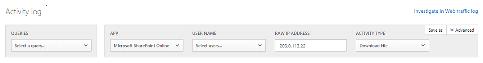
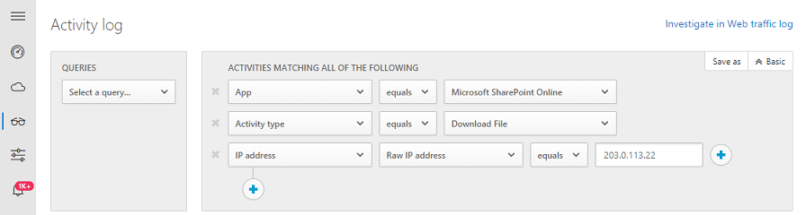
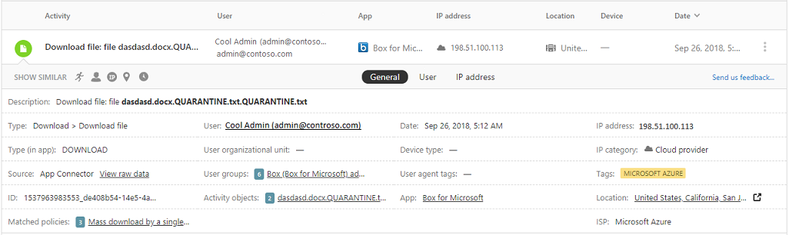

---
# required metadata

title: Activities | Microsoft Docs
description: This topic provides a list of activities, filters and match parameters that can be applied to activity policies.
keywords:
author: rkarlin
ms.author: rkarlin
manager: mbaldwin
ms.date: 10/26/2016
ms.topic: article
ms.prod:
ms.service: cloud-app-security
ms.technology:
ms.assetid: f3af2d25-9286-4e9b-b2ad-35653bec72ff

# optional metadata

#ROBOTS:
#audience:
#ms.devlang:
ms.reviewer: reutam
ms.suite: ems
#ms.tgt_pltfrm:
#ms.custom:

---
# Activities
The activity log can be filtered to enable you to find specific activities. 
The basic filter provides you with great tools to get started filtering your activities.

 

To drill down into more specific activities, you can expand the basic filter by clicking Advanced.

 

## Activity filters
Below is a list of the activity filters that can be applied. Most filters support multiple values as well as NOT, in order to provide you with a very powerful tool for policy creation.  
  
-   Activity ID - Search only for specific activities by their ID. This filter is very useful when you connect MCAS to your SIEM (using the SIEM agent), and you want to further investigate alerts within the MCAS portal.  
  
-   Activity objects – Search for files, folders or site URLs, or target objects (file/folder).
    - File, folder or site URL - Enables you to select files, folders and URLs that start with a specific string.
    - Target object (file/folder) - Enables you to select a specific file or folder. 
    
-   Activity type - Search for the app activity.

-   Administrative activity – Search only for administrative activities.  
  
-   Alert ID - Search by alert ID.

-   App – Search only for activities within specific apps.  
  
-   Applied action - Search by governance action applied: Blocked, Bypass proxy, Decrypted, Encrypted, Encryption failed, No action.

-   Date – The date when the activity occurred. Filter supports before/after dates as well as date range.  
  
-   Description – Specific keyword in the activity description, for example, all activities that include the string **user** in their description.  
  
-   Device tag - Search by compliant, managed or verified device.

-   Device type - Search only for activities that were performed using a specific device type, for example, all activities from mobile devices, PCs or Tablets.  
  
-   IP address – The raw IP address, category or tag from which the activity was performed.  
    - Raw IP address - Enables you to search for activities that were performed on or by raw IP addresses that equal, don't equal or start with or don't start with a particular sequence, or raw IP addresses that are or are not set. 
    - IP category - The category of the IP address from which the activity was performed, for example, all activities from administrative IP address range. For more information about IP categories, see [Organize the data according to your needs](general-setup.md#IPtagsandRanges).  
    - IP tag - The tag of the IP address from which the activity was performed, for example, all activities from anonymous proxy IP addresses. For more information about IP tags, see [Organize the data according to your needs](general-setup.md#IPtagsandRanges).
  
-   Impersonated activity – Search only for activities that were performed in the name of another user.  

-   Location – The country from which the activity was performed.  

-   Matched policy – Search for activities that matched on a specific policy that was set in the portal.  

-   Registered ISP – The ISP from which the activity was performed.   

-  Source - Search by the source from which the activity was detected, for example, App connector. 

-   User – The user who performed the activity, which can be filtered into domain, group, name or organization. In order to filter activities with no specific user, you can use the ‘is not set’ operator.  
    -   User domain - Search for a specific user domain.
    -   User group – Specific user groups that are automatically imported by Cloud App Security from the cloud app, for example, all activities performed by Office 365 administrators.
    -   User name - Search for a specific username.
    -   User organization – The organizational unit of the user who performed the activity, for example, all activities performed by EMEA_marketing users.  

-   User agent – The user agent of from with the activity was performed.  
  
-   User agent tag – Built-in user agent tag, for example, all activities from an outdated browser or outdated operating systems.  
    
  
## Working with the Activity drawer

You can view more information about each activity, by clicking on the Activity iteself in the Activity log. This opens the Activity drawer which provides the following additional actions you can take on the file:

- Matched policies: Click on the Matched policies link to see a list of policies this activity matched.
- View raw data: Click on View raw data to see the actual data that was received from the app.
- User: Click on the user to view the user page for the user who performed the activity. 
- Device type: Click on device type to view the raw user agent data. 
- Location: Click on the location to view the location in Bing maps.
- IP address category and tags: Click on the IP tag to view the list of IP tags found in this activity. You can then filter by all activities matching this tag.    

  
  

## Activity match parameters  
Specify the amount of activity repetition required to match the policy, for example, setting a policy to alert when a user performs 10 unsuccessful login attempts in a 2 minute time frame.  
The default setting, **Activity match parameters**, raises a match for every single activity that meet all of the activity filters.   
Using **Repeated activity** you can set the number of repeated activities, the duration of the time frame in which the activities are counted, and even specify that all activities should be performed by the same user and in the same cloud app.  
  
### Actions  
Notifications  
  
-   Alerts – Alerts can be triggered in the system and propagated via email and text message, based on severity level.  
  
-   User email notification – Email messages can be customized and will be sent to all violating file owners.  
  
-   CC manager – Based on user directory integration, email notifications can also be sent to the manager of the person found to violate a policy.  
  
-   Notify additional users – Specific list of email addresses that will receive these notifications.  
  
Governance actions in apps  
  
-   Granular actions can be enforced per app, specific actions vary depending on app terminology.  
  
-   Suspend user – suspend the user from the application.  
  
-   Revoke password – Revoke the user’s password and force him to set a new password on his next login.  
  
       
  
## See Also  
[Daily activities to protect your cloud environment](daily-activities-to-protect-your-cloud-environment.md)   
[For technical support, please visit the Cloud App Security assisted support page.](http://support.microsoft.com/oas/default.aspx?prid=16031)   
[Premier customers can also choose Cloud App Security directly from the Premier Portal.](https://premier.microsoft.com/)  
  
  