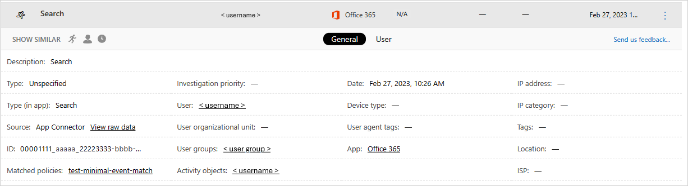

---
# required metadata

title: Visibility into cloud app activities | Microsoft Docs
description: This topic provides a list of activities, filters and match parameters that can be applied to activity policies.
keywords:
author: rkarlin
ms.author: rkarlin
manager: mbaldwin
ms.date: 5/10/2017
ms.topic: article
ms.prod:
ms.service: cloud-app-security
ms.technology:
ms.assetid: f3af2d25-9286-4e9b-b2ad-35653bec72ff

# optional metadata

#ROBOTS:
#audience:
#ms.devlang:
ms.reviewer: reutam
ms.suite: ems
#ms.tgt_pltfrm:
#ms.custom:

---
# Activities
Cloud App Security gives you visibility into all the activities from your connected apps. After you connect Cloud App Security to an app using the App connector, Cloud App Security scans all the activities that happened - the retroactive scan time period differs per app - and then it is updated constantly with new activities. 

> [!NOTE] 
> For a full list of Office 365 activities monitored by Cloud App Security, see [Search the audit log in the Office 365 Security & Compliance Center](https://support.office.com/article/Search-the-audit-log-in-the-Office-365-Security-Compliance-Center-0d4d0f35-390b-4518-800e-0c7ec95e946c?ui=en-US&rs=en-US&ad=US#ID0EABAAA=Audited_activities)

The **Activity log** can be filtered to enable you to find specific activities. You can create policies based on the activities and then define what you want to be alerted about and act on. You can also search for activities performed on certain files. The type of activities and the information we get for each activity depends on the app and what kind of data the app can provide. 

For example, you can use the **Activity log** to find users in your organization who are using operating systems or browsers that are out of date, as follows:
After you connect an app to Cloud App Security in the **Activity log** page, use the advanced filter and select **User agent tag**. Then select **Outdated browser** or **Outdated operating system**.

 

If you want to check whether there are **confidential** files accessed outside your organization, set the **Activity object** filter to search for **Classification label** and select the **confidential** label. Set the  **IP address** filter to search for **Category** and exclude your office IP addresses (IP categories can be configured in the **Settings** menu). You can click **New policy from search** to create an activity policy based on the filters you defined, and automatically notify the users.

 

 
The basic filter provides you with great tools to get started filtering your activities.

 

To drill down into more specific activities, you can expand the basic filter by clicking Advanced.

 

## Activity filters
Below is a list of the activity filters that can be applied. Most filters support multiple values as well as NOT, in order to provide you with a very powerful tool for policy creation.  
  
-   Activity ID - Search only for specific activities by their ID. This filter is very useful when you connect Cloud App Security to your SIEM (using the SIEM agent), and you want to further investigate alerts within the Cloud App Security portal.  
  
-   Activity objects – Search for the objects the activity was performed on. This filter applies to file, folder, user or app objects. 
    - Activity object ID - the ID of the object (file, folder, user or app ID).
    - File, folder or site URL - Enables you to select files, folders and URLs that start with a specific string.
    - Target object (file/folder) - Enables you to select a specific file or folder. 
    - Item - Enables you to search by the name or ID of any activity object (for example: user names, files, parameters, sites). For the **Activity object Item** filter, you can select whether you want to filter for itmes that **Contain**, **Equal** or **Starts with** the specific item.
    
-   Activity type - Search for the app activity.

-   Administrative activity – Search only for administrative activities.  
  
-   Alert ID - Search by alert ID.

-   App – Search only for activities within specific apps.  
  
-   Applied action - Search by governance action applied: Blocked, Bypass proxy, Decrypted, Encrypted, Encryption failed, No action.

-   Date – The date when the activity occurred. Filter supports before/after dates as well as date range.  
  
-   Description – Specific keyword in the activity description, for example, all activities that include the string **user** in their description.  
  
-   Device tag - Search by compliant, managed or verified device.

-   Device type - Search only for activities that were performed using a specific device type, for example, all activities from mobile devices, PCs or Tablets.  
  
-   IP address – The raw IP address, category or tag from which the activity was performed.  
    - Raw IP address - Enables you to search for activities that were performed on or by raw IP addresses that equal, don't equal or start with or don't start with a particular sequence, or raw IP addresses that are or are not set. 
    - IP category - The category of the IP address from which the activity was performed, for example, all activities from administrative IP address range. The categories need to be configured to include the relevant IP addresses, except for the "Risky" category which is pre-configured and includes two IP tags - Anonymous proxy and Tor. To learn how to configure the IP categories, see [Organize the data according to your needs](ip-tags.md).  
    - IP tag - The tag of the IP address from which the activity was performed, for example, all activities from anonymous proxy IP addresses. Cloud App Security creates a set of built-in IP tags that are not configurable. In addition, you can configure your own IP tags. For more information about configuring your own IP tags, see [Organize the data according to your needs](ip-tags.md).
   The built-in IP tags include:
    - Microsoft apps (14 of them)
    - Anonymous proxy
    - Botnet
    - Darknet scanning IP
    - Malware C&C server
    - Remote Connectivity Analyzer
    - Satellite providers
    - Smart proxy and access proxy (left out on purpose)
    - Tor exit nodes
    - Zscaler

-   Impersonated activity – Search only for activities that were performed in the name of another user.  

-   Location – The country from which the activity was performed.  

-   Matched policy – Search for activities that matched on a specific policy that was set in the portal.  

-   Registered ISP – The ISP from which the activity was performed.   

-  Source - Search by the source from which the activity was detected. Source can be any of the following:
  -	App connector - logs coming directly from the app’s API connector.
  -	App connector analysis - Cloud App Security enrichments based on information scan by the API connector.
  

-   User – The user who performed the activity, which can be filtered into domain, group, name or organization. In order to filter activities with no specific user, you can use the ‘is not set’ operator.  
    -   User domain - Search for a specific user domain.
    -   User organization – The organizational unit of the user who performed the activity, for example, all activities performed by EMEA_marketing users.  
    -   User group – Specific user groups that you can import from connected apps, for example, Office 365 administrators.  
    -   User name - Search for a specific username. To see a list of users in a specific user group, in the **Activity drawer**, click on the name of the user group. This will take you to the Accounts page which lists all the users in the group. From there you can drill down into the details of the accounts of specific users in the group.
       -  The **User group** and **User name** filters can be further filtered by using the **As** filter, and selecting the role of the user, which can be any of the following:
            - Activity object only - this means that the user or user group selected did not perform the activity in question, they were the object of the activity
            - Actor only - this means that the user or user group performed the activity
            - Any role - this means that the user or user group were involved in the activity, either as the person who performed the activity or as the object of the activity

-   User agent – The user agent of from with the activity was performed.  
  
-   User agent tag – Built-in user agent tag, for example, all activities from an outdated browser or outdated operating systems.  
    
  
## Working with the Activity drawer

You can view more information about each activity, by clicking on the Activity itself in the Activity log. This opens the Activity drawer which provides the following additional actions you can take on the file:

- Matched policies: Click on the Matched policies link to see a list of policies this activity matched.
- View raw data: Click on View raw data to see the actual data that was received from the app.
- User: Click on the user to view the user page for the user who performed the activity. 
- Device type: Click on device type to view the raw user agent data. 
- Location: Click on the location to view the location in Bing maps.
- IP address category and tags: Click on the IP tag to view the list of IP tags found in this activity. You can then filter by all activities matching this tag.    

The fields in the Activity drawer provide contextual links to additional activities and drill downs you may want to perform from the drawer directly. For example, if you move your cursor next to the IP address category, you can use the add to filter icon  to add the IP address immediately to the filter of the current page. You can also use the settings cog icon  that pops up to arrive directly at the settings page necessary to modify the configuration of one of the fields, such as **User groups**.

  
  
For a list of governance actions available, see [Activity governance actions](governance-actions.md#activity-governance-actions).

## See Also  
[Daily activities to protect your cloud environment](daily-activities-to-protect-your-cloud-environment.md)   
[For technical support, please visit the Cloud App Security assisted support page.](http://support.microsoft.com/oas/default.aspx?prid=16031)   
[Premier customers can also choose Cloud App Security directly from the Premier Portal.](https://premier.microsoft.com/)  
  
  