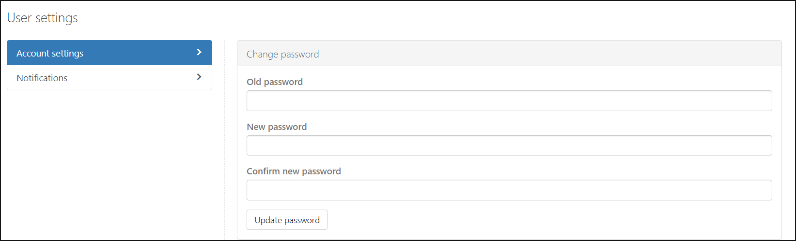

---
# required metadata

title: Set admin preferences - Cloud App Security | Microsoft Docs
description: This article provides instructions for setting admin preferences in Cloud App Security.
keywords:
author: shsagir
ms.author: shsagir
manager: shsagir
ms.date: 12/10/2018
ms.topic: conceptual
ms.collection: M365-security-compliance
ms.prod:
ms.service: cloud-app-security
ms.technology:
ms.assetid: 85cae50d-f571-4907-9600-da4cc187b43b

# optional metadata

#ROBOTS:
#audience:
#ms.devlang:
ms.reviewer: reutam
ms.suite: ems
#ms.tgt_pltfrm:
ms.custom: seodec18

---
# Admin user settings

*Applies to: Microsoft Cloud App Security*

Microsoft Cloud App Security allows you to customize your admin user settings. The notification settings allow admins to specify if they would like to receive email or text notifications for alerts. 

##   Customize your admin settings  
To set up your preferences as an admin of Microsoft Cloud App Security, click your name in the portal menu bar, and select **User settings** to set the following settings:  
  
1.  Click **Account settings**. Here you can set and renew your password for access to the Cloud App Security portal.  
  
       
  
2.  Click **Notifications** and set email and text notification preferences for emails you receive from the system.  You can set the severity that determines which alerts and violations you want to receive emails. The severity is set per policy. When violations are triggered, you receive email notification depending on the setting here and the Severity setting in the policy that was violated. Emails are sent to the alias associated with the administrator user account you used to sign in to Cloud App Security. Enter a phone number to enable Cloud App Security to send you text messages when alerts and notifications are sent, and set the severity level for which you want to receive notifications via text message.  
  
    > [!NOTE] 
    > The maximum number of alerts that are sent via text message is 10 per phone number per day. The day is calculated according to the UTC timezone. 
  
      
  
3. When you're done, click **Save**.  
  
  
 
  
    
## Next steps  
[Set up Cloud Discovery](set-up-cloud-discovery.md)   

[Premier customers can also create a new support request directly in the Premier Portal.](https://premier.microsoft.com/)  
  
  
