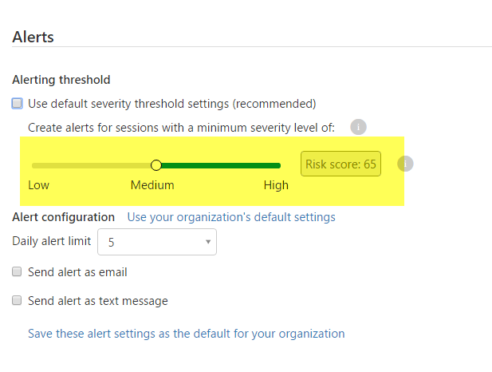

# Anomaly detection policy
  This article provides reference details about policies, providing explanations for each policy type and the fields that can be configured for each policy.  
 
 Cloud App Security has an initial learning period of 7 days during which it does not flag any new users, activity, devices or locations as anomalous. After that, each session is compared to the activity, when users were active, IP addresses, devices, etc. detected over the past month and the risk score of these activities. 
 Use the sensitivity slider in the policy to set the minimum risk score from which alerts will be triggered. It is recommended that when you create an anomaly policy, use the default sensitivity threshold for a week, before you change it in accordance with the number of alerts you received, Cloud App Security will send you more or fewer alerts for various risk scores when you change the sensitivity.
  
 
## Anomaly detection policy reference  
 An anomaly detection policy enables you to setup and configure continuous monitoring of user activity for behavioral anomalies. Anomalies are detected by scanning user activity. The risk is evaluated by looking at over 30 different risk indicators, grouped into 6 risk factors. Based on the policy results, security alerts are triggered.   
Each policy is composed of the following parts:  
  
-   Activity filters – Enable you to selectively scan only filtered user activity for anomalies.  
  
-   Risk factors – Enable you to choose which risk factors to include when evaluating risk.  
  
-   Sensitivity – Enable you to set how many alerts the policy should trigger.  
  
### Activity filters  
 For a list of Activity filters, see [enter link description here](activity-filters.md).  
  
### Risk factors  
 Below is a list of the risk factors which are considered when evaluating the risk of user activity. Each risk factor can be toggled on or off. For each risk factor there are two options under the **Apply to** field, which determine whether to include it when evaluating the risk of user activity:  
  
-   All monitored activity – include it for all user activity which passes the policy activity filter.  
  
-   Selected activity – include it for user activity which passes both the policy activity filters and the activity filters that appear under this risk factor. When this option is selected an activity filter selector appears under the risk factor, which works exactly the same as the policy activity filter.  
  
 Each risk factor, when included in the risk evaluation, has its own triggers that cause an increase in the evaluated risk of user activity:  
  
-   Login failures – a high number of login failures or activity comprised entirely of login failures.  
  
-   Admin activity - administrative activity performed by an unexpected user, or performed from an IP, ISP or location which are new, or not used by any other user in the organization.  
  
-   Inactive accounts - activity performed by a user which was not active for a long time.  
  
-   Location - activity performed from an IP, ISP or location which were either never used by any other user, never used by this particular user, never used at all, or used only for login failures in the past.  
  
-   Impossible travel - activity from remote locations within a short time.  
  
-   Device and user agent - activity performed by a user using a user agent or device which were either never used by any other user, never used by this particular user or never used at all.  
  
### Sensitivity  
 There are two ways to control the number of alerts triggered by the policy:  
  
-   Sensitivity slider – choose how many alerts to trigger per 1,000 users per week. The alerts will be triggered of the activities with the highest risk.  
  
-   Daily alert limit – restrict the number of alerts raised on a single day.  
  
## See Also  
 [Daily activities to protect your cloud environment](daily-activities-to-protect-your-cloud-environment.md)   
 [For technical support, please visit the Cloud App Security assisted support page.](http://support.microsoft.com/oas/default.aspx?prid=16031)   
 [Premier customers can also choose Cloud App Security directly from the Premier Portal.](https://premier.microsoft.com/)  
  
  