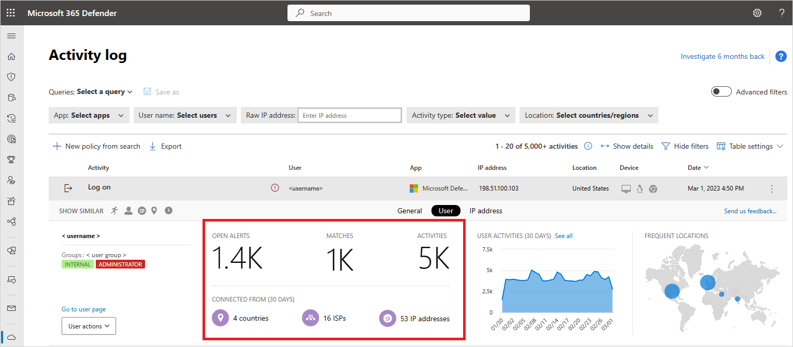

---
# required metadata

title: Create anomaly detection policies in Cloud App Security
description: This article provides a description of Anomaly detection policies and provides reference information about the building blocks of an anomaly detection policy.
keywords:
author: shsagir
ms.author: shsagir
manager: shsagir
ms.date: 03/24/2020

ms.topic: conceptual
ms.collection: M365-security-compliance
ms.prod:
ms.service: cloud-app-security
ms.technology:

# optional metadata

#ROBOTS:
#audience:
#ms.devlang:
ms.reviewer: reutam
ms.suite: ems
ms.custom: seodec18

---

# Get instantaneous behavioral analytics and anomaly detection

*Applies to: Microsoft Cloud App Security*

Microsoft Cloud App Security's anomaly detection policies provide out-of-the-box user and entity behavioral analytics (UEBA) and machine learning (ML) so that you can immediately run advanced threat detection across your cloud environment. Because they're automatically enabled, the new anomaly detection policies provide immediate results by providing immediate detections, targeting numerous behavioral anomalies across your users and the machines and devices connected to your network.  In addition, the new policies expose more data from the Cloud App Security detection engine, to help you speed up the investigation process and contain ongoing threats.

The anomaly detection policies are automatically enabled, but Cloud App Security has an initial learning period of seven days during which not all anomaly detection alerts are raised. After that, each session is compared to the activity, when users were active, IP addresses, devices, etc. detected over the past month and the risk score of these activities.  These detections are part of the heuristic anomaly detection engine that profiles your environment and triggers alerts with respect to a baseline that was learned on your organization's activity. These detections also use machine learning algorithms designed to profile the users and sign in pattern to reduce false positives.

Anomalies are detected by scanning user activity. The risk is evaluated by looking at over 30 different risk indicators, grouped into risk factors, as follows:

* Risky IP address
* Login failures
* Admin activity
* Inactive accounts
* Location
* Impossible travel
* Device and user agent
* Activity rate

Based on the policy results, security alerts are triggered. Cloud App Security looks at every user session on your cloud and alerts you when something happens that is different from the baseline of your organization or from the user's regular activity.

In addition to native Cloud App Security alerts, you will also get the following detection alerts based on information received from Azure Active Directory (AD) Identity Protection:

* Leaked credentials: Triggered when a user's valid credentials have been leaked. For more information, see [Azure AD's Leaked credentials detection](/azure/active-directory/identity-protection/concept-identity-protection-risks#user-risk).
* Risky sign-in: Combines a number of Azure AD Identity Protection sign-in detections into a single detection (disabled by default). For more information, see [Azure AD's Sign-in risk detections](/azure/active-directory/identity-protection/concept-identity-protection-risks#sign-in-risk).

These policies will appear on the Cloud App Security policies page and can be enabled, or disabled, but not edited.

## Anomaly detection policies

You can see the anomaly detection policies in the portal by clicking on **Control** then **Policies**. Select **Anomaly detection policy** for the policy type.

 

The following anomaly detection policies are available:

### Impossible travel

* This detection identifies two user activities (is a single or multiple sessions) originating from geographically distant locations within a time period shorter than the time it would have taken the user to travel from the first location to the second, indicating that a different user is using the same credentials. This detection uses a machine learning algorithm that ignores obvious "false positives" contributing to the impossible travel condition, such as VPNs and locations regularly used by other users in the organization. The detection has an initial learning period of seven days during which it learns a new user's activity pattern. The impossible travel detection identifies unusual and impossible user activity between two locations. The activity should be unusual enough to be considered an indicator of compromise and worthy of an alert. To make this work, the detection logic includes different levels of suppression to address scenarios that can trigger false positive, such as VPN activities. The sensitivity slider allows you to impact the algorithm and define how strict the detection logic is. The higher the sensitivity level, the lower the suppression that is applied as part of the detection logic. In this way, you can adapt the detection according to your coverage needs and your SNR targets.

    > [!NOTE]
    > When the IP addresses on both sides of the travel are considered safe, the travel is trusted and excluded from triggering the Impossible travel detection. For example, both sides are considered safe if they are [tagged as corporate](ip-tags.md). However, if the IP address of only one side of the travel is considered safe, the detection is triggered as normal.

### Activity from infrequent country

* This detection considers past activity locations to determine new and infrequent locations. The anomaly detection engine stores information about previous locations used by users in the organization. An alert is triggered when an activity occurs from a location that wasn't recently or never visited by any user in the organization.

### Malware detection

* This detection identifies malicious files in your cloud storage, whether they're from your Microsoft apps or third-party apps. Microsoft Cloud App Security uses Microsoft's threat intelligence to recognize whether certain files are associated with known malware attacks and are potentially malicious. This built-in policy is disabled by default. Not every file is scanned, but heuristics are used to look for files that are potentially risky. After files are detected, you can then see a list of **Infected files**. Click on the malware file name in the file drawer to open a malware report that provides you with information about that type of malware the file is infected with.

    > [!NOTE]
    > * For Office 365 malware detection, you need a valid license for Office 365 Advanced Threat Protection P1.
    > * Cloud App Security supports malware detection the following apps:
    >   * Box
    >   * Dropbox
    >   * G Suite
    >   * Office 365

### Activity from anonymous IP addresses

* This detection identifies that users were active from an IP address that has been identified as an anonymous proxy IP address. These proxies are used by people who want to hide their device's IP address, and may be used for malicious intent. This detection uses a machine learning algorithm that reduces "false positives", such as mis-tagged IP addresses that are widely used by users in the organization.

### Ransomware activity

* Cloud App Security extended its ransomware detection capabilities with anomaly detection to ensure a more comprehensive coverage against sophisticated Ransomware attacks. Using our security research expertise to identify behavioral patterns that reflect ransomware activity, Cloud App Security ensures holistic and robust protection. If Cloud App Security identifies, for example, a high rate of file uploads or file deletion activities it may represent an adverse encryption process. This data is collected in the logs received from connected APIs and is then combined with learned behavioral patterns and threat intelligence, for example, known ransomware extensions. For more information about how Cloud App Security detects ransomware, see [Protecting your organization against ransomware](use-case-ransomware.md).

### Activity performed by terminated user

* This detection enables you to able to identify when a terminated employee continues to perform actions on your SaaS apps. Because data shows that the greatest risk of insider threat comes from employees who left on bad terms, it's important to keep an eye on the activity on accounts from terminated employees. Sometimes, when employees leave a company, their accounts are de-provisioned from corporate apps, but in many cases they still retain access to certain corporate resources. This is even more important when considering privileged accounts, as the potential damage a former admin can do is inherently greater.
This detection takes advantage of Cloud App Security's ability to monitor user behavior across apps, allowing identification of the regular activity of the user, the fact that the account was terminated, and actual activity on other apps. For example, an employee who's Azure AD account was terminated, but still has access to the corporate AWS infrastructure, has the potential to cause large-scale damage.

The detection looks for users whose account was terminated in Azure AD, but still perform activities in other platforms such as AWS or Salesforce. This is especially relevant for users who use another account (not their primary single sign-on account) to manage resources, since these accounts are often not terminated when a user leaves the company.

### Activity from suspicious IP addresses

* This detection identifies that users were active from an IP address identified as risky by Microsoft Threat Intelligence. These IP addresses are involved in malicious activities, such as Botnet C&C, and may indicate compromised account. This detection uses a machine learning algorithm that reduces "false positives", such as mis-tagged IP addresses that are widely used by users in the organization.

### Suspicious inbox forwarding

* This detection looks for suspicious email forwarding rules, for example, if a user created an inbox rule that forwards a copy of all emails to an external address.

> [!NOTE]
> Cloud App Security only alerts you for each forwarding rule that is identified as suspicious, based on the typical behavior for the user.

### Suspicious inbox manipulation rules

* This detection profiles your environment and triggers alerts when suspicious rules that delete or move messages or folders are set on a user's inbox. This may indicate that the user's account is compromised, that messages are being intentionally hidden, and that the mailbox is being used to distribute spam or malware in your organization.

### Suspicious email deletion activity (Preview)

* This policy profiles your environment and triggers alerts when a user performs suspicious email deletion activities in a single session. This policy may indicate that a user mailboxes may be compromised by potential attack vectors such as command-and-control communication (C&C/C2) over email.

### Unusual activities (by user)

These detections identify users who perform:

* Unusual multiple file download activities
* Unusual file share activities
* Unusual file deletion activities
* Unusual impersonated activities
* Unusual administrative activities
* Unusual Power BI report sharing activities (preview)
* Unusual multiple VM creation activities (preview)
* Unusual multiple storage deletion activities (preview)
* Unusual region for cloud resource (preview)

These policies look for activities within a single session with respect to the baseline learned, which could indicate on a breach attempt. These detections leverage a machine learning algorithm that profiles the users log on pattern and reduces false positives. These detections are part of the heuristic anomaly detection engine that profiles your environment and triggers alerts with respect to a baseline that was learned on your organization's activity.

### Multiple failed login attempts

* This detection identifies users that failed multiple login attempts in a single session with respect to the baseline learned, which could indicate on a breach attempt.

### Data exfiltration to unsanctioned apps

* This policy is automatically enabled to alert you when a user or IP address uses an app that is not sanctioned to perform an activity that resembles an attempt to exfiltrate information from your organization.

### Multiple delete VM activities

* This policy profiles your environment and triggers alerts when users delete multiple VMs in a single session, relative to the baseline in your organization. This might indicate an attempted breach.

## Enable automated governance

You can enable automated remediation actions on alerts generated by anomaly detection policies.

1. Click on the name of the detection policy in the **Policy** page.
1. In the **Edit anomaly detection policy** window that opens, under **Governance** set the remediation actions you want for each connected app or for all apps.
1. Click **Update**.

## Tune anomaly detection policies

To affect the anomaly detection engine to suppress or surface alerts according to your preferences:

* In the Impossible Travel policy, you can set the sensitivity slider to determine the level of anomalous behavior needed before an alert is triggered. For example, if you set it to low, it will suppress Impossible Travel alerts from a user's common locations, and if you set it to high, it  will surface such alerts. You can choose from the following sensitivity levels:

  * **Low**: System, tenant and user suppressions
  * **Medium**: System and user suppressions
  * **High**: Only system suppressions

    Where:

    | Suppression type | Description |
    | --- | --- |
    | **System** | Built-in detections that are always suppressed. |
    | **Tenant** | Common activities based on previous activity in the tenant. For example, suppressing activities from an ISP previously alerted on in your organization. |
    | **User** | Common activities based on previous activity of the specific user. For example, suppressing activities from a location that is commonly used by the user. |

* You can also configure whether the alerts for Activity from infrequent country, anonymous IP addresses, suspicious IP addresses, and  impossible travel should analyze both failed and successful logins or just successful logins.

> [!NOTE]
> By default, legacy sign-in protocols, such as those that don't use multi-factor authentication (for example, WS-Trust), are not monitored by the impossible travel policy. If your organization uses legacy protocols, to avoid missing relevant activities, edit the policy and under **Advanced configuration**, set **Analyze sign in activities** to **All sign ins**.

## Scope anomaly detection policies

Each anomaly detection policy can be independently scoped so that it applies only to the users and groups you want to include and exclude in the policy.
For example, you can set the Activity from infrequent county detection to ignore a specific user who travels frequently.

To scope an anomaly detection policy:

1. Click **Control** > **Policies**, and set the **Type** filter to **Anomaly detection policy**.
1. Click on the policy you want to scope.
1. Under **Scope**, change the drop-down from the default setting of **All users and groups**, to **Specific users and groups**.
1. Select **Include** to specify the users and groups for whom this policy will apply. Any user or group not selected here won't be considered a threat and won't generate an alert.
1. Select **Exclude** to specify users for whom this policy won't apply. Any user selected here won't be considered a threat and won't generate an alert, even if they're members of groups selected under **Include**.

    

## Triage anomaly detection alerts

You can triage the various alerts triggered by the new anomaly detection policies quickly and decide which ones need to be taken care of first. To do this, you need the context for the alert, so you're able to see the bigger picture and understand whether something malicious is indeed happening.

1. In the **Activity log**, you can open an activity to display the Activity drawer. Click on **User** to view the user insights tab. This tab includes information like number of alerts, activities, and where they've connected from, which is important in an investigation.

    
    

1. This enables you to understand what the suspicious activities are that the user performed and gain deeper confidence as to whether the account was compromised. For example, an alert on multiple failed logins may indeed be suspicious and can indicate potential brute force attack, but it can also be an application misconfiguration, causing the alert to be a benign true positive. However, if you see a multiple failed logins alert with additional suspicious activities, then there is a higher probability that the account is compromised. In the example below, you can see that the **Multiple failed login attempts** alert was followed by **Activity from a TOR IP address** and **Impossible travel activity**, both strong indicators of compromise (IOCs) by themselves. If this wasn't suspicious enough, then you can see that the same user performed a **Mass download activity**, which is often an indicator of the attacker performing exfiltration of data.

    

1. For malware infected files, After files are detected, you can then see a list of **Infected files**. Click on the malware file name in the file drawer to open a malware report that provides you with information about that type of malware the file is infected with.

## Next steps

> [!div class="nextstepaction"]
> [Daily activities to protect your cloud environment](daily-activities-to-protect-your-cloud-environment.md)

[!INCLUDE [Open support ticket](includes/support.md)]
