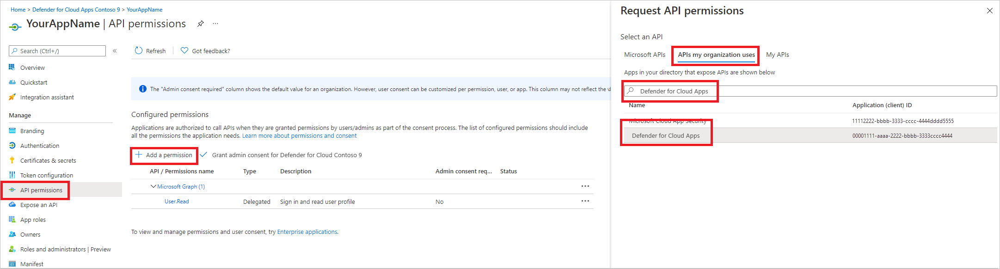
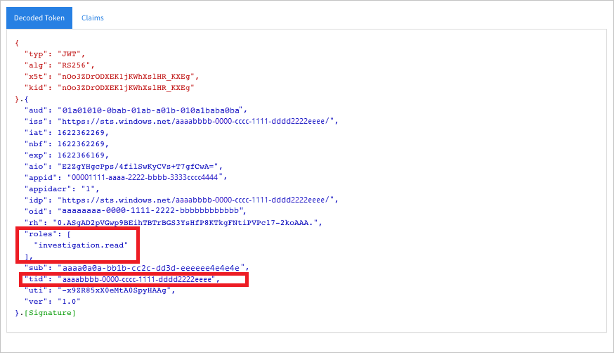

# Access Microsoft Defender for Cloud Apps with application context


This page describes how to create an application to get programmatic access to Defender for Cloud Apps without a user. If you need programmatic access to Defender for Cloud Apps on behalf of a user, see [Get access with user context](api-authentication-user.md). If you aren't sure which access you need, see the [Managing API tokens](api-authentication.md) page.

Microsoft Defender for Cloud Apps exposes much of its data and actions through a set of programmatic APIs. Those APIs help you automate work flows and innovate based on Defender for Cloud Apps capabilities. The API access requires OAuth2.0 authentication. For more information, see [OAuth 2.0 Authorization Code Flow](/azure/active-directory/develop/active-directory-v2-protocols-oauth-code).

In general, you need to take the following steps to use the APIs:

- Create a Microsoft Entra application.
- Get an access token using this application.
- Use the token to access Defender for Cloud Apps API.

This article explains how to create a Microsoft Entra application, get an access token to Microsoft Defender for Cloud Apps, and validate the token.

## Create an app for Defender for Cloud Apps

1. In the Microsoft Entra admin center, register a new application. For more information, see [Quickstart: Register an application with the Microsoft Entra admin center](/azure/active-directory/develop/quickstart-register-app).

1. To enable your app to access Defender for Cloud Apps and assign it **'Read all alerts'** permission, on your application page, select **API Permissions** > **Add permission** > **APIs my organization uses** >, type **Microsoft Cloud App Security**, and then select **Microsoft Cloud App Security**.

   > [!NOTE]
   > *Microsoft Cloud App Security* does not appear in the original list. Start writing its name in the text box to see it appear. Make sure to type this name, even though the product is now called Defender for Cloud Apps.

   

   - Select **Application permissions** > **Investigation.Read**, and then select **Add permissions**.

        :::image type="content" source="media/application-permissions.png" alt-text="Screenshot of adding app permission." lightbox="media/application-permissions.png":::

     You need to select the relevant permissions. **Investigation.Read** is only an example. For other permission scopes, see [Supported permission scopes](#supported-permission-scopes)

     - To determine which permission you need, look at the **Permissions** section in the API you're interested to call.

1. Select **Grant admin consent**.

     > [!NOTE]
     > Every time you add a permission, you must select **Grant admin consent** for the new permission to take effect.

    

1. To add a secret to the application, select **Certificates & secrets**, select **New client secret**, add a description to the secret, and then select **Add**.

    > [!NOTE]
    > After you select **Add**, select **copy the generated secret value**. You won't be able to retrieve this value after you leave.

    

1. Write down your application ID and your tenant ID. On your application page, go to **Overview** and copy the **Application (client) ID** and the **Directory (tenant) ID**.

   

1. **For Microsoft Defender for Cloud Apps Partners only**. Set your app to be multitenanted (available in all tenants after consent). This is **required** for third-party apps (for example, if you create an app that is intended to run in multiple customers' tenant). This is **not required** if you create a service that you want to run in your tenant only (for example, if you create an application for your own usage that will only interact with your own data). To set your app to be multitenanted:

    - Go to **Authentication**, and add `https://portal.azure.com` as the **Redirect URI**.

    - On the bottom of the page, under **Supported account types**, select the **Accounts in any organizational directory** application consent for your multitenant app.

    You need your application to be approved in each tenant where you intend to use it. This is because your application interacts Defender for Cloud Apps on behalf of your customer.

    You (or your customer if you're writing a third-party app) need to select the consent link and approve your app. The consent should be done with a user who has administrative privileges in Active Directory.

    The consent link is formed as follows:

    ```url
    https://login.microsoftonline.com/common/oauth2/authorize?prompt=consent&client_id=00000000-0000-0000-0000-000000000000&response_type=code&sso_reload=true
    ```

    Where 00000000-0000-0000-0000-000000000000 is replaced with your application ID.

**Done!** You've successfully registered an application! See examples below for token acquisition and validation.

## Supported permission scopes

| Permission name      | Description                                                  | Supported actions                                            |
| -------------------- | ------------------------------------------------------------ | ------------------------------------------------------------ |
| Investigation.read   | Perform all supported actions on activities and alerts except closing alerts.<br />View IP ranges but not add, update, or delete.<br /><br />Perform all entities actions. | Activities list, fetch, feedback<br />Alerts list, fetch, mark as read/unread<br />Entities list, fetch, fetch tree<br />Subnet list |
| Investigation.manage | Perform all investigation.read actions in addition to managing alerts and IP ranges. | Activities list, fetch, feedback<br />Alerts list, fetch, mark as read/unread, close<br />Entities list, fetch, fetch tree<br />Subnet list, create/update/delete |
| Discovery.read       | Perform all supported actions on activities and alerts except closing alerts.<br />List discovery reports and categories. | Alerts list, fetch, mark as read/unread<br />Discovery list reports, list report categories |
| Discovery.manage     | Discovery.read permissions<br />Close alerts, upload discovery files, and generate block scripts | Alerts list, fetch, mark as read/unread, close<br />Discovery list reports, list report categories<br />Discovery file upload, generate block script |
| Settings.read        | List IP ranges.                                              | Subnet list                                                  |
| Settings.manage      | List and manage IP ranges.                                   | Subnet list, create/update/delete                            |

## Get an access token

For more information on Microsoft Entra tokens, see the [Microsoft Entra tutorial](/azure/active-directory/develop/active-directory-v2-protocols-oauth-client-creds).

<!-- IDs listed in the following sections are approved and shouldn't be changed.-->

### Use PowerShell

```powershell
# This script acquires the App Context Token and stores it in the variable $token for later use in the script.
# Paste your Tenant ID, App ID, and App Secret (App key) into the indicated quotes below.

$tenantId = '' ### Paste your tenant ID here
$appId = '' ### Paste your Application ID here
$appSecret = '' ### Paste your Application key here

$resourceAppIdUri = '05a65629-4c1b-48c1-a78b-804c4abdd4af'
$oAuthUri = "https://login.microsoftonline.com/$TenantId/oauth2/token"
$authBody = [Ordered] @{
    resource = "$resourceAppIdUri"
    client_id = "$appId"
    client_secret = "$appSecret"
    grant_type = 'client_credentials'
}
$authResponse = Invoke-RestMethod -Method Post -Uri $oAuthUri -Body $authBody -ErrorAction Stop
$token = $authResponse.access_token
```

### Use C#

The following code was tested with NuGet Microsoft.Identity.Client 4.47.2.

1. Create a new console application.
1. Install NuGet [Microsoft.Identity.Client](https://www.nuget.org/packages/Microsoft.Identity.Client/).
1. Add the following:

    ```text
    using Microsoft.Identity.Client;
    ```

1. Copy and paste the following code in your app (don't forget to update the three variables: ```tenantId, appId, appSecret```):

    ```c#
    string tenantId = "00000000-0000-0000-0000-000000000000"; // Paste your own tenant ID here
    string appId = "00001111-aaaa-2222-bbbb-3333cccc4444"; // Paste your own app ID here
    string appSecret = "22222222-2222-2222-2222-222222222222"; // Paste your own app secret here for a test, and then store it in a safe place!
    const string authority = "https://login.microsoftonline.com";
    const string audience = "05a65629-4c1b-48c1-a78b-804c4abdd4af";

    IConfidentialClientApplication myApp = ConfidentialClientApplicationBuilder.Create(appId).WithClientSecret(appSecret).WithAuthority($"{authority}/{tenantId}").Build();

    List scopes = new List() { $"{audience}/.default" };

    AuthenticationResult authResult = myApp.AcquireTokenForClient(scopes).ExecuteAsync().GetAwaiter().GetResult();

    string token = authResult.AccessToken;
    ```

### Use Python

See [Microsoft Authentication Library (MSAL) for Python](https://github.com/AzureAD/microsoft-authentication-library-for-python).

### Use Curl

> [!NOTE]
> The following procedure assumes that Curl for Windows is already installed on your computer.

1. Open a command prompt, and set CLIENT_ID to your Azure application ID.
1. Set CLIENT_SECRET to your Azure application secret.
1. Set TENANT_ID to the Azure tenant ID of the customer that wants to use your app to access Defender for Cloud Apps.
1. Run the following command:

```curl
curl -i -X POST -H "Content-Type:application/x-www-form-urlencoded" -d "grant_type=client_credentials" -d "client_id=%CLIENT_ID%" -d "scope=05a65629-4c1b-48c1-a78b-804c4abdd4af/.default" -d "client_secret=%CLIENT_SECRET%" "https://login.microsoftonline.com/%TENANT_ID%/oauth2/v2.0/token" -k
```

You get an answer in the following form:

```output
{"token_type":"Bearer","expires_in":3599,"ext_expires_in":0,"access_token":"eyJ0eXAiOiJKV1QiLCJhbGciOiJSUzI1NiIsIn <truncated> aWReH7P0s0tjTBX8wGWqJUdDA"}
```

## Validate the token

Ensure that you got the correct token:

1. Copy and paste the token you got in the previous step into [JWT](https://jwt.ms) in order to decode it.
1. Validate that you get a 'roles' claim with the desired permissions
1. In the following image, you can see a decoded token acquired from an app with permissions to all Microsoft Defender for Cloud Apps roles:



## Use the token to access Microsoft Defender for Cloud Apps API

1. Choose the API you want to use. For more information, see [Defender for Cloud Apps APIs](api-introduction.md).
1. Set the authorization header in the http request you send to "Bearer {token}" (Bearer is the authorization scheme).
1. The expiration time of the token is one hour. You can send more than one request with the same token.

The following is an example of sending a request to get a list of alerts **using C#**:

```C#
    var httpClient = new HttpClient();

    var request = new HttpRequestMessage(HttpMethod.Get, "https://portal.cloudappsecurity.com/cas/api/v1/alerts/");

    request.Headers.Authorization = new AuthenticationHeaderValue("Bearer", token);

    var response = httpClient.SendAsync(request).GetAwaiter().GetResult();

    // Do something useful with the response
```

## See also

- [Managing API tokens](api-authentication.md)
