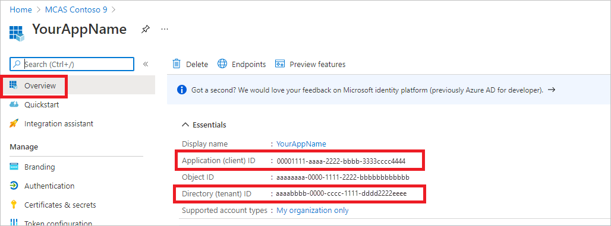

# Access Microsoft Defender for Cloud Apps API with user context


This page describes how to create an application to get programmatic access to Defender for Cloud Apps on behalf of a user.

If you need programmatic access Microsoft Defender for Cloud Apps without a user, refer to [Access Microsoft Defender for Cloud Apps with application context](api-authentication-application.md).

If you aren't sure which access you need, read the [Introduction page](api-authentication.md).

Microsoft Defender for Cloud Apps exposes much of its data and actions through a set of programmatic APIs. Those APIs enable you to automate work flows and innovate based on Microsoft Defender for Cloud Apps capabilities. The API access requires OAuth2.0 authentication. For more information, see [OAuth 2.0 Authorization Code Flow](/azure/active-directory/develop/active-directory-v2-protocols-oauth-code).

In general, you need to take the following steps to use the APIs:

- Create a Microsoft Entra application
- Get an access token using this application
- Use the token to access Defender for Cloud Apps API

This page explains how to create a Microsoft Entra application, get an access token to Microsoft Defender for Cloud Apps and validate the token.

>[!NOTE]
> When accessing Microsoft Defender for Cloud Apps API on behalf of a user, you will need the correct Application permission and user permission.
> If you are not familiar with user permissions on Microsoft Defender for Cloud Apps, see [Manage admin access](manage-admins.md).

>[!TIP]
> If you have the permission to perform an action in the portal, you have the permission to perform the action in the API.

## Create an app

1. In the Microsoft Entra admin center, register a new application. For more information, see [Quickstart: Register an application with the Microsoft Entra admin center](/azure/active-directory/develop/quickstart-register-app).


1. When the **Register an application** page appears, enter your application's registration information:

   - **Name** - Enter a meaningful application name that is displayed to users of the app.
   - **Supported account types** - Select which accounts you would like your application to support.

       | Supported account types | Description |
       |-------------------------|-------------|
       | **Accounts in this organizational directory only** | Select this option if you're building a line-of-business (LOB) application. This option isn't available if you're not registering the application in a directory.<br><br>This option maps to Microsoft Entra-only single-tenant.<br><br>This is the default option unless you're registering the app outside of a directory. In cases where the app is registered outside of a directory, the default is Microsoft Entra multitenant and personal Microsoft accounts. |
       | **Accounts in any organizational directory** | Select this option if you would like to target all business and educational customers.<br><br>This option maps to a Microsoft Entra-only multitenant.<br><br>If you registered the app as Microsoft Entra-only single-tenant, you can update it to be Microsoft Entra multitenant and back to single-tenant through the **Authentication** pane. |
       | **Accounts in any organizational directory and personal Microsoft accounts** | Select this option to target the widest set of customers.<br><br>This option maps to Microsoft Entra multitenant and personal Microsoft accounts.<br><br>If you registered the app as Microsoft Entra multitenant and personal Microsoft accounts, you can't change this in the UI. Instead, you must use the application manifest editor to change the supported account types. |

   - **Redirect URI (optional)** - Select the type of app you're building, **Web, or **Public client (mobile & desktop)**, and then enter the redirect URI (or reply URL) for your application.
       - For web applications, provide the base URL of your app. For example, `http://localhost:31544` might be the URL for a web app running on your local machine. Users would use this URL to sign in to a web client application.
       - For public client applications, provide the URI used by Microsoft Entra ID to return token responses. Enter a value specific to your application, such as `myapp://auth`.

     To see specific examples for web applications or native applications, check out our [quickstarts](/azure/active-directory/develop/#quickstarts).

     When finished, select **Register**.

1. Allow your Application to access Microsoft Defender for Cloud Apps and assign it 'Read alerts' permission:

    - On your application page, select **API Permissions** > **Add permission** > **APIs my organization uses** > type *Microsoft Cloud App Security* and then select **Microsoft Cloud App Security**.

    - **Note**: *Microsoft Cloud App Security* doesn't appear in the original list. Start writing its name in the text box to see it appear. Make sure to type this name, even though the product is now called Defender for Cloud Apps.

      

    - Choose **Delegated permissions** > **Investigation.Read** > select **Add permissions**

      

    - **Important note**: Select the relevant permissions. **Investigation.Read** is only an example. For other permission scopes, see [Supported permission scopes](#supported-permission-scopes)

      - To determine which permission you need, view the **Permissions** section in the API you're interested to call.

    - Select **Grant admin consent**

      **Note**: Every time you add permission you must select **Grant admin consent** for the new permission to take effect.

      

1. Write down your application ID and your tenant ID:

   - On your application page, go to **Overview** and copy the following information:

        

## Supported permission scopes

| Permission name      | Description                                                  | Supported actions                                            |
| -------------------- | ------------------------------------------------------------ | ------------------------------------------------------------ |
| Investigation.read   | Perform all supported actions on activities and alerts except closing alerts.<br />View IP ranges but not add, update, or delete.<br /><br />Perform all entities actions. | Activities list, fetch, feedback<br />Alerts list, fetch, mark as read/unread<br />Entities list, fetch, fetch tree<br />Subnet list |
| Investigation.manage | Perform all investigation.read actions in addition to managing alerts and IP ranges. | Activities list, fetch, feedback<br />Alerts list, fetch, mark as read/unread, close<br />Entities list, fetch, fetch tree<br />Subnet list, create/update/delete |
| Discovery.read       | Perform all supported actions on activities and alerts except closing alerts.<br />List discovery reports and categories. | Alerts list, fetch, mark as read/unread<br />Discovery list reports, list report categories |
| Discovery.manage     | Discovery.read permissions<br />Close alerts, upload discovery files, and generate block scripts | Alerts list, fetch, mark as read/unread, close<br />Discovery list reports, list report categories<br />Discovery file upload, generate block script |
| Settings.read        | List IP ranges.                                              | Subnet list                                                  |
| Settings.manage      | List and manage IP ranges.                                   | Subnet list, create/update/delete                            |

## Get an access token

For more information on Microsoft Entra tokens, see [Microsoft Entra tutorial](/azure/active-directory/develop/active-directory-v2-protocols-oauth-client-creds)

### Using C#

- Copy/Paste the following class in your application.
- Use **AcquireUserTokenAsync** method with your application ID, tenant ID, and authentication acquire a token.

> [!NOTE]
> While the following code sample demonstrates how to acquire a token using the username and password flow, Microsoft recommends that you use more secure authentication flows in a production environment.
>

```csharp
namespace MDA
{
    using System.Net.Http;
    using System.Text;
    using System.Threading.Tasks;
    using Newtonsoft.Json.Linq;

    public static class MDAUtils
    {
        private const string Authority = "https://login.microsoftonline.com";

        private const string MDAId = "05a65629-4c1b-48c1-a78b-804c4abdd4af";
        private const string Scope = "Investigation.read";

        public static async Task<string> AcquireUserTokenAsync(string username, string password, string appId, string tenantId)
        {
            using (var httpClient = new HttpClient())
            {
                var urlEncodedBody = $"scope={MDAId}/{Scope}&client_id={appId}&grant_type=password&username={username}&password={password}";

                var stringContent = new StringContent(urlEncodedBody, Encoding.UTF8, "application/x-www-form-urlencoded");

                using (var response = await httpClient.PostAsync($"{Authority}/{tenantId}/oauth2/token", stringContent).ConfigureAwait(false))
                {
                    response.EnsureSuccessStatusCode();

                    var json = await response.Content.ReadAsStringAsync().ConfigureAwait(false);

                    var jObject = JObject.Parse(json);

                    return jObject["access_token"].Value<string>();
                }
            }
        }
    }
} 
```

## Validate the token

Verify to make sure you got a correct token:

- Copy/paste into [JWT](https://jwt.ms) the token you got in the previous step in order to decode it
- Validate that you get a 'scp' claim with the desired app permissions
- In the screenshot below you can see a decoded token acquired from the app in the tutorial:

    

## Use the token to access the Microsoft Defender for Cloud Apps API

- Choose the API you want to use. For more information, see [Defender for Cloud Apps API](api-introduction.md).
- Set the Authorization header in the HTTP request you send to "Bearer {token}" (Bearer is the Authorization scheme)
- The Expiration time of the token is 1 hour (you can send more than one request with the same token)

- Example of sending a request to get a list of alerts **using C#**

    ```csharp
    var httpClient = new HttpClient();
    
    var request = new HttpRequestMessage(HttpMethod.Get, "https://portal.cloudappsecurity.com/cas/api/v1/alerts/");
    
    request.Headers.Authorization = new AuthenticationHeaderValue("Bearer", token);
    
    var response = httpClient.SendAsync(request).GetAwaiter().GetResult();
    
    // Do something useful with the response
    ```

## See also

- [Managing API tokens](api-authentication.md)
- [Microsoft identity platform and OAuth 2.0 authorization code flow](/azure/active-directory/develop/v2-oauth2-auth-code-flow)
