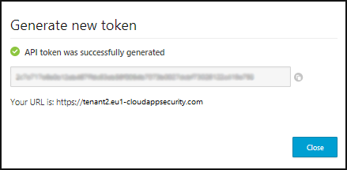

---
# required metadata

title: API token management in Cloud App Security
description: This article provides information about generating API tokens for Cloud App Security.
keywords:
author: ShlomoSagir-MS
ms.author: shsagir
manager: ShlomoSagir-MS
ms.date: 12/10/2018
ms.topic: conceptual
ms.collection: M365-security-compliance
ms.prod:
ms.service: cloud-app-security
ms.technology:
ms.assetid: 4f5e6b1e-6b2c-4358-98f0-945e2993d5fe

# optional metadata

#ROBOTS:
#audience:
#ms.devlang:
ms.reviewer: reutam
ms.suite: ems
#ms.tgt_pltfrm:
ms.custom: seodec18

---
# API tokens

*Applies to: Microsoft Cloud App Security*

The Microsoft Cloud App Security API provides programmatic access to Cloud App Security through REST API endpoints. Applications can use the API to perform read and update operations on Cloud App Security data and objects. For example, the Cloud App Security API supports the following common operations for a user object:

- Upload log files for Cloud Discovery
- Generate block scripts
- List activities, alerts, and policy reports
- Dismiss or resolve alerts

To see the full documentation of the API, in the Cloud App Security portal go to Help > **API documentation**.

In order to access the API, you have to create an API token and use it in your software to connect to the Cloud App Security API.

The API tokens tab enables you to help you manage all the API tokens of your tenant. 

## Generate a token

1. On the **Settings** menu, select **Security extensions** and then **API tokens**.

2. Click the plus icon, **Generate new token** and provide a name to identify the token in the future, and click **Next**.
   

3. Copy the token value and save it somewhere for recovery - if you lose it you need to regenerate the token. The token has the privileges of the user who issued it. For example, a security reader can't issue a token that can alter data.

4. You can filter the tokens by status: Active, Inactive, or Generated. 

   - Generated are tokens that have never been used. 
   - Active are tokens that were generated and were used within the past seven days. 
   - Inactive were used but there was no activity in the last seven days.
5. After you generate a new token, you'll be provided with a new URL to use to access the Cloud App Security portal. 

   

    The generic portal URL continues to work but is considerably slower than the custom URL provided with your token. If you forget the URL at any time, you can view it by going to the **?** icon in the menu and selecting **About**.

> [!NOTE]
> If you are using Azure Active Directory Privileged Identity Management role activation, your API token will only be effective once the role is activated. For more information, see [Activate my Azure AD roles in PIM](https://docs.microsoft.com/en-us/azure/active-directory/privileged-identity-management/pim-how-to-activate-role).

## API token management

The API token page includes a table of all the API tokens that were generated.

Full admins see all tokens generated for this tenant. Other users only see the tokens that they generated themselves.

The table provides details about when the token was generated and when it was last used and allows you to revoke the token. 

After a token is revoked, it's removed from the table, and the software that was using it fails to make API calls until a new token is provided. 

> [!NOTE]
> SIEM connectors and log collectors also use API tokens. These tokens should be managed from the log collectors and SIEM agent sections and do not appear in this table. 

## Next steps
[Troubleshooting SIEM integration issues](troubleshooting-siem.md)   

[Premier customers can also create a new support request directly in the Premier Portal.](https://premier.microsoft.com/)  

## Check out this video!
[Microsoft Cloud App Security – REST API’s and Tokens](https://channel9.msdn.com/Shows/Microsoft-Security/Microsoft-Cloud-App-Security--REST-APIs-and-Tokens)  
