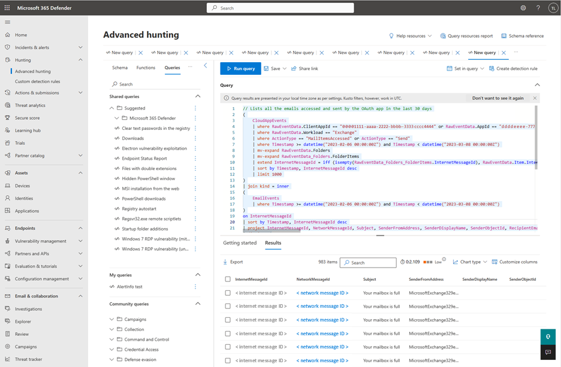

---
# Required metadata
		# For more information, see https://review.learn.microsoft.com/en-us/help/platform/learn-editor-add-metadata?branch=main
		# For valid values of ms.service, ms.prod, and ms.topic, see https://review.learn.microsoft.com/en-us/help/platform/metadata-taxonomies?branch=main

title:       Hunt for threats in app activities
description: App governance will enable you to hunt for resources accessed and activities carried out by apps in your environment.
author:      anandd512 # GitHub alias
ms.author:   andeshpande # Microsoft alias
ms.service:  # Add the ms.service or ms.prod value
# ms.prod:   # To use ms.prod, uncomment it and delete ms.service
ms.topic:    # Add the ms.topic value
ms.date:     05/18/2023
---

# Hunt for threats in app activities

Apps can be a valuable entry point for attackers, so it is recommended to monitor anomalies and suspicious behaviors that use apps. While investigating an app governance alert or reviewing the app behavior in the environment, it becomes important to quickly get visibility into details of activities done by such suspicious apps and take remediation actions to protect assets in your organization.

Using app governance and advanced hunting capabilities, you can quickly - with a few clicks - get complete visibility into activities done by the apps and the resources it has accessed.

 Follow these 4 simple steps to make app-based threat hunting easy.

## Step 1: Find the app in app governance

App governance lists [all Azure AD OAuth apps](https://security.microsoft.com/cloudapps/app-governance?viewid=allApps). If you are looking to get more details on the data accessed by a specific app, search for that app on the app list in app governance. Alternatively, you can also use the **Data usage** or **Services accessed** filters to view apps that have accessed data on one or more of the supported Microsoft 365 services.

## Step 2: View data accessed by apps

Once you’ve identified an app, select the app to open the app details flyout. Select the __Data usage__ tab on the flyout to view information on size and count of resources accessed by the app in the last 30 days. Currently, app governance provides data usage-based insights for resources such as emails, files, and chat and channel messages across Exchange Online, OneDrive, SharePoint and Teams.

## Step 3: Hunt for related activities and resources accessed.

Once you have a high-level overview of the data used by the app across services and resources, you may want to know the details of the app activities and the resources it accessed while performing these activities. Click on the __go-hunt__ icon next to each resource to view details of the resources accessed by the app in the last 30 days. When you click on the __go-hunt__ icon, it opens a new tab and redirects you to advanced hunting with a pre-populated KQL query. Once the page loads, click on the __Run query__ button to run the KQL query and view the results.

After the query runs, the query results display in tabular form. Each row in the table corresponds to an activity done by the app to access the specific resource type. Each column in the table provides comprehensive context about the app itself, the resource, the user, and the activity.

As an example, when you click the **go-hunt** icon beside the **Email** resource, app governance enables you to view the following information for all the emails accessed by the app in the last 30 days in advanced hunting:

- __Details of the email:__ InternetMessageId, NetworkMessageId, Subject, Sender name and address, Recipient address, AttachmentCount and UrlCount

- __App details__: OAuthApplicationId of the app used to send or access the email

- __User context__: ObjectId, AccountDisplayName,  IPAddress, and UserAgent

- __App activity context__: OperationType, Timestamp of the activity, Workload

Similarly, you can use the **go-hunt** icon in app governance to get details for other supported resources such as files, chat messages and channel messages.

You can also use the **go-hunt** icon beside any user in the Users tab in the app details flyout to get details on all the activities done by the app in the context of a specific user.

## Step 4: Leverage advanced hunting capabilities

In advanced hunting, you can modify or adjust a KQL query to fetch results based on your specific requirements. You can choose to save the query for future users or share a link with others in your organization. You can also. export the results to a CSV file. [Learn more about advanced hunting](/microsoft-365/security/defender/advanced-hunting-overview?view=o365-worldwide).

## Known limitations

When using advanced hunting to investigate data from app governance, you might notice discrepancies in the data. These discrepancies can be due to one of the below reasons:

- App governance and advanced hunting process data separately. Any problems encountered by either solution during processing can result in a discrepancy. 

- App governance data processing can take several hours longer to complete. Because of this delay, it might not cover recent app activity that is available on advanced hunting.

- The provided advanced hunting queries are set to show only 1k results. While you can edit a query to show more results, advanced hunting will still apply a maximum limit of 10k results. App governance does not have this limit.

