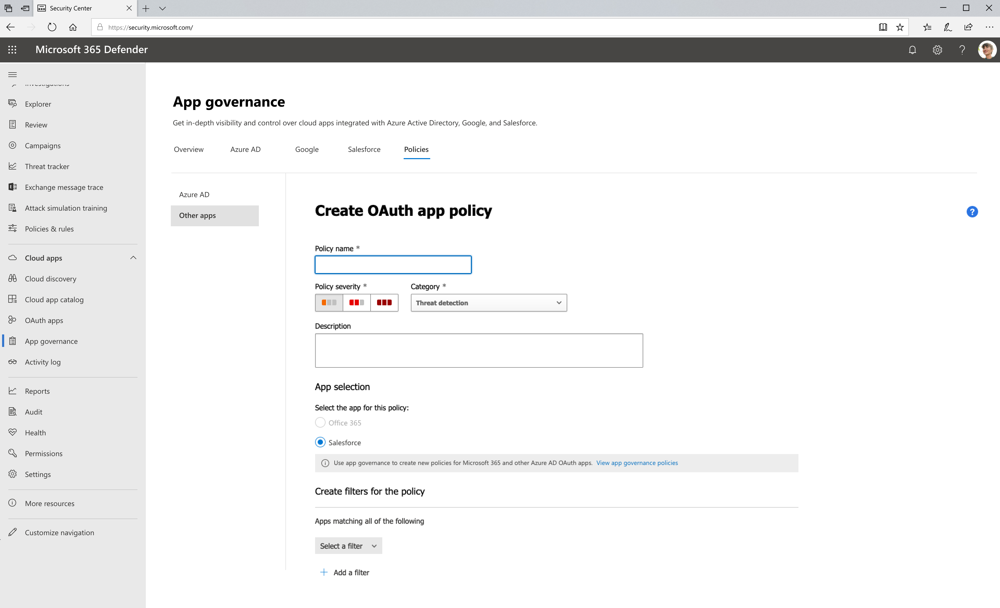
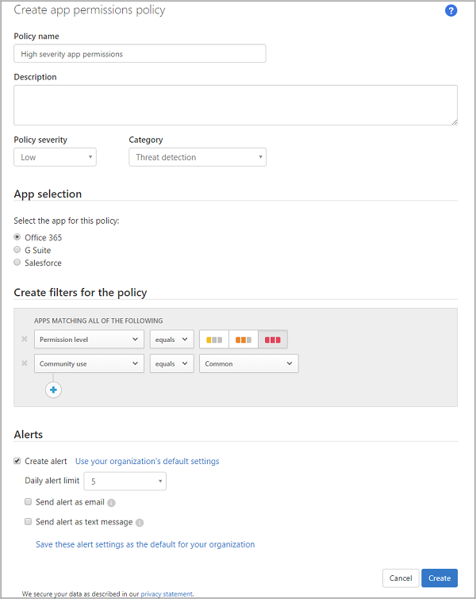

# Create app policies in app governance

Along with a built-in set of capabilities to detect anomalous app behavior and generate alerts based on machine learning algorithms, policies in app governance enable you to:

- Specify conditions by which app governance alerts you to app behavior for automatic or manual remediation.

- Enforce the app compliance policies for your organization.

Use app governance to create OAuth policies for apps connected to Microsoft 365, Google Workspace, and Salesforce.

 

>[!VIDEO https://www.microsoft.com/videoplayer/embed/RE4YU37]

## Create OAuth app policies for Microsoft Entra ID

For apps connected to Microsoft Entra ID, create app policies from provided templates that can be customized, or create your own custom app policy.

1. To create a new app policy for Azure AD apps, go to **Microsoft Defender XDR > App governance > Policies > Azure AD**.

    For example:

    :::image type="content" source="media/app-governance-app-policies-create/azure-ad-policies.jpg" alt-text="Screenshot of the Azure AD tab.":::

1. Select the **Create New Policy** option, and then do one of the following steps:

    - To create a new app policy from a template, choose the relevant template category followed by the template in that category.
    - To create a custom policy, select the **Custom** category.

    For example:

    :::image type="content" source="media/app-governance/app-governance-create-policy.png" alt-text="Screenshot of a Choose a policy template page.":::

## App policy templates

To create a new app policy based on an app policy template, on the **Choose App policy template page**, select a category of app template, select the name of the template, and then select **Next**.

The following sections describe the app policy template categories.

### Usage

The following table lists the app governance templates supported to generate alerts for app usage.

|Template name|Description|
|---|---|
|**New app with high data usage**|Find newly registered apps that have uploaded or downloaded large amounts of data using Microsoft Graph and EWS APIs. This policy checks the following conditions:  <li>Registration age: Seven days or less (customizable) <li>Data usage: Greater than 1 GB in one day (customizable)|
|**Increase in users**|Find apps with a sizable increase in the number of users. This policy checks the following conditions:   <li> Time range: Last 90 days  <li> Increase in consenting users: At least 50% (customizable)|

### Permissions

The following table lists the app governance templates supported to generate alerts for app permissions.

|Template name|Description|
|---|---|
|**Overprivileged app**|Find apps that have unused Microsoft Graph API permissions. These apps have been granted permissions that could be unnecessary for regular use.|
|**New highly privileged app**|Find newly registered apps that have been granted write access and other powerful permissions to Microsoft Graph and other common Microsoft first-party APIs. This policy checks the following conditions:  <li>Registration age: Seven days or less (customizable)|
|**New app with non-Graph API permissions**|Find newly registered apps that have permissions to non-Graph APIs. These apps can expose you to risks if the APIs they access receive limited support and updates.  This policy checks the following conditions:  <li>Registration age: Seven days or less (customizable) <li> Non-Graph API permissions: Yes|

### Certification

The following table lists the app governance templates supported to generate alerts for Microsoft 365 certification.

|Template name|Description|
|---|---|
|**New uncertified app**|Find newly registered apps that don’t have publisher attestation or Microsoft 365 certification. This policy checks the following conditions:  <li>Registration age: Seven days or less (customizable) <li>Certification: No certification (customizable)|

## Custom policies

Use a custom app policy when you need to do something not already done by one of the built-in templates.

- To create a new custom app policy, first select **Create new policy** on the **Policies** page. On the **Choose App policy template page**, select the **Custom** category, the **Custom policy** template, and then select **Next**.

1. On the **Name and description** page, configure the following:

    - Policy Name
    - Policy Description
    - Select the policy severity, which sets the severity of alerts generated by this policy.
      - High
      - Medium
      - Low

2. On the **Choose Policy settings and conditions** page, for **Choose which apps this policy is applicable for**, select:

    - All Apps
    - Choose specific apps
    - All apps except

3. If you choose specific apps, or all apps except for this policy, select **Add apps** and select the desired apps from the list. In the **Choose apps** pane, you can select multiple apps to which this policy applies, and then select **Add**. Select **Next** when you're satisfied with the list.

4. Select **Edit conditions**. Select **Add condition** and choose a condition from the list. Set the desired threshold for your selected condition. Repeat to add more conditions. Select **Save** to save the rule, and when you're finished adding rules, select **Next**.

    > [!NOTE]
    > Some policy conditions are only applicable to apps that access Graph API permissions. When evaluating apps that access only non-Graph APIs, app governance will skip these policy conditions and proceed to check only other policy conditions.

5. Here are the available conditions for a custom app policy:

   | Condition                            | Condition values accepted                                    | Description                                                  | More information                                             |
   | ------------------------------------ | ------------------------------------------------------------ | ------------------------------------------------------------ | ------------------------------------------------------------ |
   | **Registration age**                     | Within last X days                                           | Apps that were registered to Microsoft Entra ID within a specified period from the current date |                                                              |
   | **Certification**                        | No certification, Publisher attested, Microsoft 365 Certified | Apps that are Microsoft 365 Certified, have a publisher attestation report, or neither | [Microsoft 365 Certification](/microsoft-365-app-certification/docs/enterprise-app-certification-guide) |
   | **Publisher verified**                   | Yes or No                                                    | Apps that have verified publishers                           | [Publisher Verification](/azure/active-directory/develop/publisher-verification-overview) |
   | **Application permissions** (Graph only) | Select one or more API permissions from list                 | Apps with specific Graph API permissions that have been granted directly | [Microsoft Graph permissions reference](/graph/permissions-reference) |
   | **Delegated permissions** (Graph only)   | Select one or more API permissions from list                 | Apps with specific Graph API permissions given by a user | [Microsoft Graph permissions reference](/graph/permissions-reference) |
   | **Highly privileged**       | Yes or No                                                    | Apps with relatively powerful permissions to Microsoft Graph and other common Microsoft first-party APIs          | An internal designation based on the same logic used by Defender for Cloud Apps. |
   | **Overprivileged** (Graph only)          | Yes or No                                                    | Apps with unused Graph API permissions                       | Apps with more granted permissions than are being used by those apps. |
   | **Non-Graph API permissions**            | Yes or No                                                    | Apps with permissions to non-Graph APIs. These apps can expose you to risks if the APIs they access receive limited support and updates. |                                                              |
   | **Data usage**             | Greater than X GB of data downloaded and uploaded per day    | Apps that have read and written more than a specified amount of data using Microsoft Graph  and EWS APIs |                                                              |
   | **Data usage trend**        | X % increase in data usage compared to previous day          | Apps whose data reads and writes using Microsoft Graph and EWS APIs have increased by a specified percentage compared to the previous day |                                                              |
   | **API access** (Graph only)              | Greater than X API calls per day                             | Apps that have made over a specified number of Graph API calls in a day |                                                              |
   | **API access trend** (Graph only)        | X % increase in API calls compared to previous day           | Apps whose number of Graph API calls have increased by a specified percentage compared to the previous day |                                                              |
   | **Number of consenting users**           | (Greater than or Less than) X consented users                | Apps that have been given consent by a greater or fewer number of users than specified |                                                              |
   | **Increase in consenting users**         | X % increase in users in the last 90 days                    | Apps whose number of consenting users have increased by over a specified percentage in the last 90 days |                                                              |
   | **Priority account consent given**       | Yes or No                                                    | Apps that have been given consent by priority users          | A user with a [priority account](/microsoft-365/admin/setup/priority-accounts). |
   | **Names of consenting users**            | Select users from list                                       | Apps that have been given consent by specific users          |                                                              |
   | **Roles of consenting users**            | Select roles from list                                       | Apps that have been given consent by users with specific roles | Multiple selections allowed. 
 Any Microsoft Entra role with assigned member should be made available in this list. |
   | **Sensitivity labels accessed**          | Select one or more sensitivity labels from the list          | Apps that accessed data with specific sensitivity labels in the last 30 days. |                                                              |
   | **Services accessed** (Graph only)       | Exchange and/or OneDrive and/or SharePoint and/or Teams      | Apps that have accessed OneDrive, SharePoint, or Exchange Online using Microsoft Graph and EWS APIs | Multiple selections allowed.                                 |
   | **Error rate** (Graph only)              | Error rate is greater than X% in the last seven days         | Apps whose Graph API error rates in the last seven days are greater than a specified percentage ||
   | **App origin** (Preview)                          | External or Internal         | Apps that originated within the tenant or registered in an external tenant |                                                    |
   
     All of the specified conditions must be met for this app policy to generate an alert.

6. When you're done specifying the conditions, select **Save**, and then select **Next**.
7. On the **Define Policy Actions** page, select **Disable app** if you want app governance to disable the app when an alert based on this policy is generated, and then select **Next**. Use caution when applying actions because a policy may affect users and legitimate app use.

8. On the **Define Policy Status** page, select one of these options:

    - **Audit mode**: Policies are evaluated but configured actions won't occur. Audit mode policies appear with the status of **Audit** in the list of policies. You should use Audit mode for testing a new policy.
    - **Active**: Policies are evaluated and configured actions will occur.
    - **Inactive**: Policies aren't evaluated and configured actions won't occur.

9. Carefully review all parameters of your custom policy. Select **Submit** when you're satisfied. You can also go back and change settings by selecting **Edit** beneath any of the settings.

## Test and monitor your new app policy

Now that your app policy is created, you should monitor it on the **Policies** page to ensure it's registering an expected number of active alerts and total alerts during testing.

:::image type="content" source="media\app-governance\mapg-cc-policies-policy.png" alt-text="Screenshot of the app governance policies summary page in Microsoft Defender XDR, with a highlighted policy." lightbox="media\app-governance\mapg-cc-policies-policy.png":::

If the number of alerts is an unexpectedly low value, edit the settings of the app policy to ensure you've configured it correctly before setting its status.

Here's an example of a process for creating a new policy, testing it, and then making it active:

1. Create the new policy with severity, apps, conditions, and actions set to initial values and the status set to **Audit mode**.
2. Check for expected behavior, such as alerts generated.
3. If the behavior isn't expected, edit the policy apps, conditions, and action settings as needed and go back to step 2.
4. If the behavior is expected, edit the policy and change its status to **Active**.

For example, the following flow chart shows the steps involved:

:::image type="content" source="media/app-governance/mapg-create-new-policy-process.png" alt-text="Diagram of the create app policy workflow." lightbox="media/app-governance/mapg-create-new-policy-process.png" border="false":::

## Create a new policy for OAuth apps connected to Salesforce and Google Workspace

Policies for OAuth apps trigger alerts only on policies that are authorized by users in the tenant.

**To create a new app policy for Salesforce, Google and other apps**:

1. Go to **Microsoft Defender XDR > App governance > Policies > Other apps**. For example:

    
   
1. Filter the apps according to your needs. For example, you might want to view all apps that request **Permission** to **Modify calendars in your mailbox**.

   > [!TIP]
   > Use the **Community use** filter to get information on whether allowing permission to this app is common, uncommon, or rare. This filter can be helpful if you have an app that's rare and requests permission that has a high severity level or requests permission from many users.
   
   
1. You might want to set the policy based on the group memberships of the users who authorized the apps. For example, an admin can decide to set a policy that revokes uncommon apps if they ask for high permissions, only if the user who authorized the permissions is a member of the Administrators group.

For example:

### Anomaly detection policies for OAuth apps connected to Salesforce and Google Workspace

In addition to Oauth app policies that you can create, Defender for Cloud apps provides out-of-the-box anomaly detection policies that profile metadata of OAuth apps to identify ones that are potentially malicious.

This section is only relevant for Salesforce and Google Workspace applications.

> [!Note]
> Anomaly detection policies are only available for OAuth apps that are authorized in your Microsoft Entra ID.
> The severity of OAuth app anomaly detection policies cannot be modified.

The following table describes the out-of-the-box anomaly detection policies provided by Defender for Cloud Apps:

|Policy  |Description  |
|---------|---------|
|**Misleading OAuth app name**|Scans OAuth apps connected to your environment and triggers an alert when an app with a misleading name is detected. Misleading names, such as foreign letters that resemble Latin letters, could indicate an attempt to disguise a malicious app as a known and trusted app.|
|**Misleading publisher name for an OAuth app**|Scans OAuth apps connected to your environment and triggers an alert when an app with a misleading publisher name is detected. Misleading publisher names, such as foreign letters that resemble Latin letters, could indicate an attempt to disguise a malicious app as an app coming from a known and trusted publisher.|
|**Malicious OAuth app consent**|Scans OAuth apps connected to your environment and triggers an alert when a potentially malicious app is authorized. Malicious OAuth apps may be used as part of a phishing campaign in an attempt to compromise users. This detection uses Microsoft security research and threat intelligence expertise to identify malicious apps.|
|**Suspicious OAuth app file download activities**|For more information, see [Anomaly detection policies](/defender-cloud-apps/anomaly-detection-policy).|

## Next step

[Manage your app policies](app-governance-app-policies-manage.md)
