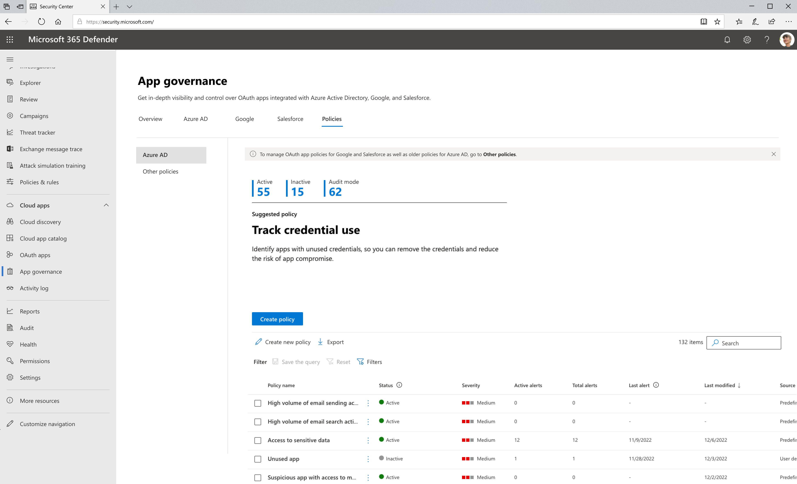

# Get started with app policies

Policies for app governance are a way to implement proactive and reactive alerts and automatic remediation for your specific needs for app compliance in your organization. You can create policies in app governance to manage OAuth apps in Microsoft 365, Google and Salesforce.

There are two types of policies in app governance:

- **Predefined policies**

    App governance is equipped with a set of predefined policies tailored to your environment. They allow you to start monitoring your apps even before you set up any policies, ensuring that you're notified of any app anomalies early on. The app governance threat detection team regularly modifies the underlying conditions and adds new predefined policies regularly. For more information, see [Predefined app policies](app-governance-predefined-policies.md).

- **User defined policies**

    In addition to predefined policies, admins can also use the available conditions to create their custom policies or pick from the available recommended policies.

To see your list of current app policies, go to the **Microsoft Defender XDR > App governance** page and select **Policies**. This shows you a list of all your policies in app governance. 

For example:

> [!NOTE]
> Built-in threat detection policies aren't listed on the **Policies** tab. For more information, see [Investigate threat detection alerts](app-governance-anomaly-detection-alerts.md).
> 

## What’s available on the app policies dashboard

The **App governance** > **Policies** tab shows the number of active, inactive, and audit mode policies, and the following information for each policy:

- **Policy name**
- **Status**

  - **Active**:  All policy evaluation and actions are active.
  - **Inactive**: All policy evaluation and actions are disabled.
  - **Audit mode**: Policy evaluation is active (alerts will trigger) but policy actions are disabled.

- **Severity**: Severity level set on any alerts triggered because of this policy being evaluated as true, which is part of the configuration of the policy.
- **Active alerts**: Number of alerts generated by the policy that have an **In Progress** or **New** status.
- **Total alerts**: Number of both active alerts and resolved alerts for this policy.
- **Last alert**: Date of last generated alert due to this policy.
- **Last Modified**: Date when this policy was last changed.
- **Source**:

  - **Predefined**: Policies created by app governance.
  - **User defined**: Policies created by the tenant admin.

The policy list is sorted by **Last modified** by default. To sort the list by another attribute, select the attribute name.

When you select a policy, you get a detailed policy pane with these extra details:

- **Name**
- **Severity**: Based on the severity level set when the policy was created
- **Description**: A more detailed explanation of the purpose of the policy.
- **Last modified**
- A list of the total and active alerts generated by this policy.

You can edit, activate, deactivate, or delete an app policy by selecting **Edit**, **Delete**, **Activate**, or **Deactivate** in the detailed policy pane, or by selecting the vertical ellipses of the policy in the policy list.

You can also:

- Create a new policy. You can start with an app usage policy or a permissions policy.
- Export the policy list to a comma-separated value (CSV) file. For example, you could open the CVS file in Microsoft Excel and sort the policies by **Severity** and then **Number of Total Alerts**.
- Search the policy list.

## Edit an existing user-defined policy

1. On the **App governance** page, select the **Policies** tab and select the policy you want to edit. A panel opens on the right side with the details of the existing policy.

1. Select **Edit**.

    While you can't change the name of the policy once created, but you can change the description and policy severity as needed. When you're done, select **Next**.

1. Choose whether you want to continue with the existing policy settings or customize them. Select **No, I'll customize the policy** to make changes, and then select **Next**.

1. Choose whether this policy applies to all apps, specific apps, or all apps except the apps you select. Select **Choose apps** to select which apps to apply the policy to, and then select **Next**.

1. Choose whether to modify the existing conditions of the policy. 

    - If you choose to modify the conditions, select **Edit or modify existing conditions for the policy** and choose which policy conditions to apply. 
    - Otherwise, select **Use existing conditions of the policy**. 
  
    When you're done, select **Next**.

1. Choose whether to disable the app if it triggers the policy conditions and then select **Next**.

1. Set the policy status to **Audit** mode, **Active**, or **Inactive**, as needed, and then select **Next**.

1. Review your setting choices for the policy and if everything is the way you want it, select **Submit**.

## Next step

[Create an app policy](app-governance-app-policies-create.md)
