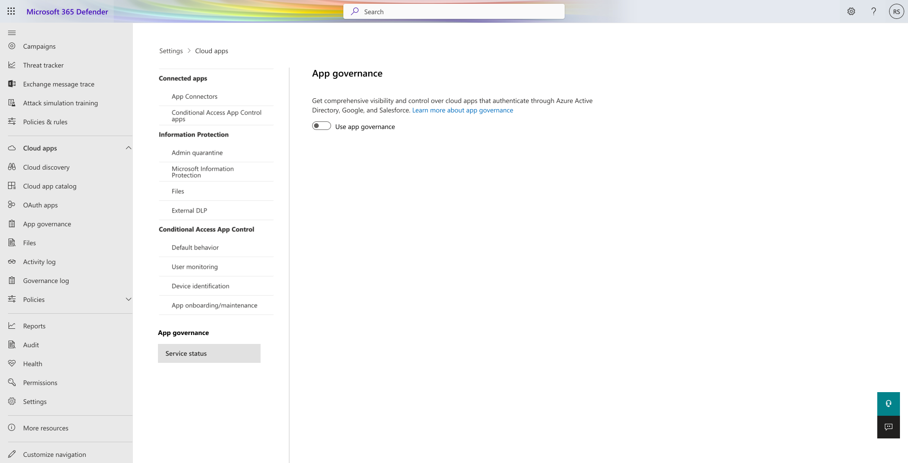
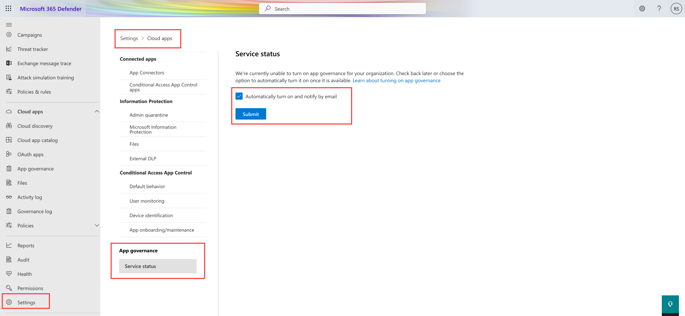

# Get started with app governance

> [!NOTE]
> Starting June 1, 2023, app governance will be included with your Defender for Cloud Apps license. If you are currently an app governance trial customer, please refer to the instructions on this page to learn how to turn on app governance with a Defender for Cloud Apps license before July 31, 2023, and continue using it without any interruption.

## Prerequisites

To activate app governance, first check that you satisfy the following prerequisites:

1. Microsoft Defender for Cloud Apps must be present in your account as either a standalone product or as part of the various [license](#licensing) packages.
1. You must have [one of the appropriate roles](#roles) to turn on app governance and access it.
1. Your organization's billing address must be in a region **other than** Brazil, South Korea, Switzerland, Norway, South Africa, or United Arab Emirates.
1. Your organization must use commercial cloud, not government cloud such as GCC, GCC-H, DoD and Fairfax. App governance is not yet available in government clouds.

## Turn on app governance

If you satisfy the prerequisites, navigate to [Microsoft 365 Defender > Settings > Cloud Apps > App governance](https://security.microsoft.com/cloudapps/settings) and turn app governance on.

If you are unable to see the app governance option in the settings page, it can be due to the following reasons:

1. App governance is not yet supported in your region.

1. Your organization is in a government cloud.

1. We are unable to serve you at the moment due to capacity constraints.

You can join the waitlist and provide your consent, so we can turn on app governance for your organization automatically when app governance becomes available for you. When we turn on app governance, we will notify you by email.

> [!NOTE]
> If you are currently running a free trial of app governance and wish to use it without interruption, go to [Microsoft 365 Defender > Settings > Cloud Apps > App governance](https://security.microsoft.com/cloudapps/settings) and switch the app governance toggle on before July 31, 2023.  
>   
> If you want to opt out of app governance, you don’t need to take any action. App governance will automatically turn off after July 31, 2023. Your data will be deleted permanently in accordance with our data retention policies. To keep a copy of your app and policy data, export them manually from the app governance pages.

If you aren't already a Defender for Cloud Apps customer, you can [sign up for a free trial](https://www.microsoft.com/security/business/cloud-apps-defender). Then, go to [Microsoft 365 Defender > Settings > Cloud Apps > App governance](https://security.microsoft.com/cloudapps/settings) and turn on app governance. 

## Licensing

App governance is available to organizations with a valid Defender for Cloud Apps license, including:

- Microsoft Defender for Cloud Apps (standalone)

- Enterprise Mobility & Security E5/A5

- Microsoft 365 Security E5/A5/F5

- Microsoft 365 E5/A5/F5

- Microsoft 365 Compliance E5/A5/F5

- Microsoft 365 F5 Security & Compliance

## Roles

You must have one of these roles to turn on app governance:

- Global Admin

- Company Admin

- Security Admin          

- Compliance Admin  

- Compliance Data Admin

- Cloud App Security admin

One of the following administrator roles is required to see app governance pages or manage policies and settings:

- Application Administrator
- Cloud Application Administrator
- Company or Global Administrator
- Compliance Administrator
- Compliance Data Administrator
- Global Reader
- Security Administrator
- Security Operator
- Security Reader (read-only)

Here are the capabilities for each role.

| Role | Read the dashboard | Read all apps |Read policies | Create, update, or delete policies | Read alerts | Update alerts | Read settings | Update settings | Read Remediation | Update Remediation |
|:-------|:-----|:-------|:-------|:-------|:-------|:-------|:-------|:-------|:-------|:-------|
| Application Administrator | 

 | 

 | 

 | 

 | 

 | 

 | 

 | 

 | 

 | 

 |
| Cloud Application Administrator | 

 | | | | | | | | | |
| Company or Global Administrator | 

 | 

 | 

 | 

 | 

 | 

 | 

 | 

 | 

 | 

 |
| Compliance Administrator | 

 | 

 | 

 | 

 | 

 |  | 

 | 

 | 

 | |
| Compliance Data Administrator | 

 | 

 | 

 | 

 | 

 |  | 

 | 

 | 

 | |
| Global Reader  | 

 | 

 | 

 |  | 

 |  | 

 |  | | |
| Security Administrator | 

 | 

 | 

 | 

 | 

 |  | 

 | 

 | 

 | |
| Security Operator | 

 | 

 | 

 | 

 | 

 | 

 | 

 | 

 | 

 | |
| Security Reader  | 

 | 

 | 

 |  | 

 |  | 

 |  | 

 | |
|||||||||| | |

For more information about each role, see [Administrator role permissions](/azure/active-directory/roles/permissions-reference).

> [!NOTE]
> App governance alerts will not flow to Microsoft 365 Defender or show up in app governance until you have provisioned both Defender for Cloud Apps and Microsoft 365 Defender by accessing their respective portals at least once.

