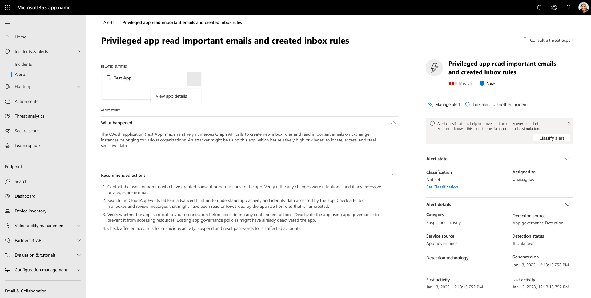

# Manage app governance alerts

>*[Microsoft 365 licensing guidance for security & compliance](/office365/servicedescriptions/microsoft-365-service-descriptions/microsoft-365-tenantlevel-services-licensing-guidance/microsoft-365-security-compliance-licensing-guidance).*

You can investigate alerts about malicious cloud apps and apps that may present risks to your organization in the Microsoft 365 Defender **Alerts** or **Incidents** pages.

:::image type="content" source="media\app-governance\mapg-cc-alerts.png" alt-text="The app governance alerts summary page in the Microsoft 365 Defender." lightbox="media\app-governance\mapg-cc-alerts.png":::

The **Alerts** page, by default lists new alerts generated by app governance based on threat detection rules and your active policies. View the details of a specific alert by selecting the alert. A page will open with additional information about the alert and options for managing the alert.

In the page, you can get additional information from the **Alert story** section:

- Exact details about why the alert was created under **What happened**
- Information on how to remediate the alert under **Recommended actions**

To investigate and take action on an app in app governance, select the app entity card under **Related entities** and then select **View app details**.

App policies that you configured for automatic remediation from the **Action** will have a status of **Resolved**.

To manage the app governance alert:

1. Investigation: Examine the information in the alert and change its status to **Mark in progress**.
2. Resolution: After your investigation and, as needed, the determination of app policy changes or continued app support in your tenant, change its status to **Resolved**.

Based on app alert patterns, you can update the appropriate app policy and change its **Action** setting to perform automatic remediation. This removes your need to investigate and manually resolve future alerts that are generated by the app policy. For more information, see [Manage your app policies](app-governance-app-policies-manage.md).

## Ban or approve an OAuth app connected to Salesforce and Google Workspace

> [!Note]
> This section is only relevant for Salesforce and Google Workspace applications.
1. On the **OAuth apps** page, select the app to open the **App drawer** to view more information about the app and the permissions it was granted.
    - Select **Permissions** to view a full list of permissions that were granted to the app.
    - Under **Community use**, you can view how common the app is in other organizations.
    - Select **Related activity** to view the activities that are listed in the activity log related to this app.

1. To ban the app, select the ban icon at the end of the app row in the table.

    

    - You can choose if you want to tell users the app they installed and authorized has been banned. The notification lets users know the app will be disabled and they won't have access to the connected app. If you don't want them to know, unselect **Notify users who granted access to this banned app** in the dialog.
    - It's recommended that you let the app users know their app is about to be banned from use.

    

1. Type the message you want to send to the app users in the Enter a custom notification message box. Select **Ban app** to send the mail, and ban the app from your connected app users.

1. To approve the app, select the approve icon at the end of the row in the table.

    

    - The icon turns green, and the app is approved for all your connected app users.
    - When you mark an app as approved, there's no effect on the end user. This color change is meant to help you see the apps that you've approved to separate them from ones that you haven't reviewed yet.

## Revoke OAuth app connected to Salesforce and Google Workspace and notify user

> [!Note]
> This section is only relevant for Salesforce and Google Workspace applications.
For Google Workspace and Salesforce, it's possible to revoke permission to an app or to notify the user that they should change the permission. When you revoke permission it removes all permissions that were granted to the application under "Enterprise Applications" in Azure AD.

1. On the **OAuth apps** page, select the three dots at the end of the app row and select **Notify user**. By default, the user will be notified as follows: *You authorized the app to access your Google Workspace account. This app conflicts with your organization's security policy. Reconsider giving or revoking the permissions you gave this app in your Google Workspace account. To revoke app access, go to: [https://security.google.com/settings/security/permissions?hl=en&pli=1](https://security.google.com/settings/security/permissions?hl=en&pli=1) Select the app and select 'Revoke access' on the right menu bar.* You can customize the message that is sent.
1. You can also revoke permissions to use the app for the user. Select the icon at the end of the app row in the table and selecting **Revoke app**.

    
