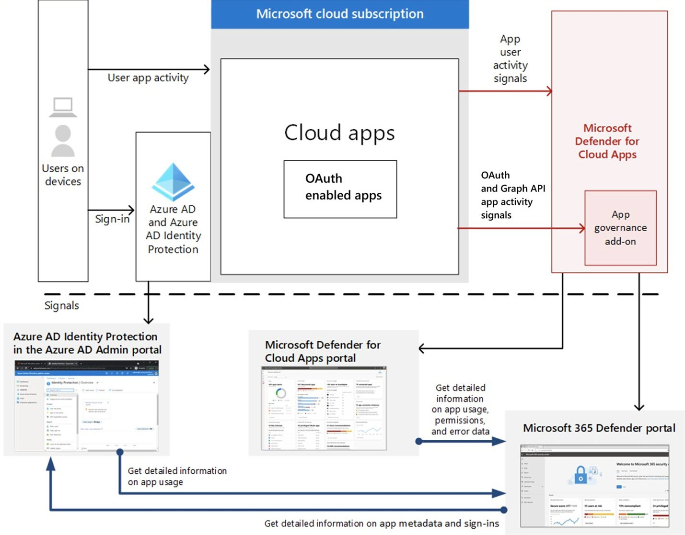

# App governance add-on to Defender for Cloud Apps in Microsoft 365 Defender

> [!NOTE]
> To sign up for app governance, see [Get started with app governance](app-governance-get-started.md).

Cyberattacks have become increasingly sophisticated in the ways they exploit the apps you have deployed in your on-premises and cloud infrastructures, establishing a starting point for privilege escalation, lateral movement, and exfiltration of your data. To understand the potential risks and stop these types of attacks, you need to gain clear visibility into your organization’s app compliance posture to quickly identify when an app exhibits anomalous behaviors and to respond when these behaviors present risks to your environment, data, and users.

The app governance add-on feature to Defender for Cloud Apps is a security and policy management capability designed for OAuth-enabled apps registered on Azure Active Directory (Azure AD). App governance delivers full visibility, remediation, and governance into how these apps and their users access, use, and share your sensitive data stored in Microsoft 365 through actionable insights and automated policy alerts and actions.

App governance provides you with comprehensive:

- **Insights**: See a view of all the third-party apps for the Microsoft 365 platform in your tenant on a single dashboard. You can see all the apps’ status and alert activities and react or respond to them.
- **Governance**: Create proactive or reactive policies for app and user patterns and behaviors and protect your users from using non-compliant or malicious apps and limiting the access of risky apps to your data.
- **Detection**: Be alerted and notified when there are anomalies in app activity and when non-compliant, malicious, or risky apps are used.
- **Remediation**: Along with automatic remediation capabilities, use remediation controls in a timely manner to respond to anomalous app activity detections.

App governance is a platform-based solution that is an integral part of the Microsoft 365 app ecosystem. App governance oversees and governs OAuth-enabled apps that are registered with Azure AD. App governance provides you with application behavior controls to help strengthen the security and compliance posture of your IT infrastructure. 
 
> [!VIDEO https://www.microsoft.com/videoplayer/embed/RE4S7sp]

## A first glimpse at app governance

To see the app governance dashboard, go to [aka.ms/appgovernance](https://aka.ms/appgovernance). Note that your sign-in account must have one of the [administrator roles](app-governance-get-started.md#roles) to view any app governance data.

## App governance integration with Azure AD and Defender for Cloud Apps

App governance, Azure AD, and Defender for Cloud Apps collect and provide different data sets:

- App governance provides detailed information about an app’s activity at the API level.
- Azure AD provides foundational app metadata and detailed information on sign-ins to apps.
- Defender for Cloud Apps provides app risk information.

By sharing information across app governance, Azure AD, and Defender for Cloud Apps, you can display aggregate information in one portal and easily link to another portal for more information. Here are some examples:

- App sign-in information in app governance:

  From the app governance portal, you can see the aggregated sign-in activity for each app and link back to the Azure Active Directory admin center for the details of sign-in events.

- API usage information in the Defender for Cloud Apps portal:

  From the Defender for Cloud Apps portal, you can see API usage level and aggregate data transfer and link to the app governance portal for the details.

Here's a summary of the integration.

App governance sends its alerts to Microsoft 365 Defender to enable more detailed analysis of app-based security incidents. App governance alerts show up in Microsoft 365 Defender alerts list as alerts with the Detection source field set to "App Governance".
