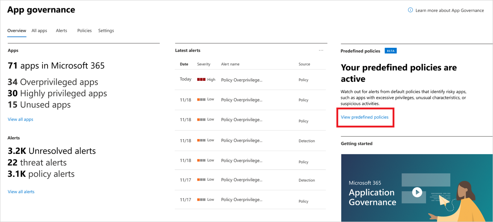
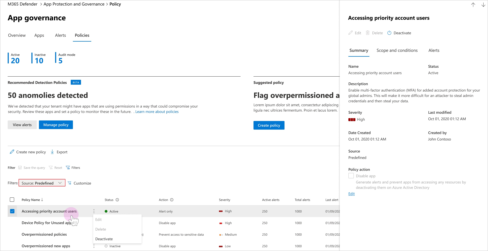

# Predefined app policies

App governance contains a set of out of the box policies to detect anomalous app behaviors. These policies are activated by default, but you can deactivate them if you choose to. 
 

> [!VIDEO https://learn-video.azurefd.net/vod/player?id=22872b35-18aa-424d-bec7-3f77869a5e47]

## Working with predefined policies

- To view available predefined policies, go to **Microsoft Defender XDR** > **App governance** > **Overview** and select **View predefined policies** in the **Predefined policies** section.  

    

- Alternatively, to view available predefined policies, go to **Microsoft Defender XDR** > **App governance** > **Policies**  and filter for **Source: Predefined** to see the list of available predefined policies.

    

- To view the description of the policy, select the policy to see the policy summary and description in the detailed policy window.
- To change the status of a policy (deactivate / activate), select the policy and select **Deactivate** in the detailed policy window.
- By default, predefined policies trigger alerts when the conditions are met. You can choose to automatically disable the app when the policy triggers. Use caution when applying these actions because a policy may affect users and legitimate app use. To disable the app, mark the **Disable app** box under **Policy action** in the summary section and select **Save**.
- Alerts generated from predefined policies are listed as app governance policy alerts in the Microsoft Defender XDR alerts queue.

## Next steps

- [Create an app policy](app-governance-app-policies-create.md)
