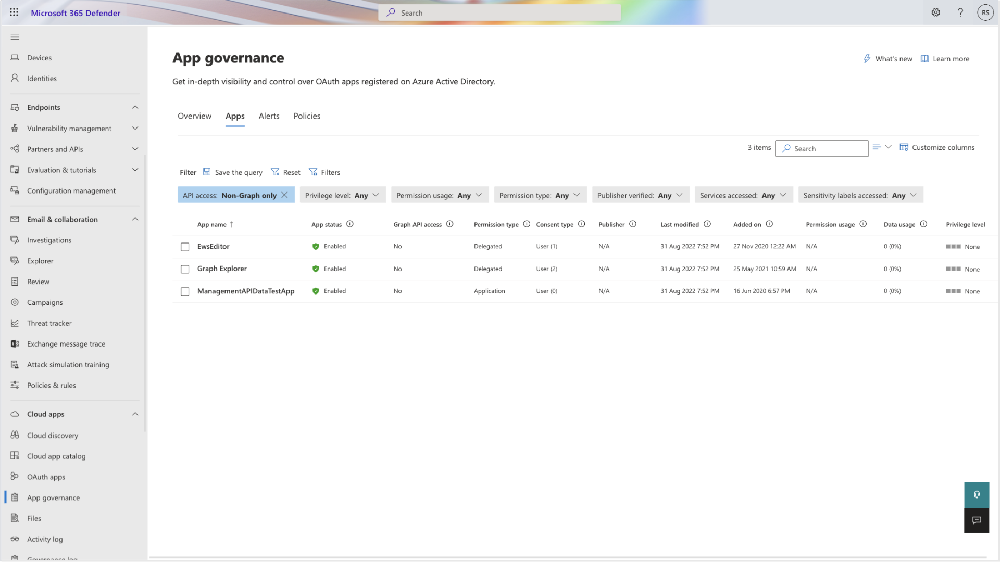
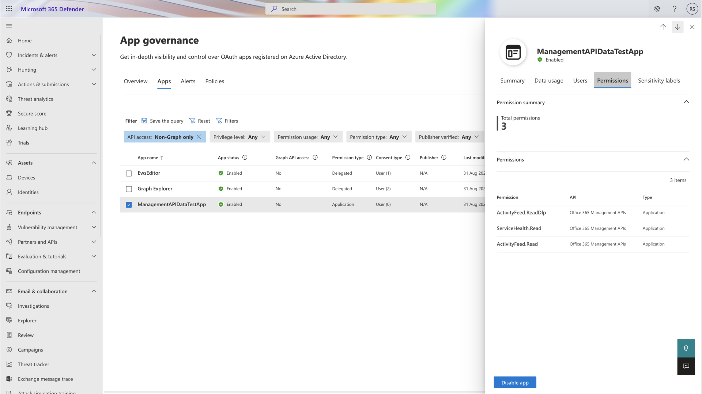
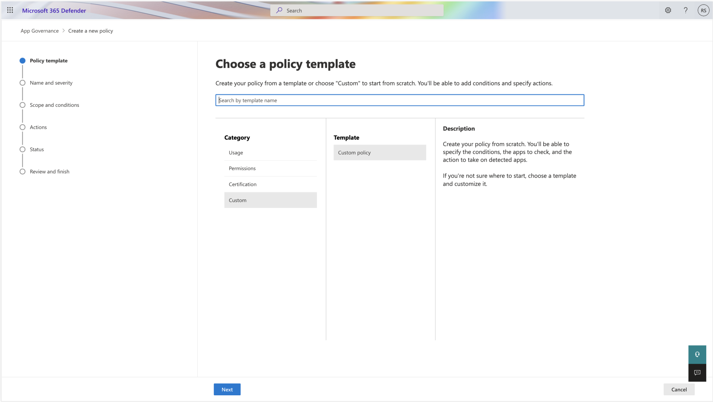

# Secure apps accessing non-Graph APIs using app governance

Many apps use APIs other than Microsoft Graph to access Microsoft 365 and additional resources. With visibility over such apps, you can identify and defend against risks inherent to these apps as well as risks from APIs that they access, some of which might receive limited support and updates.

App governance provides visibility over OAuth apps registered on Azure Active Directory, regardless of whether they access Graph API or other APIs. Additionally, you can monitor these apps and automatically take action if they're non-compliant or exhibit suspicious behavior.

You can better protect your organization with the new functionalities and enhancements in the following ways:

- Get improved coverage of OAuth apps with powerful app governance insights and monitoring capabilities.
- Automatically get alerted for any threats or anomalies by apps using non-Graph or legacy APIs.
- Get an enhanced experience for investigation of apps with additional filters, columns, and properties.

## Identify apps that use only non-Graph APIs

App governance lists all Azure AD OAuth apps in the [Apps page](https://security.microsoft.com/cloudapps/app-governance?viewid=allApps). To find apps that don't use Graph API, apply the API access filter, and select **Non-Graph only**. You can also use the Graph API access column to identify apps that don't have Graph API permissions among the listed apps.

## View non-Graph APIs used by OAuth apps

To view the APIs used by an app, go to the **Permissions** tab on the app details flyout pane. You can find the names of the consented permissions and the APIs accessed by the app.

## Track API access

With visibility over apps that access non-Graph APIs, you can now use the **New app with non-Graph API permissions** policy template or the **Non-graph API permission** policy condition to find and monitor such apps.

## Next steps

[Determine your overall app compliance posture](app-governance-visibility-insights-compliance-posture.md).
