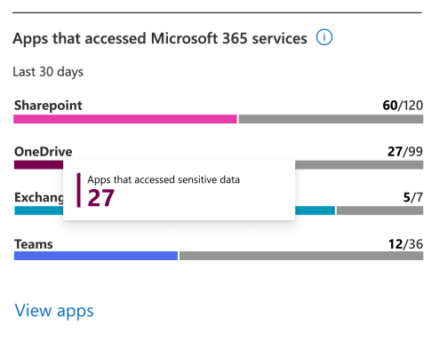

# Determine your app compliance posture

From this page, you can see:

- - For OAuth-enabled apps that use the Microsoft Graph API:

     - How many are in your tenant
  - How many might be overprivileged
  - How many are highly privileged

   From this information, you can determine the level of risk to your organization by overprivileged and highly privileged apps.
   
- For incidents:

  - How many active incidents your tenant has
  - How many are based on app governance detections (**Threat incidents**)
  - How many are based on app policies you have in place (**Policy incidents**)
  - The 10 latest incidents

- From this information, you can determine how quickly incidents are being generated and the relative number of detected and policy-based incidents.

- For data usage:

  - Total data accessed by apps in the tenant through Graph API over the current month and previous three calendar months. (Currently includes emails, files, and chat and channel messages read and written by apps that access Microsoft 365 using Graph API)
  - Data usage over the current month and previous three calendar months, broken down by resource type. (Currently includes emails, files, and chat and channel messages read and written by apps that access Microsoft 365 using Graph API)
   
- For apps that access data on Microsoft 365:

- The number of apps that have accessed data on SharePoint, OneDrive, Exchange Online, or Teams in the last 30 days 
- For sensitivity labels accessed:

- The number apps that have accessed content with sensitivity labels on SharePoint, OneDrive, Exchange Online or Teams in the last 30 days 
  
- From this information, you can determine if there are anomalous spikes in data usage in your Microsoft 365 tenant.

