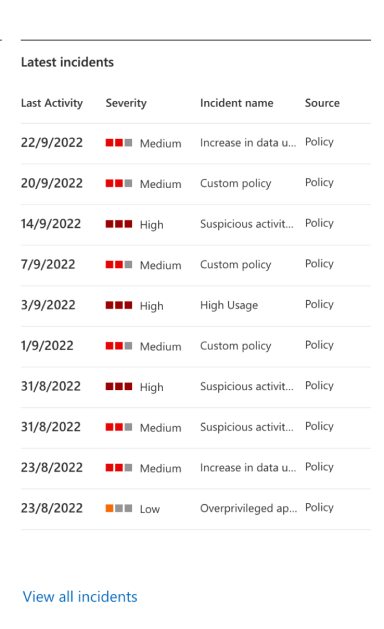
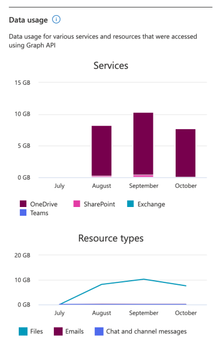
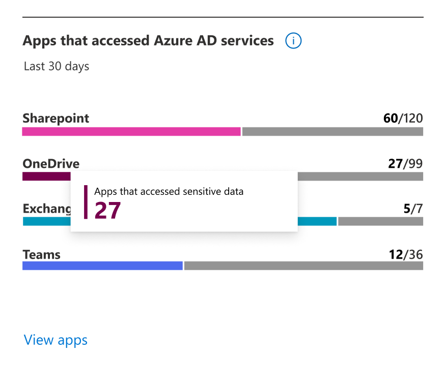

# Determine your app compliance posture

This article describes the cards shown on the **App governance > Overview** page with compliance posture data.

The **Overview** page shows the following details:

|Apps / incidents  |Details shown  | Use this data to... |
|---------|---------|---------|
|**OAuth-enabled apps that use the Microsoft Graph API**     |  - How many apps are in your tenant  - How many apps might be overprivileged  - How many apps are highly privileged | Determine the level of risk to your organization by overprivileged and highly privileged apps. |
|**For incidents**    | - How many active incidents your tenant has  - How many are based on app governance detections (**Threat incidents**)  - How many are based on app policies you have in place (**Policy incidents**)  - The 10 latest incidents  | Determine how quickly incidents are being generated and the relative number of detected and policy-based incidents. |

For example:

> [!div class="mx-imgBorder"]
> 
> 
> [!div class="mx-imgBorder"]
> 

## Data usage cards

Data usage cards show the following types of information:

- **Total data accessed by apps** in the tenant through Microsoft Graph and EWS APIs over the current month and previous three calendar months. (Currently includes emails, files, and chat and channel messages read and written by apps that access Microsoft 365 using Microsoft Graph and EWS APIs)

- **Data usage over the current month and previous three calendar months**, broken down by resource type. (Currently includes emails, files, and chat and channel messages read and written by apps that access Microsoft 365 using Microsoft Graph and EWS APIs)

For example:

> [!div class="mx-imgBorder"]
> 

## Apps that access data on Microsoft 365

For apps that access data on Microsoft 365, cards show the number of apps that have accessed data on SharePoint, OneDrive, Exchange Online, or Teams using Microsoft Graph and EWS APIs in the last 30 days.

For example:

> [!div class="mx-imgBorder"]
> 

## Sensitivity labels accessed

For sensitivity labeling data, cards show the number apps that have accessed content with sensitivity labels on SharePoint, OneDrive, Exchange Online or Teams using Microsoft Graph and EWS APIs in the last 30 days.

For example:

> [!div class="mx-imgBorder"]
> 

## Next steps

[Get insights on and regulate access to sensitive content](app-governance-visibility-insights-sensitive-content.md)