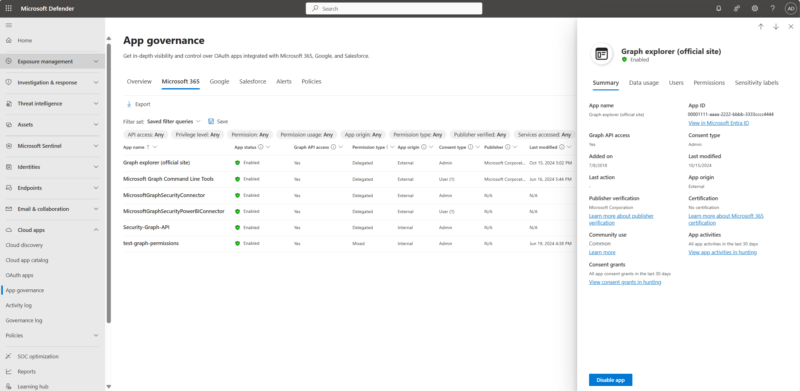

# Get started with visibility and insights

Start by viewing the [app governance dashboard](https://aka.ms/appgovernance) on the **App governance > Overview** tab in the Microsoft Defender Portal.

Your sign-in account must have one of the [required app governance administrator roles](app-governance-get-started.md#roles) to view any app governance data.

For example:

:::image type="content" source="media/app-governance-visibility-insights-get-started/overview.png" alt-text="Screenshot of the App governance overview page in Microsoft Defender XDR.":::

## What’s available on the Overview tab

The dashboard on the **Overview** tab contains a summary of your app ecosystem:

|Dashboard element  |Description  |
|---------|---------|
|**Tenant summary**     | The count of key app and incident categories.        |
|**Latest incidents**     |   The 10 most recent active incidents in the tenant      |
|**Data usage**     |  Mouse over each month column in the graph to see the corresponding value:   - **Total data usage**: Tracks total data accessed by all apps in the tenant through Graph API over the last four calendar months. Currently includes emails, files, and chat and channel messages read and written by apps that access Microsoft 365 using Graph API.    - **Data usage by resource type**: Data usage over the last four calendar months, broken down by resource type. Currently includes emails, files, and chat and channel messages read and written by apps that access Microsoft 365 using Graph API.       |
|**Apps that accessed data across Microsoft 365 services**     |  The count of apps that have accessed data with and without sensitivity labels on SharePoint, OneDrive, Exchange Online, and Teams in the last 30 days.   For example, in the screenshot above, 99 apps accessed OneDrive in the last 30 days, out of which 27 apps accessed data with sensitivity labels.       |
|**Sensitivity labels accessed**     |     Count of apps that accessed labeled data across SharePoint, OneDrive, Exchange Online, and Teams in the last 30 days, sorted by the count.   For example, in the screenshot above, 90 apps accessed confidential data on SharePoint, OneDrive, Exchange Online, and Teams.    |
|**Predefined policies**     |  Count of active and total predefined policies that identify risky apps, such as apps with excessive privileges, unusual characteristics, or suspicious activities.       |
|**App categories**     |  The top apps sorted by these categories:    - **All categories**: Sorts across all available categories.   - **Highly privileged**: High privilege is an internally determined category based on platform machine learning and signals.   - **Overprivileged**: When app governance receives data that indicates that a permission granted to an application hasn't been used in the last 90 days, that application is overprivileged. App governance must be operating for at least 90 days to determine if any app is overprivileged.   - **Unverified publisher**: Applications that haven't received [publisher certification](/azure/active-directory/develop/publisher-verification-overview) are considered unverified.   - **App only permissions**: [Application permissions](/azure/active-directory/develop/v2-permissions-and-consent#permission-types) are used by apps that can run without a signed-in user present. Apps with permissions to access data across the tenant are potentially a higher risk. - **New apps**: New apps that have been registered in the last seven days.       |

## View app insights

One of the primary value points for app governance is the ability to quickly view app alerts and insights. 

**To view insights for your apps**:

1. On the **App governance** page, select one of the apps tabs to display your apps.

    The apps listed depend on the apps present in your tenant.
   
1. Filter the apps listed using one or more of the following default filter options:

   - **API access**
      
   - **Privilege level**
      
   - **Permission**
      
   - **Permission usage**
      
   - **App origin**
      
   - **Permission type**
      
   - **Publisher verified**
      
    Use one of the following nondefault filters to further customize the apps listed:
   
   - **Last modified**
      
   - **Added on**
      
   - **Certification**
   
   - **Users**
   
   - **Services accessed**
   
   - **Data usage**
   
   - **Sensitivity labels accessed**
   
   > [!TIP]
   > Save the query to save the currently selected filters for use again in the future.
   
   
1. Select the name of an app to view more details. For example:

   
   
   
   
The details pane lists the app usage over the past 30 days, the users who have consented to the app, and the permissions assigned to the app. 

For example, an administrator might review the activity and permissions of an app that is generating alerts and make a decision to disable the app using the **Disable App** button towards the bottom of the app details pane.

## Next steps

[Get detailed insights on a specific app](app-governance-visibility-insights-view-apps.md).
