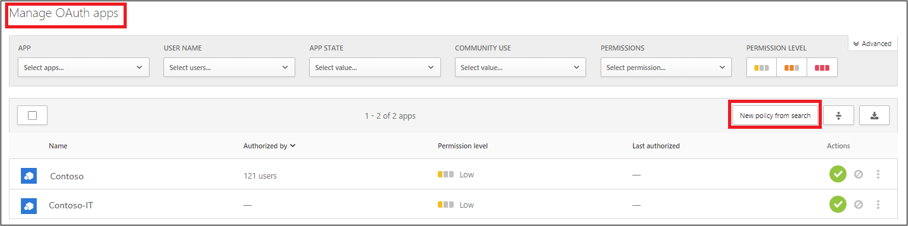

---
# required metadata

title: Create policies to control OAuth apps in Cloud App Security
description: This article provides instructions for creating and working with app permission policies in Microsoft Cloud App Security.
keywords:
author: shsagir
ms.author: shsagir
manager: shsagir
ms.date: 11/27/2019
ms.topic: conceptual
ms.collection: M365-security-compliance
ms.prod:
ms.service: cloud-app-security
ms.technology:

# optional metadata

#ROBOTS:
#audience:
#ms.devlang:
ms.reviewer: reutam
ms.suite: ems
#ms.tgt_pltfrm:
ms.custom: seodec18

---
# OAuth app policies

*Applies to: Microsoft Cloud App Security*

In addition to the [existing investigation of OAuth apps](manage-app-permissions.md) connected to your environment, you can set permission policies to so that you get automated notifications when an OAuth app meets certain criteria. For example, you can automatically be alerted when there are apps that require a high permission level and were authorized by more than 50 users.

OAuth app policies enable you to investigate which permissions each app requested and which users authorized them for Office 365, G Suite, and Salesforce. You're also able to mark these permissions as approved or banned. Marking them as banned will revoke permissions for each app for each user who authorized it.

## Create a new OAuth app policy

There are two ways to create a new OAuth app policy. The first way is under **Investigate** and the second is under **Control**.

To create a new OAuth app policy:

1. Under **Investigate** select **OAuth app**.

1. Filter the apps according to your needs, for example, you can view all apps that request **Permission** to **Modify calendars in your mailbox**.
1. Click the **New policy from search** button.
    
1. You can use the **Community use** filter to get information on whether allowing permission to this app is common, uncommon, or rare. This filter can be helpful if you have an app that's rare and requests permission that has a high severity level or requests permission from many users.
1. You can set the policy based on the group memberships of the users who authorized the apps. For example, an admin can decide to set a policy that revokes uncommon apps if they ask for high permissions, only if the user who authorized the permissions is a member of the administrators group.

Alternatively, you can also create the policy by clicking **Control** followed by **Policies**. Then click **Create policy** followed by **OAuth app policy**.

   

## OAuth app anomaly detection policies

In addition to OAuth app policies you can create, there are the following out-of-the-box anomaly detection policies that profile metadata of OAuth apps to identify ones that are potentially malicious:

| Policy name | Policy description |
| --- | --- |
| Misleading OAuth app name | Scans OAuth apps connected to your environment and triggers an alert when an app with a misleading name is detected. Misleading names, such as foreign letters that resemble Latin letters, could indicate an attempt to disguise a malicious app as a known and trusted app. |
| Misleading publisher name for an OAuth app | Scans OAuth apps connected to your environment and triggers an alert when an app with a misleading publisher name is detected. Misleading publisher names, such as foreign letters that resemble Latin letters, could indicate an attempt to disguise a malicious app as an app coming from a known and trusted publisher. |
| Malicious OAuth app consent | Scans OAuth apps connected to your environment and triggers an alert when a potentially malicious app is authorized. Malicious OAuth apps may be used as part of a phishing campaign in an attempt to compromise users. |

<!--| Suspicious OAuth app name | Scans OAuth apps connected to your environment and triggers an alert when an app with a suspicious name is detected. Suspicious names, such as names of known apps published by unknown publishers, could indicate an attempt to disguise a malicious app as a known and trusted app. |
| Non-secure redirect URL is used by an OAuth app | Scans OAuth apps connected to your environment and triggers an alert when an app uses a non-secure redirect URL (for example, does not use the HTTPS protocol), which exposes sensitive data to interception. |-->

> [!NOTE]
> Anomaly detection policies are only available for OAuth apps that are authorized in your Azure Active Directory.

## Next steps

> [!div class="nextstepaction"]
> [Data protection policies](data-protection-policies.md)

[!INCLUDE [Open support ticket](includes/support.md)]
