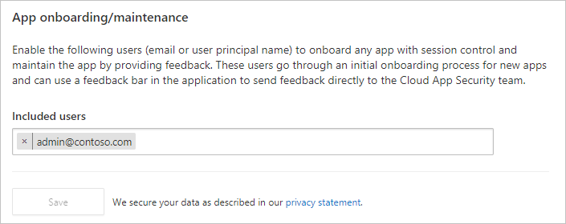
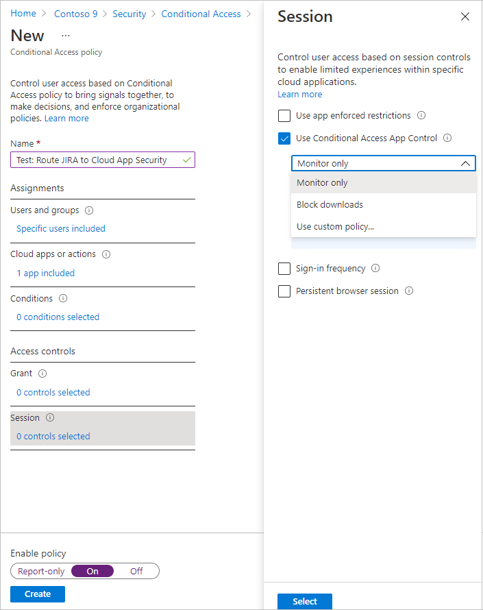
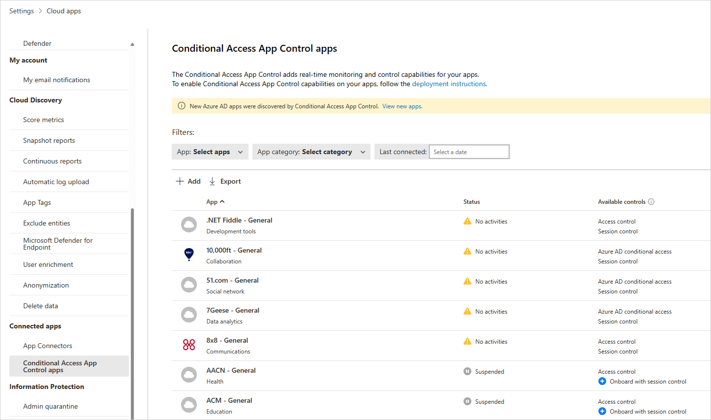
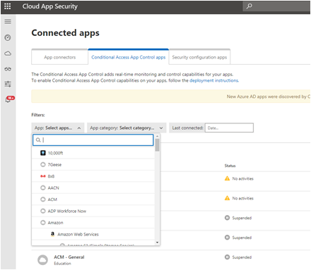
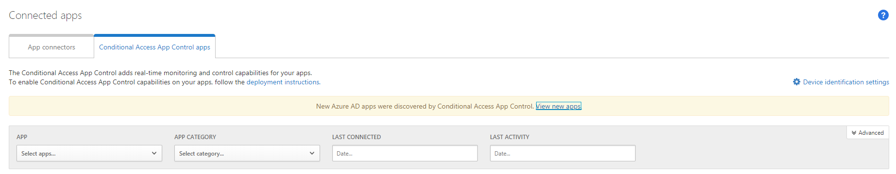
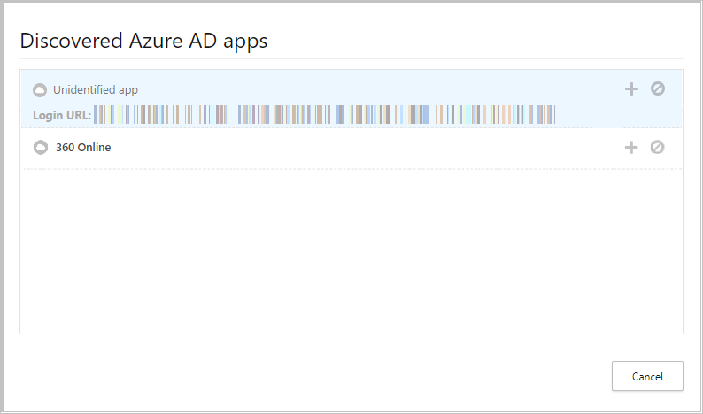

---
# Required metadata
# For more information, see https://review.learn.microsoft.com/en-us/help/platform/learn-editor-add-metadata?branch=main
# For valid values of ms.service, ms.prod, and ms.topic, see https://review.learn.microsoft.com/en-us/help/platform/metadata-taxonomies?branch=main

title:       Manual onboarding of apps using Microsoft Entra ID | Microsoft Defender for Cloud Apps
description: Learn how to onboard and deploy custom line-of-business apps, non-featured SaaS apps, and on-premises apps hosted via the Microsoft Entra ID Application Proxy with session controls.
author:      damalkaw # GitHub alias
ms.author:   damalkaw # Microsoft alias
ms.service:  defender-for-cloud-apps
ms.topic:   how-to
ms.date:     07/23/2024
---

# Manual Onboarding of Apps using Microsoft Entra ID

[!INCLUDE [Banner for top of topics](includes/banner.md)]

Session controls in Microsoft Defender for Cloud Apps can be configured to work with any web apps. This article describes how to onboard and deploy custom line-of-business apps, non-featured SaaS apps, and on-premises apps hosted via the Microsoft Entra ID Application Proxy with session controls. It provides steps to create a Microsoft Entra ID Conditional Access policy that routes app sessions to Defender for Cloud Apps. For other IdP solutions, see [Deploy conditional access app control for custom apps with non-Microsoft IdP](proxy-deployment-any-app-idp.md).

## Prerequisites

### Add admins to the app onboarding/maintenance list

1. In the menu bar of Defender for Cloud Apps, select the settings cog and select **Settings**.

1. Under **Conditional Access App Control**, select **App onboarding/maintenance**.

1. Enter the user principal name or email for the users that will be onboarding the app, and then select **Save**.

    

### Check for necessary licenses

- Your organization must have the following licenses to use conditional access app control:

  - [Microsoft Entra ID Premium P1](/azure/active-directory/license-users-groups) or higher
  - Microsoft Defender for Cloud Apps

- Apps must be configured with single sign-on
- Apps must use one of the following authentication protocols:

    |IdP|Protocols|
    |---|---|
    |Microsoft Entra ID|SAML 2.0 or OpenID Connect|
  
 ### Check for pre-onboarded apps
  
 Before you onboard your apps, make sure that it's not included in the following list of pre-onboarded apps for both access and session controls:
  
- AWS
- Box
- Concur
- CornerStone on Demand
- DocuSign
- Dropbox
- Egnyte
- GitHub
- Google Workspace
- HighQ
- JIRA/Confluence
- LinkedIn Learning
- Microsoft Azure DevOps (Visual Studio Team Services)
- Microsoft Azure portal
- Microsoft Dynamics 365 CRM
- Microsoft Exchange Online
- Microsoft OneDrive
- Microsoft Power BI
- Microsoft SharePoint Online
- Microsoft Teams
- Microsoft Yammer
- Salesforce
- ServiceNow
- Slack
- Tableau
- Workday
- Workiva
- Workplace by Facebook

To use pre-onboarded apps with Defender for Cloud Apps, you must route the app to access and session controls and perform an initial sign-in.

## To deploy any app

Follow these steps to configure any app to be controlled by Defender for Cloud Apps conditional access app control.

1. **[Configure your Microsoft Entra ID to work with Defender for Cloud Apps](#step-1-configure-microsoft-entra-id-to-work-with-defender-for-cloud-apps)**

1. **[Configure the app that you are deploying](#conf-app)**

1. **[Verify that the app is working correctly](#verify-app)**

1. **[Enable the app for use in your organization](#enable-app)**

1. **[Update the Microsoft Entra ID policy](#update-azure-ad)**

> [!NOTE]
> To deploy conditional access app control for Microsoft Entra ID apps, you need a valid [license for Microsoft Entra ID Premium P1 or higher](/azure/active-directory/fundamentals/license-users-groups) as well as a Defender for Cloud Apps license.

## Step 1: Configure Microsoft Entra ID to work with Defender for Cloud Apps

>[!NOTE]
>When configuring an application with SSO in Microsoft Entra ID, or other identity providers, one field that may be listed as optional is the sign-on URL setting. Note that this field may be required for conditional access app control to work.

1. In Microsoft Entra ID, browse to **Security** > **Conditional Access**.

1. On the **Conditional Access** pane, in the toolbar at the top, select **New policy**.

1. On the **New** pane, in the **Name** textbox, enter the policy name.

1. Under **Assignments**, select **Users and groups**, assign the users that will be onboarding (initial sign-on and verification) the app, and then select **Done**.

1. Under **Assignments**, select **Cloud apps**, assign the apps you want to control with conditional access app control, and then select **Done**.

1. Under **Access controls**, select **Session**, select **Use Conditional Access App Control**, and choose a built-in policy (**Monitor only** or **Block downloads**) or **Use custom policy** to set an advanced policy in Defender for Cloud Apps, and then click **Select**.

    

1. Optionally, add conditions and grant controls as required.

1. Set **Enable policy** to **On** and then select **Create**.

## Step 2: Add the app manually and install certificates, if necessary

Applications in the app catalog are automatically populated into the table under Connected Apps. Check that the app you want to deploy is recognized by navigating there.

1. In the menu bar of Defender for Cloud Apps, select the settings cog, and select the **Conditional Access App Control** tab to access a table of applications that can be configured with access and session policies.

    

1. Select the **App: Select apps…** dropdown menu to filter and search for the app you want to deploy.

    

1. If you don't see the app there, you'll have to manually add it.

### How to manually add an unidentified app

1. In the banner, select **View new apps**.

    

1. In the list of new apps, for each app that you're onboarding, select the **+** sign, and then select **Add**.

    > [!NOTE]
    > If an app does not appear in the Defender for Cloud Apps app catalog, it will appear in the dialog under unidentified apps along with the login URL. When you click the + sign for these apps, you can onboard the application as a custom app.

    

### To add domains for an app

Associating the correct domains to an app allows Defender for Cloud Apps to enforce policies and audit activities.

For example, if you've configured a policy that blocks downloading files for an associated domain, file downloads by the app from that domain will be blocked. However, file downloads by the app from domains not associated with the app won't be blocked and the action won't be audited in the activity log.
> [!NOTE]
> Defender for Cloud Apps still adds a suffix to domains not associated with the app to ensure a seamless user experience.

1. From within the app, on the Defender for Cloud Apps admin toolbar, select **Discovered domains**.
    > [!NOTE]
    > The admin toolbar is only visible to users with permissions to onboard or maintenance apps.
1. In the Discovered domains panel, make a note of domain names or export the list as a .csv file.
    > [!NOTE]
    > The panel displays a list of discovered domains that are not associated in the app. The domain names are fully qualified.
1. Go to Defender for Cloud Apps, in the menu bar, select the settings cog and select **Conditional Access App Control**.
1. In the list of apps, on the row in which the app you're deploying appears, choose the three dots at the end of the row, and then under **APP DETAILS**, choose **Edit**.
    > [!TIP]
    > To view the list of domains configured in the app, select **View app domains**.
1. In **User-defined domains**, enter all the domains you want to associate with this app, and then select **Save**.
    > [!NOTE]
    > You can use the * wildcard character as a placeholder for any character. When adding domains, decide whether you want to add specific domains (`sub1.contoso.com`,`sub2.contoso.com`) or multiple domains (`*.contoso.com`).

### Install root certificates

1. Repeat the following steps to install the **Current CA** and **Next CA** self-signed root certificates.
    1. Select the certificate.
    1. Select **Open**, and when prompted select **Open** again.
    1. Select **Install certificate**.
    1. Choose either **Current User** or **Local Machine**.
    1. Select **Place all certificates in the following store** and then select **Browse**.
    1. Select **Trusted Root Certificate Authorities** and then select **OK**.
    1. Select **Finish**.

    > [!NOTE]
    > For the certificates to be recognized, once you have installed the certificate, you must restart the browser and go to the same page.<!-- You'll see a check-mark by the certificates links confirmation they are installed.-->

1. Select **Continue**.
1. Check that the application is available in the table.

## Step 3: Verify that the app is working correctly

To verify that the application is being proxied, first perform either a hard sign-out of browsers associated with the application or open a new browser with incognito mode.

Open the application and perform the following checks:

- Check that the URL contains the `.mcas` suffix
- Visit all pages within the app that are part of a user's work process and verify that the pages render correctly.
- Verify that the behavior and functionality of the app isn't adversely affected by performing common actions such as downloading and uploading files.
- Review the list of domains associated with the app. For more information, see [Add the domains for the app](#add-domains).

If you encounter errors or issues, use the admin toolbar to gather resources such as `.har` files and recorded sessions for filing a support ticket.

## Step 4: Enable the app for use in your organization

Once you're ready to enable the app for use in your organization's production environment, do the following steps.

1. In Defender for Cloud Apps, select the settings cog, and then select **Conditional Access App Control**.
1. In the list of apps, on the row in which the app you're deploying appears, choose the three dots at the end of the row, and then choose **Edit app**.
1. Select **Use with Conditional Access App Control** and then select **Save**.

## Step 5: Update the Microsoft Entra ID policy

1. In  Microsoft Entra ID, under **Security**, select **Conditional Access**.
1. Update the policy you created earlier to include the relevant users, groups, and controls you require.
1. Under **Session** > **Use Conditional Access App Control**, if you selected **Use Custom Policy**, go to Defender for Cloud Apps and create a corresponding session policy. For more information, see [Session policies](session-policy-aad.md).

## Next steps

> [!div class="nextstepaction"]
> [PREVIOUS: Deploy conditional access app control for catalog apps](proxy-deployment-aad.md)

> [!div class="nextstepaction"]
> [NEXT: How to create a session policy](session-policy-aad.md)

## See also

> [!div class="nextstepaction"]
> [Introduction to conditional access app control](proxy-intro-aad.md)

> [!div class="nextstepaction"]
> [Troubleshooting access and session controls](troubleshooting-proxy.md)

[!INCLUDE [Open support ticket](includes/support.md)]
