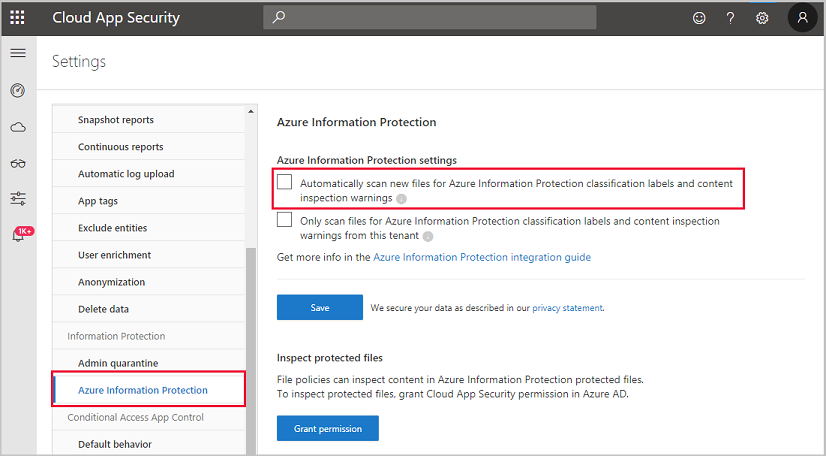
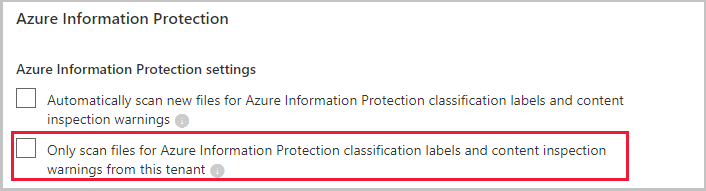
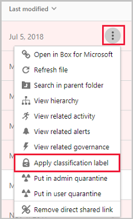
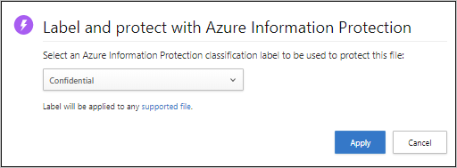
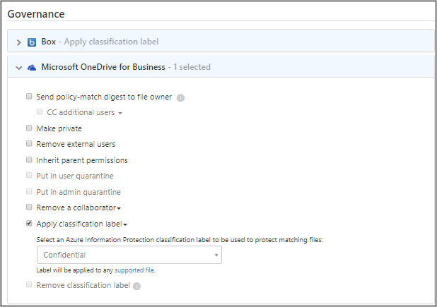
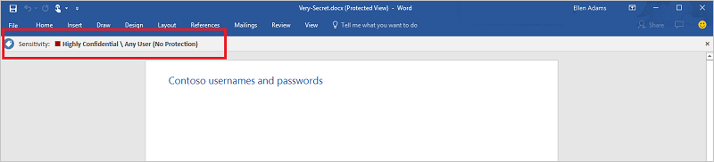
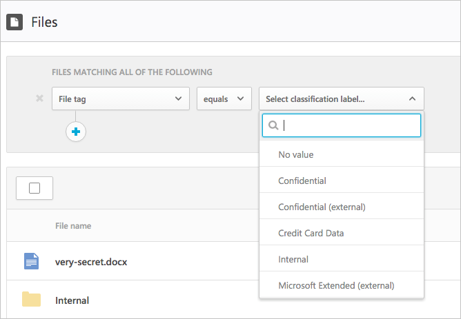
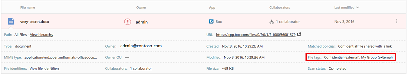
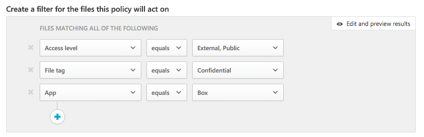
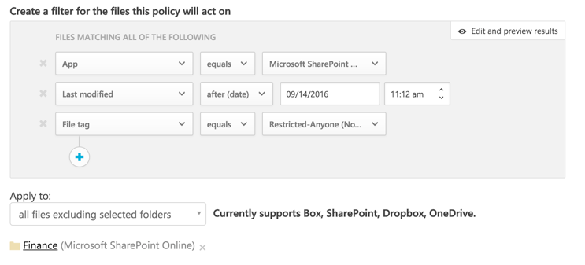

---
# required metadata

title: Integrate Azure Information Protection with Cloud App Security
description: This article provides information about how to leverage your Azure Information Protection tags in Cloud App Security for added control of your organization's cloud app use.
keywords:
author: shsagir
ms.author: shsagir
manager: shsagir
ms.date: 7/30/2019
ms.topic: conceptual
ms.collection: M365-security-compliance
ms.prod:
ms.service: cloud-app-security
ms.technology:

# optional metadata

#ROBOTS:
#audience:
#ms.devlang:
ms.reviewer: reutam
ms.suite: ems
#ms.tgt_pltfrm:
ms.custom: seodec18

---

# Azure Information Protection integration

*Applies to: Microsoft Cloud App Security*

Microsoft Cloud App Security lets you apply Azure Information Protection classification labels automatically, with or without protection, to files as a file policy governance action. You can also investigate files by filtering for the applied classification label within the Cloud App Security portal. Using classifications enables greater visibility and control of your sensitive data in the cloud. Integrating Azure Information Protection with Cloud App Security is as easy as selecting one single checkbox.

> [!NOTE]
> This article is also relevant for Office 365 unified sensitivity labels if you already [migrated your classification labels for the Office 365 Security and Compliance Center](https://docs.microsoft.com/azure/information-protection/configure-policy-migrate-labels). If you did not migrate your existing classification labels, and you begin to create new labels in the Office 365 Security and Compliance Center, Cloud App Security will only use the preexisting labels configured in the Azure Information Protection portal.

By integrating Azure Information Protection into Cloud App Security, you can use the full power of both services and secure files in your cloud, including:

- The ability to apply classification labels as a governance action to files that match specific policies
- The ability to view all classified files in a central location
- The ability to investigate according to classification level, and quantify exposure of sensitive data over your cloud applications
- The ability to create policies to make sure classified files are being handled properly

> [!NOTE]
> To enable this feature, you need both a Cloud App Security license and a license for Azure Information Protection Premium P1. As soon as both licenses are in place, Cloud App Security syncs the organizations labels from the Azure Information Protection service.

## Prerequisites

- To work with Azure Information Protection integration, you must enable the [App connector for Office 365](connect-office-365-to-microsoft-cloud-app-security.md).

To use labels in Cloud App Security, the labels must be published as part of the policy. If you're using Azure Information Protection, labels must be published via the Azure Information Protection portal. If you migrated to unified labels, labels must be published via Office 365 Security and Compliance Center.

Cloud App Security currently supports applying Azure Information Protection classification labels for the following file types:

- Word: docm, docx, dotm, dotx
- Excel: xlam, xlsm, xlsx, xltx
- PowerPoint: potm, potx, ppsx, ppsm, pptm, pptx
- PDF
    > [!NOTE]
    > For PDF, you must use unified labels.

This feature is currently available for files stored in Box, G Suite, SharePoint Online, and OneDrive for Business. More cloud apps will be supported in future versions.

Files that were labeled with protection outside of Cloud App Security can't be changed by Cloud App Security. However, you can scan these files by granting permissions to [inspect content for protected files](content-inspection.md#content-inspection-for-protected-files). Files that were labeled (without protection) external to Cloud App Security, can be scanned and Cloud App Security can apply a different label (with or without protection) as defined in Cloud App Security policies.

## How it works

You're probably familiar with file classification labels in [Azure Information Protection](https://docs.microsoft.com/azure/information-protection/what-is-information-protection). You can see the Azure Information Protection classification tags in Cloud App Security. As soon as you integrate Cloud App Security with Azure Information Protection, Cloud App Security scans files as follows:

1. Cloud App Security retrieves the list of all the classification labels used in your tenant. This action is performed every hour to keep the list up-to-date.

2. Cloud App Security then scans the files for classification labels, as follows:

    - If you enabled automatic scan, all new or modified files are added to the scan queue and all existing files and repositories will be scanned, classified, and protected.
    - If you set a file policy to search for classification labels, these files are added to the scan queue for classification labels.

3. As noted above, these scans are for the classification labels discovered in the initial scan Cloud App Security does to see which classification labels are used in your tenant. External labels, classification labels set by someone external to your tenant, are added to the list of classification labels. If you don't want to scan for these, select the **Only scan files for Azure Information Protection classification labels from this tenant** check box.

4. After you enable Azure Information Protection on Cloud App Security, all new files that are added to Office 365 will be scanned for classification labels.

5. You can create new policies within Cloud App Security that apply your classification labels automatically.

## How to integrate Azure Information Protection with Cloud App Security
  
### Enable Azure Information Protection

All you have to do to integrate Azure Information Protection with Cloud App Security is click a single checkbox. By enabling automatic scan, you enable searching for Azure Information Protection classification labels on your Office 365 files without the need to create a policy. After you enable it, if you have files in your cloud environment that are labeled with Azure Information Protection classification labels, you'll see them in Cloud App Security.

To enable Cloud App Security to scan files with content inspection enabled for classification labels:

1. In Cloud App Security, under the settings cog, select the **Settings** page under the **System** heading.

    
1. Under **Azure Information Protection**, select **Automatically scan files for Azure Information Protection classification labels**.

    

After enabling Azure Information Protection, you'll be able to see files that have classification labels and filter them per label in Cloud App Security. After Cloud App Security is connected to the cloud app, you'll be able to use the Azure Information Protection integration features to apply Azure Information Protection classification labels (with or without protection) in the Cloud App Security portal, by adding them directly to files or by configuring a file policy to apply classification labels automatically as a governance action.

> [!NOTE]
> Automatic scan does not scan existing files until they are modified again. To scan existing files for Azure Information Protection classification labels, you must have at least one **File policy** that includes content inspection. If you have none, create a new **File policy**, delete all the preset filters, under **Inspection method** select **Built-in DLP**. In the **Content inspection** field, select **Include files that match a preset expression** and select any predefined value, and save the policy. This enables content inspection, which automatically detects Azure Information Protection classification labels.

#### Set internal and external tags

By default, Cloud App Security scans classification labels that were defined in your organization as well as external ones defined by other organizations. 

To ignore classification labels set external to your organization, in the Cloud App Security portal, go under **Settings** and **Azure Information Protection**. Select **Only scan files for Azure Information Protection classification labels and content inspection warnings from this tenant**.

### Apply labels directly to files

1. From the **Files** page under **Investigate**, select the file you want to protect. Click the three dots at the end of the file's row then choose **Apply classification label**.  

    
  
    >[!NOTE]
    > Cloud App Security can apply Azure Information Protection on files that are up to 50 MB.

2. You're asked to choose one of your organization's classification labels to apply to the file, and click **Apply**.

    

3. After you choose a classification label and click apply, Cloud App Security will apply the classification label to the original file.

4. You can also remove classification labels by choosing the **Remove classification label** option.

> [!NOTE]
> You can remove labels only if they do not include protection, and they were applied from within Cloud App Security, not labels applied directly in Information Protection.

For more information about how Cloud App Security and Azure Information Protection work together, see [Protect data against user mistakes](https://docs.microsoft.com/enterprise-mobility-security/solutions/protect-data-user-mistake).

### Automatically label files

You can automatically apply classification labels to files by creating a file policy and setting **Apply classification label** as the governance action.

Follow these instructions to create the file policy:

1. Create a file policy.
2. Set the policy to include the type of file you want to detect. For example, select all files where **Access level** does not equal **Internal** and where the **Owner OU** equals your finance team.
3. Under governance actions for the relevant app, click **Apply a classification label** then select the label type.

    

> [!NOTE]
> The ability to automatically apply an Azure Information Protection label through file policy is a powerful capability. To protect customers from mistakenly applying a label to a large number of files, as a safety precaution there is a daily limit of 100 **Apply label** actions per app, per tenant. After the daily limit is reached, the apply label action pauses temporarily and continues automatically the next day (after 12:00 UTC). To raise the limit for your tenant, open a support ticket.

### Control file exposure

- For example, if the below is a document you labeled with an Azure Information Protection classification label:

    

- You can see this document in Cloud App Security by filtering on the classification label for Azure Information Protection in the **Files** page.

    

- You can get more information about these files and their classification labels in the file drawer. Just click on the relevant file in the **Files** page and check whether it has a classification label.

    

- Then, you can create file policies in Cloud App Security to control files that are shared inappropriately and find files that are labeled and were recently modified.

- You can create a policy that automatically applies a classification label to specific files.
- You can also trigger alerts on activities related to file classification.

> [!Note]
> When Azure Information Protection labels are disabled on a file, the disabled labels appear as disabled in Cloud App Security. Deleted labels are not displayed.

**Sample policy - confidential data that is externally shared on Box:**

1. Create a file policy.
2. Set the policy’s name, severity, and category.
3. Add the following filters to find all confidential data that is externally shared on Box:

**Sample policy - restricted data that was recently modified outside the Finance folder on SharePoint:**

1. Create a file policy.
2. Set the policy’s name, severity, and category.
3. Add the following filters to find all recently modified restricted files while excluding the Finance folder in the folder selection option:

You can also choose to set alerts, user notification or take immediate action for these policies.
Learn more about [governance actions](governance-actions.md).

Learn more about [Azure Information Protection](https://docs.microsoft.com/information-protection/understand-explore/what-is-information-protection) and check out the Azure Information Protection [Quick start tutorial](https://docs.microsoft.com/information-protection/get-started/infoprotect-quick-start-tutorial).

## Related Videos

> [!div class="nextstepaction"]
> [Cloud App Security + Azure Information Protection Integrations](https://channel9.msdn.com/Shows/Microsoft-Security/MCAS--AIP-Integrations)  

## Next steps

> [!div class="nextstepaction"]
> [Control cloud apps with policies](control-cloud-apps-with-policies.md)

[!INCLUDE [Open support ticket](includes/support.md)]
