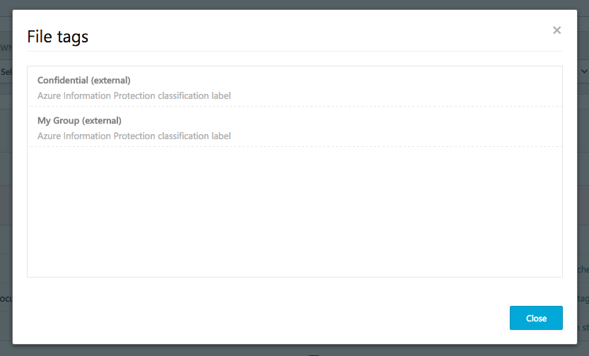
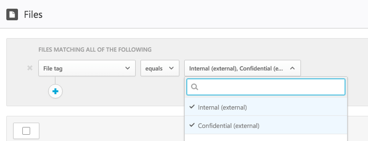

---
# required metadata

title: Integrate Azure Information Protection with Cloud App Security | Microsoft Docs
description: This article provides information about how to leverage your Azure Information Protection tags in Cloud App Security for added control of your organization's cloud app use.
keywords:
author: rkarlin
ms.author: rkarlin
manager: mbaldwin
ms.date: 1/15/2017
ms.topic: article
ms.prod:
ms.service: cloud-app-security
ms.technology:
ms.assetid: 8168319a-199f-4e6c-ad68-e0f236480803

# optional metadata

#ROBOTS:
#audience:
#ms.devlang:
ms.reviewer: reutam
ms.suite: ems
#ms.tgt_pltfrm:
#ms.custom:

---

# Azure Information Protection integration

Cloud App Security lets you investigate files and set policies based on Azure Information Protection classification labels, enabling greater visibility and control of your sensitive data in the cloud. Integrating Azure Information Protection with Cloud App Security is as easy as selecting one single checkbox. 

By integrating Azure Information Protection into Cloud App Security, you can leverage the full power of both services and secure files in your cloud, including:
- The ability to view all classified files in a central location
- The ability to perform investigation according to classification level, and quantify exposure of sensitive data over your cloud applications
- The ablility to create policies to make sure classified files are being handled properly

> [!NOTE] 
> To enable this feature you will need both a Cloud App Security license and a license for Azure Information Protection Premium P1 or P2. As soon as both licenses are in place, Cloud App Security will sync the organizations labels from the Azure Information Protection service.

## How it works
You are probably familiar with file classification labels in [Azure Information Protection](https://docs.microsoft.com/information-protection/). You can see the Azure Information Protection classification tags in Cloud App Security. As soon as you integrate Cloud App Security with Azure Information Protection, Cloud App Security scans files as follows:
1. Cloud App Security retrieves the list of all the classification labels used in your tenant. This is performed every hour to keep the list up to date.
2. Cloud App Security then scans the files for classification labels, as follows:
    a. If you enabled automatic scan (see below), all new or modified files will be added to the scan queue.
    b. If you set a file policy (see below) to search for classification labels, these files will be added to the scan queue for classification labels.
3. As noted above, these scans are for the classification labels discovered in the initial scan Cloud App Security performs to see which classification labels are used in your tenant. External labels, classification labels set by someone external to your tenant, are added to the list of classification labels. If you don't want to scan for these, select the **Ignore Azure Information Protection classification labels from other tenants** checkbox (see below).
4. After you enable Azure Information Protection on Cloud App Security, all new files that are added to Office 365 will be scanned for classification labels as well.

## How to integrate Azure Information Protection with Cloud App Security
  
### Enable Azure Information Protection

This is all you have to do to integrate Azure Information Protection with Cloud App Security: Enable automatic scan to enable searching for Azure Information Protection classification labels on your Office 365 files without the need to create a policy. After you enable this, if you have files in your cloud environment that are labeled with Azure Information Protection classification labels, you will see them in Cloud App Security.

To enable Cloud App Security to scan files with content inspection enabled for classification lables:

1. In Cloud App Security, under the settings cog, select the **General settings** page.
2. Under Azure Information Protection, select **Automatically scan files for Azure Information Protection classification labels**. 

After enabling Azure Information Protection, you will be able to see files that have classification labels and filter them per label in Cloud App Security.

 

> [!NOTE] 
> Automatic scan will not scan existing files until they are modified again. To scan existing files for Azure Information Protection classification labels, create a new **File policy** without any filters, check the **Content inspection** option and save the policy.

### Set internal and external tags
By default, Cloud App Security will scan classification labels that were defined in your organization as well as external ones that were defined by other organizations. 

To ignore classification labels set external to your organization, in the Cloud App Security portal, under **General settings**, under **Azure security settings** select **Ignore Azure Information Protection classification labels from other tenants**.
 

### Control file exposure
- If this is the document you labeled with an Azure Information Protection classification label:

- You will be able to see this file in Cloud App Security, in the **Files** page, by filtering for the classification label:

- You can get more information about those files and their classification labels in the file drawer.

- In the **Files** page, click on the relevant file to see if it has any classification labels:

- You can click on the classification lable to view more information or to see the full list of classification labels:
 

- Then, you can create file policies in Cloud App Security to control files that are shared inappropriately and find files that are labeled and were recently modified.
- In addition, you can trigger alerts on activities related to classified files.

**Policy #1 - confidential data that is externally shared on Box:**

1.	Create a file policy.
2.	Set the policy’s name, severity and category.
3.	Add the following filters to find all confidential data that is externally shared on Box:

 

**Policy #2 - restricted data that was recently modified outside the Finance folder on SharePoint:**

1.	Create a file policy.
2.	Set the policy’s name, severity and category.
3.	Add the following filters to find all restricted data that was recently modified, and add exclude the Finance folder in the folder selection option: 
 
 

You can also choose to set alerts, user notification or take immediate action for these policies.
Learn more about [governance actions](governance-actions.md).

Learn more about [Azure Information Protection](https://docs.microsoft.com/en-us/information-protection/understand-explore/what-is-information-protection) and check out the Azure Information Protection [Quick start tutorial](https://docs.microsoft.com/en-us/information-protection/get-started/infoprotect-quick-start-tutorial).

 
## See Also  
[Control cloud apps with policies](control-cloud-apps-with-policies.md)   
[For technical support, please visit the Cloud App Security assisted support page.](http://support.microsoft.com/oas/default.aspx?prid=16031)   
[Premier customers can also choose Cloud App Security directly from the Premier Portal.](https://premier.microsoft.com/)  
  
  
