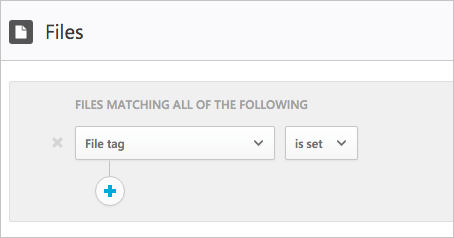

---
# required metadata

title: Azure Information Protection integration | Microsoft Docs
description: This article provides information about how to leverage your Azure Information Protection tags in Cloud App Security for added control of your organization's cloud app use.
keywords:
author: rkarlin
ms.author: rkarlin
manager: mbaldwin
ms.date: 11/23/2016
ms.topic: article
ms.prod:
ms.service: cloud-app-security
ms.technology:
ms.assetid: 8168319a-199f-4e6c-ad68-e0f236480803

# optional metadata

#ROBOTS:
#audience:
#ms.devlang:
ms.reviewer: reutam
ms.suite: ems
#ms.tgt_pltfrm:
#ms.custom:

---

# Azure Information Protection integration

Cloud App Security lets you investigate files and set policies based on Azure Information Protection file labels, enabling greater visibility and control of your sensitive data in the cloud. To enable this, set a policy in Cloud App Security to scan files with content inspection enabled. In addition, you can trigger alerts on activities related to classified files. 
Azure Information Protection integration lets you:
-	Quantify exposure of sensitive data over your cloud applications.
-	Create policies and alert on violations of uploading of classified data in your connected cloud apps, or quarantine/block sensitive data from being shared externally.
-	Investigate audit trails and remediate files that are in violation of your policies 

> [!NOTE] 
> By default, files are scanned for labels only when there is a file policy that scans them with content inspection enabled. To scan all files for labels without file policies, enable automatic scan.

## Terminology overview
-	The Azure Information Protection classification label- an attribute added to files in your organization either automatically, based on a policy, or manually, set by end-users.
-	External - A tag set by someone external to your organization.
-	File tag- The classification label’s presentation in Cloud App Security. This field is shown for each file in the files table and can be used in filters.
-	File policy- A set of rules that rely on file filters that allow you to enforce a wide range of automated processes leveraging the cloud provider’s APIs.

## License and tenant creation
To enable this feature you will need both a Cloud App Security license and a license for Azure Information Protection Premium P1 or P2. As soon as both licenses are in place, Cloud App Security will sync the organizations labels from the Azure Information Protection service:

 	 
In addition, by default, files that are going through content inspection by one or more file policies will also be scanned for classification labels.

## Gain visibility

The file tags that were scanned for each file are visible in the file drawer.
In the **Files** page, click on the relevant file to see if it has any file tags:

You can click on the tags to view more information or to see the full list of tags:
 

Use the **File tags** filter to search for files that were tagged with a specific tag:
 

Or for files that were tagged with any file tag:

## How it works
Cloud App Security scans new files in near real-time and then, for each file, it scans the labels, and the classification label is added to the list of classification labels that were seen in the tenant. 

## Enable automatic scan
To enable automatic scans for file tags for new files in Office 365:

1. In Office 365, go to the **General settings** page.
2. Under Azure security settings select **Automatically scan files for Azure Information Protection classification labels**. 
After it's enabled, all new files that are added to Office 365, not only the ones that are scanned for content by a file policy, will be scanned for file tags as well.

 

## Internal and external tags
By default, Cloud App Security will scan classification labels that were defined in your organization as well as external ones that were defined by other organizations. 

To ignore them, under **Azure security setting** select **Ignore Azure Information Protection classification labels from other tenants**.
 

> [!Note]
> If you are working in a test tenant you will probably not want to ignore external classification labels in order to be able to test files you receive from other tenants.

## Use Azure Information Protection tags to apply control
Create file policies in Cloud App Security to find files that are shared inappropriately and find files that are labeled and were recently modified. 

**Policy #1 - confidential data that is externally shared on Box:**

1.	Create a file policy.
2.	Set the policy’s name, severity and category.
3.	Add the following filters to find all confidential data that is externally shared on Box:

 

**Policy #2 - restricted data that was recently modified outside the Finance folder on SharePoint:**

1.	Create a file policy.
2.	Set the policy’s name, severity and category.
3.	Add the following filters to find all restricted data that was recently modified, and add exclude the Finance folder in the folder selection option: 
 
 

You can also choose to set alerts, user notification or take immediate action for these policies.
Learn more about [governance actions](governance-actions.md).

Learn more about [Azure Information Protection](https://docs.microsoft.com/en-us/information-protection/understand-explore/what-is-information-protection) and check out the Azure Information Protection [Quick start tutorial](https://docs.microsoft.com/en-us/information-protection/get-started/infoprotect-quick-start-tutorial).

  

## See Also  
[Control cloud apps with policies](control-cloud-apps-with-policies.md)   
[For technical support, please visit the Cloud App Security assisted support page.](http://support.microsoft.com/oas/default.aspx?prid=16031)   
[Premier customers can also choose Cloud App Security directly from the Premier Portal.](https://premier.microsoft.com/)  
  
  
