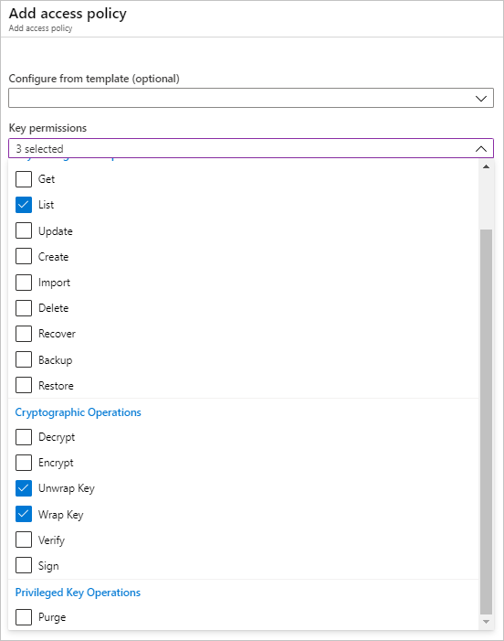
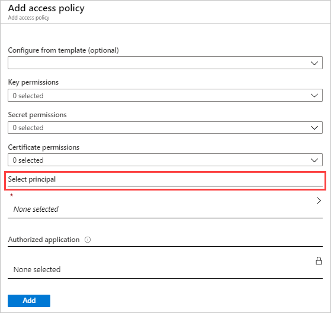
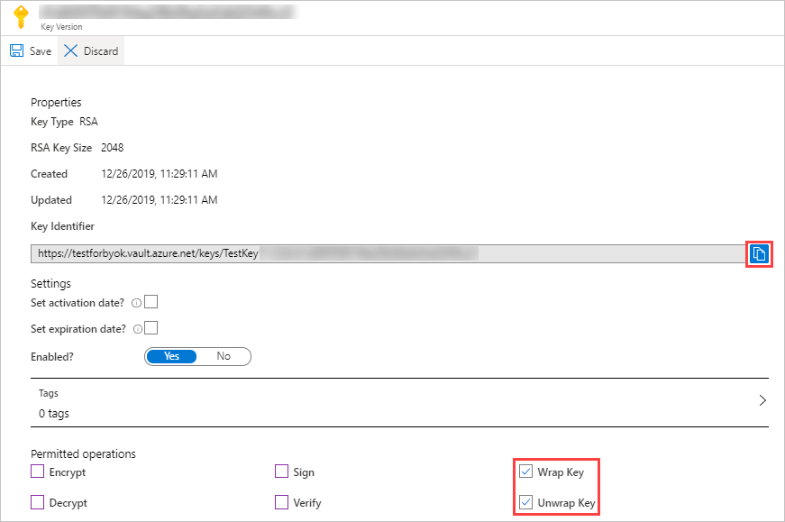
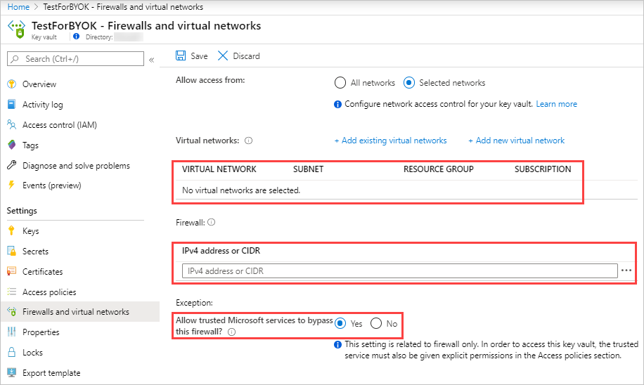

---
# required metadata
title: Manage encryption for Cloud App Security data
description: This article provides instructions for configuring encryption for data stored in Cloud App Security.
author: shsagir
ms.author: shsagir
ms.service: cloud-app-security
ms.topic: conceptual
ms.date: 01/15/2020

# optional metadata
#ROBOTS: NOINDEX # Used to prevent showing on search pages
#services: na
#ms.subservice: na
ms.collection: M365-security-compliance
---
# Manage encryption for Cloud App Security data

*Applies to: Microsoft Cloud App Security*

**// TBD OVERVIEW:** PMs to provide. Affects all content in this section and BYOK section

Microsoft’s Cloud App Security encrypts data at rest for all new tenants as of **{Date place holder}**.

Any data that resides in Cloud App Security for more than 48 hours will be encrypted.

Bring your own key (BYOK) allows you to encrypt data using your own key that you manage in your Azure Key Vault.

## Set up your Azure Key Vault key

1. [Create a new Key Vault](https://docs.microsoft.com/azure-stack/user/azure-stack-key-vault-manage-portal#create-a-key-vault).

1. Create an access policy, fill out the following information, and then click **Add**.
    1. Click **Key permissions** and choose the following permissions from the dropdown menu:

        | Section | Required permissions |
        | --- | --- |
        | Key Management Operations | - List |
        | Cryptographic Operations | - Wrap key - Unwrap key |

        

    2. Principal: **// TBD**

        

1. [Create a new key](https://docs.microsoft.com/azure-stack/user/azure-stack-key-vault-manage-portal#create-a-key), do the following, and then click **Add**.

    > [!NOTE]
    > You can set up data encryption with an unversioned key or a specific key version. **// Do we have any additional info to provide the user? Maybe a link that explains the implications of each option?**

    1. Under **Permitted operations**, select the following options:

        - Wrap key
        - Unwrap key

    2. Copy the **Key Identifier** URI, you'll need this later.

    

1. [Set up the **soft-delete** behavior for your Key Vault](https://docs.microsoft.com/azure/key-vault/key-vault-ovw-soft-delete#soft-delete-behavior).

1. [Set up the **no purge** behavior for your Key Vault](https://docs.microsoft.com/azure/key-vault/key-vault-ovw-soft-delete#purge-protection).

1. Optionally, if using a firewall for a selected network, configure the following firewall settings to give Cloud App Security access to the specified key, and then click **Save**:
    1. Make sure no virtual networks are selected.
    1. Add the following IP addresses: **// TBD: Require list of MCAS IP addresses**

    

## Enable data encryption in Cloud App Security

When you enable data encryption, Cloud App Security immediately uses your Azure Key Vault key to encrypt data at rest. Since your key is essential to the encryption process, it is important to ensure that your designated Key Vault and key are accessible at all times.

### To enable data encryption

1. In Cloud App Security, in the menu bar, click the settings cog  and select **Settings**.

1. Select the **Data encryption** tab.

1. Click **Enable data encryption**.

1. In the **Azure Key Vault key URI** box, paste the key identifier URI value you copied earlier.

1. Once the URI validation has completed, click **Enable**.

## Disable data encryption in Cloud App Security

When you disable data encryption, Cloud App Security removes your encryption from the data. However, your data remains encrypted by Cloud App Security's managed keys. **// Do we have any more info on this to clarify this for the user?**

### To disable data encryption

1. In Cloud App Security, in the menu bar, click the settings cog  and select **Settings**.

1. Select the **Data encryption** tab.

1. Click **Disable data encryption**.

## Key roll handling

**// TBD**

### Using versioned key

**// TBD**

### Using unversioned key

**// TBD**

## How to handle data encryption failures

If there is a problem accessing your Azure Key Vault key, Cloud App Security will fail to encrypt your data and your tenant will be lock down within an hour. When your tenant is locked down, all access to it will be blocked until the cause has been resolved. Once your key is accessible again, full access to your tenant will be restored.

The following table lists the possible scenarios that can cause data encryption to fail and the actions you can take to resolve them:

| Scenario | Actions |
| --- | --- |
| **Missing Key Vault permissions** | In the selected Key Vault, under access policy, make sure that the following key permissions are selected: Under **Key management operations** - List Under **Cryptographic operations** - Wrap key - Unwrap key |
| **Azure Key Vault firewall blocking access to key** | In the selected Key Vault, make sure that the filewall is configured with the following IP addresses: **// Require list of MCAS IP addresses** |
| **Missing key permissions** | In the selected key, make sure that the following operations are permitted: - Wrap key - Unwrap key  |
| **Encryption key is not enabled** | In the selected key, make sure that the key is enabled.  |
| **Encryption key is not active** | In the selected key, make sure that the activation date and time is prior to the current date and time.  |
| **Encryption key has expired** | In the selected key, make sure that the expiration date and time has not passed.  |
| **Encryption key not found or deleted** | Verify that the selected key exists in your Key Vault. If key was deleted, recover and enable it again. If the key was moved to another Key Vault, move it back to the selected Key Vault. |
