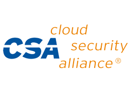
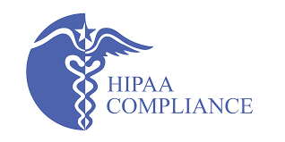
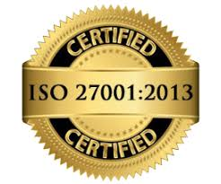

---
# required metadata
title: Cloud App Security compliance, data security, privacy, trust | Microsoft Docs
description: This article describes the Cloud App Security compliance offering, trust center, privacy, and data security.
author: shsagir
ms.author: shsagir
ms.service: cloud-app-security
ms.topic: overview
ms.date: 8/21/2019

# optional metadata
ms.collection: M365-security-compliance
ms.custom: seodec18
ms.suite: ems
---
# Microsoft Cloud App Security data security and privacy

*Applies to: Microsoft Cloud App Security*

[!INCLUDE [Handle personal data](../includes/gdpr-intro-sentence.md)]

Microsoft Cloud App Security is a critical component of the Microsoft Cloud Security stack. It's a comprehensive solution that helps your organization take full advantage of the promise of cloud applications. Cloud App Security keeps you in control through comprehensive visibility, auditing, and granular controls over your sensitive data.

Microsoft Cloud app security has tools that help uncover shadow IT and assess risk while enabling you to enforce policies and investigate activities. It helps you control access in real time and stop threats so your organization can more safely move to the cloud.

## Cloud App Security compliance

In a world where data breaches and attacks are daily occurrences, it's essential for organizations to choose a cloud app security broker that makes every effort to protect their data. Microsoft Cloud App Security, like all Microsoft cloud products and services, is built to address the rigorous security and privacy demands of our customers.

To help organizations comply with national, regional, and industry-specific requirements governing the collection and use of individuals’ data, Microsoft Cloud App Security provides a comprehensive set of compliance offerings. The compliance offerings include certifications and attestations.

### Compliance framework and offerings

Microsoft Cloud App Security meets many international and industry-specific compliance standards including, but not limited to:

| |Title|Description|
|----|----|----|
||CSA STAR Attestation|Azure and Intune were awarded Cloud Security Alliance STAR Attestation based on an independent audit.|
||CSA STAR Certification|Azure, Intune, and Power BI were awarded Cloud Security Alliance STAR Certification at the Gold level.|
||[EU Model Clauses](https://www.microsoft.com/en-us/trustcenter/compliance/eu-model-clauses)|Microsoft offers EU Standard Contractual Clauses, guarantees for transfers of personal data.|
||EU-U.S. Privacy Shield|Microsoft complies with this framework for protecting personal data transferred from the EU to the US.|
||FISC|Microsoft meets the requirements of the Financial Industry Information Systems v8 standard in Japan.|
||[HIPAA/HITECH](https://www.microsoft.com/en-us/trustcenter/compliance/hipaa)|Microsoft offers Health Insurance Portability & Accountability Act Business Associate Agreements (BAAs).|
||ISO 9001|Microsoft is certified for its implementation of these quality management standards.|
||[ISO/IEC 27001](https://www.microsoft.com/en-us/trustcenter/compliance/iso-iec-27001)|Microsoft is certified for its implementation of these information security management standards.|
||[ISO/IEC 27018](https://www.microsoft.com/en-us/trustcenter/compliance/iso-iec-27018)|Microsoft was the first cloud provider to adhere to this code of practice for cloud privacy.|
||PCI DSS|Azure complies with Payment Card Industry Data Security Standards Level 1 version 3.1.|
||[SOC 1 and SOC 2 Type 2 Reports](https://www.microsoft.com/en-us/trustcenter/compliance/soc)|Microsoft cloud services comply with Service Organization Controls standards for operational security.|
||SOC 3|Microsoft cloud services comply with Service Organization Controls standards for operational security.|
||UK G-Cloud|The Crown Commercial Service renewed the Microsoft cloud services classification to Government Cloud v6.|

For more information, go to [Microsoft Compliance Offerings](https://www.microsoft.com/en-us/trustcenter/compliance/complianceofferings) and select Cloud App Security.  

## Privacy

### You're the owner of your data

- In Microsoft Cloud App Security, your administrators can view the identifiable personal data stored in the service from the portal using the Search bar.
- Admins can search for a specific user’s metadata or user’s activity. Clicking on an entity opens the [**Users and accounts**](accounts.md). The **Users and accounts** page provides you with comprehensive details about the entity that are pulled from connected cloud applications. It also provides the user’s activity history and security alerts related to the user.

- You own your data and can cancel subscriptions and request deletion of your data at any time. If you don't renew your subscription, your data will be deleted within the timeline specified in the [Online Services Terms](https://www.microsoftvolumelicensing.com/DocumentSearch.aspx?Mode=3&DocumentTypeId=31).

- If you ever choose to terminate the service, you can take your data with you.

### Microsoft Cloud App Security is the processor of your data

- Cloud App Security uses your data only for purposes that are consistent with providing the services to which you subscribe.

- If a government approaches Microsoft for access to your data, Microsoft redirects the inquiry to you, the customer, whenever possible. Microsoft has challenged legal demands that weren't valid, which prohibited disclosure of [a government request](https://www.microsoft.com/en-us/trustcenter/privacy/govt-requests-for-data) for customer data. Learn more about [who can access your data and on what terms](https://www.microsoft.com/en-us/trustcenter/Privacy/Who-can-access-your-data-and-on-what-terms).

### Privacy controls

- Privacy controls help you configure who in your organization has access to  the service and what they can access.

## Updating personal data

Personal data about users is derived from the user's object in the SaaS applications used. Because of this, any changes made to the user profile in these applications are reflected in Microsoft Cloud App Security.

## Data location

Microsoft Cloud App Security currently operates in datacenters in the United States and Europe (each a “Geo”). Your tenant account will be created in a Geo based on the country you chose when you signed up. Specifically, your data will be stored in a data center in the Geo nearest to that location.

> [!NOTE]
> Cloud App Security leverages Azure Data Centers around the world to provide optimized performance through geolocation. This means that a user’s session may be hosted outside of a particular region, depending on traffic patterns and their location. However, to protect your privacy, no session data is stored in these data centers.

[Learn more about privacy](https://www.microsoft.com/en-us/trustcenter/privacy)

## Transparency

Microsoft provides transparency about its practices:

- Sharing with you where your data is stored.
- Affirming that your data is used only to deliver agreed-upon services.
- Specifying how Microsoft engineers and approved subcontractors use this data to provide services.

Microsoft uses strict controls to govern access to customer data, granting the lowest level of access required to complete key tasks and revoking access when it is no longer needed.

### Data protection

Microsoft Cloud App Security enforces data protection during content inspection. File content isn't stored in the Cloud App Security datacenter. Only the metadata of the file records and any matches that were identified are stored.

### Data retention

Microsoft Cloud App Security retains data as follows:

- Activity log: 180 days

- Discovery data: 90 days

- Alerts: 180 days

- Governance log: 120 days

You can learn more about Microsoft data practices by reading the [Online Service Terms](https://www.microsoftvolumelicensing.com/DocumentSearch.aspx?Mode=3&DocumentTypeId=31).

[Learn more about transparency](https://www.microsoft.com/en-us/trustcenter/about/transparency)

### Deleting personal data

After data is deleted from a connected cloud application, Microsoft Cloud App Security will automatically delete the copy of the data within 2 years.

### Exporting personal data

Microsoft Cloud App Security provides you with the ability to [export](activity-filters.md#export) to CSV all user activity and security alert information.

## Security

### Encryption

Microsoft uses encryption technology to protect your data while at rest in a Microsoft database and when it travels between user devices and Cloud App Security datacenters.

> [!NOTE]
> Cloud App security leverages Transport Layer Security (TLS) protocols 1.2+ to provide best-in class encryption. Native client applications and browsers that do not support TLS 1.2+, will not be accessible when configured with session control. However, SaaS apps that use TLS 1.1 or lower will appear in the browser as using TLS 1.2+ when configured with Cloud App Security.

### Identity and access management

Microsoft Cloud App Security enables you to limit access of administrators to the portal based on geolocation using Azure Active Directory. It's possible to require multi-factor authentication to access the Microsoft Cloud App Security portal by using Azure Active Directory.

### Permissions

Microsoft Cloud App Security supports role-based access control. Office 365 and Azure Active Directory Global admin and Security admin roles have full access to Cloud App Security, and Security readers have read access. [For more information](https://docs.microsoft.com/cloud-app-security/manage-admins).

## Customer controls for organizational compliance

### Scoped deployment

Microsoft Cloud App Security enables you to scope your deployment. Scoping enables you to govern only specific groups using Cloud App Security, or to exclude specific groups from Cloud App Security governance. For more information, see [Scoped deployment](scoped-deployment.md).

### Anonymization

You can choose to keep **Cloud Discovery** reports anonymous. After your log files are uploaded to **Microsoft** Cloud App Security, all username information is replaced with encrypted usernames. For specific security investigations, you can resolve the real username. Private data is encrypted using AES-128 with a dedicated key per tenant. [For more information](https://docs.microsoft.com/cloud-app-security/cloud-discovery-anonymizer).

## Next steps

[Cloud App Security Overview](https://www.microsoft.com/cloud-platform/cloud-app-security)

[Cloud App Security documentation](https://docs.microsoft.com/cloud-app-security/)

[Sign up for Cloud App Security](https://signup.microsoft.com/Signup?OfferId=757c4c34-d589-46e4-9579-120bba5c92ed&ali=1)

Get a free trial of Cloud App Security, and see how it meets your business challenges.
