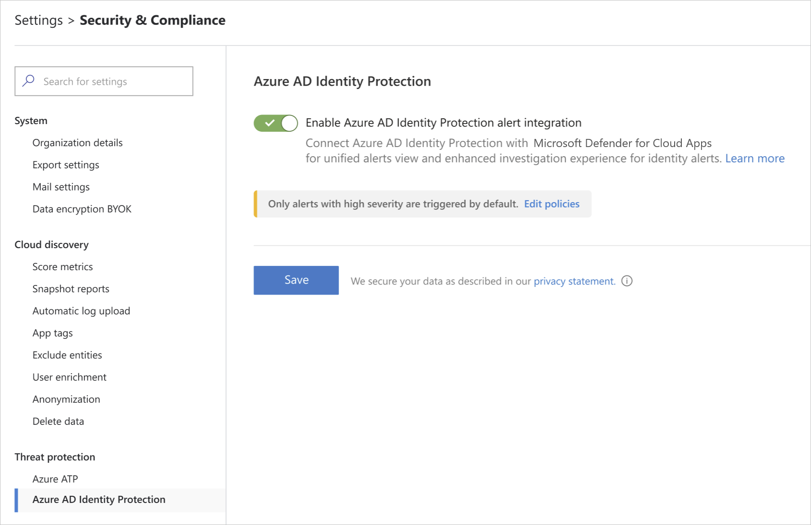

# Classic portal: Microsoft Entra ID Protection integration

[!INCLUDE [Banner for top of topics](includes/classic-banner.md)]

Microsoft Defender for Cloud Apps integrates with Microsoft Entra ID Protection to provide user entity behavioral analytics (UEBA) across a hybrid environment. For more information about the machine learning and behavioral analytics provided by Identity Protection, see [What is Identity Protection?](/azure/active-directory/identity-protection/overview-identity-protection).

## Prerequisites

- A Cloud App Security Admin account to enable integration between Identity Protection and Defender for Cloud Apps.

## Enable Identity Protection

> [!NOTE]
> The Identity Protection feature is enabled by default. However, if the feature was disabled, you can use these steps to enable it.

To enable Defender for Cloud Apps integration with Identity Protection:

1. In Defender for Cloud Apps, under the settings cog, select **Settings**.

    

1. Under **Threat Protection**, select **Azure AD Identity Protection**.

    

1. Select **Enable Azure AD Identity Protection alert integration** and then select **Save**.

After enabling Identity Protection integration, you'll be able to see alerts for all the users in your organization.

## Disable Identity Protection

To disable Defender for Cloud Apps integration with Identity Protection:

1. In Defender for Cloud Apps, under the settings cog, select **Settings**.

1. Under **Threat Protection**, select **Azure AD Identity Protection**.

1. Clear **Enable Azure AD Identity Protection alert integration** and then select **Save**.

> [!NOTE]
>
> - When the integration is disabled, existing Identity Protection alerts are kept in accordance with Defender for Cloud Apps retention policies.
> - Since Defender for Cloud Apps only consumes interactive logins from Microsoft Entra ID, some alerts may not show related activities. You can investigate such activities in the Microsoft Entra admin center.

## Configure Identity Protection Policies

The Identity Protection policies can be fine-tuned to your organization's need using the severity slider. The sensitivity slider allows you to control which alerts are ingested. In this way, you can adapt the detection according to your coverage needs and your (SNR) targets.

The following policies are available:

|Policy|Description|Default state|Default Severity|
|---|---|---|---|
|Leaked Credentials|Shows leaked credentials alerts, user's valid credentials have been leaked|Enabled|Low - Receive all alerts|
|Risky sign-in|Aggregates multiple risky sign-in detections, sign-ins that weren't performed by the user|Enabled|High - Receive only high severity alerts|

> [!NOTE]
> Defender for Cloud Apps does not send email notifications for Identity Protection alerts. However, you can configure email notifications for them in the Identity Protection portal.

## Next steps

> [!div class="nextstepaction"]
> [Control cloud apps with policies](control-cloud-apps-with-policies.md)

[!INCLUDE [Open support ticket](includes/classic-support.md)]
