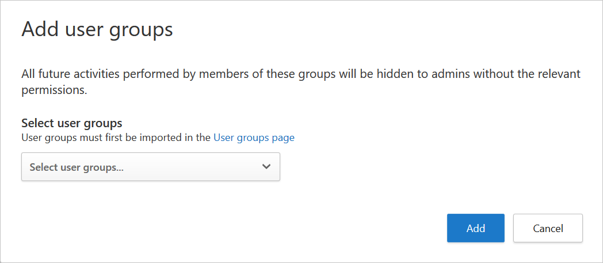

# Classic portal: Activity privacy

[!INCLUDE [Banner for top of topics](includes/banner.md)]

Microsoft Defender for Cloud Apps provides enterprises with the ability to granularly determine which users they want to monitor based on group membership. Activity privacy adds the ability to follow your organization's compliance regulations without compromising user privacy. This is achieved by enabling you to monitor users while maintaining their privacy by hiding their activities in the activity log. Only authorized admins have the option to choose to view these private activities, with each instance being audited in the governance log.

>[!NOTE]
> Private activities aren't forwarded to Microsoft 365 Defender advanced hunting, and aren't passed on in our SIEM integration.

## Configure activity privacy user groups

You may have users in Defender for Cloud Apps that you want to monitor but, due to compliance regulations, you need to limit the people who can do so. Activity privacy allows you to define a user group for which the activities will be hidden by default.

To configure your user privacy groups, you must first [import user groups](user-groups.md) to Defender for Cloud Apps. By default, you'll see the following groups:

- **Application** user group -  A built-in group that enables you to see activities performed by Microsoft 365 and Azure AD applications.

- **External users** group - All users who aren't members of any of the managed domains you configured for your organization.

1. In the menu bar, select the settings cog and select **Scoped deployment and privacy**.

    

1. To set specific groups to be monitored by Defender for Cloud Apps, in the **Activity privacy** tab, select the plus icon.
    

1. In the **Add user groups** dialog, under **Select user groups**, select all the groups you want to make private in Defender for Cloud Apps, and then select **Add**.

    

    > [!NOTE]
    > Once a user group is added, all the activities performed by users of the group will be made private from then on. Existing activities are not affected.

## Assign admins permission to view private activities

1. In the menu bar, select the settings cog and select **Manage admin access**.

    

1. To give specific admins permission to view private activities, in the **Activity privacy permissions** tab, select the plus icon.
    

1. In the **Add admin permission** dialog, enter the admin's UPN or email address, and then select **Add permission**.

    

    > [!NOTE]
    > Only admins can be assigned permission to view private activities.

## Viewing private activities

Once an admin has been granted the appropriate permission to view private activities, they have the option to choose to see these activities in the activity log.

### To view private activities

1. In the **Activity log** page, to the right of the activity table, select the settings icon, and then select **Show private activities**.

    

1. In the **Show private activities** dialog, select **OK** to confirm that you understand that the action is being audited. Once confirmed, the private activities are shown in the activity log and the action is recorded in the governance log.

[!INCLUDE [Open support ticket](includes/support.md)]
