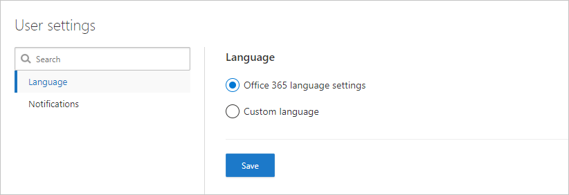
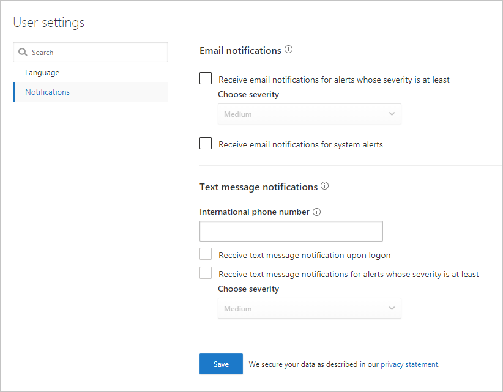

# Classic portal: Admin user settings

[!INCLUDE [Banner for top of topics](includes/classic-banner.md)]

Microsoft Defender for Cloud Apps allows you to customize your admin user settings. The notification settings allow admins to specify if they would like to receive email notifications for alerts.

## Customize your admin settings

To set up your preferences as an admin of Microsoft Defender for Cloud Apps, select your name in the portal menu bar, and select **User settings** to set the following settings:

1. Select **Language**. Here you can choose the language to use in the Defender for Cloud Apps portal.

    

2. Select **Notifications** and set email notification preferences for emails you receive from the system. You can set the severity that determines which alerts and violations you want to receive emails. The severity is set per policy. When violations are triggered, you receive email notification depending on the setting here and the Severity setting in the policy that was violated. Emails are sent to the alias associated with the administrator user account you used to sign in to Defender for Cloud Apps.

    > [!NOTE]
    >
    > - Notifications are not sent for Microsoft Entra IPC events.

    

3. When you're done, select **Save**.

## Next steps

> [!div class="nextstepaction"]
> [Set up Cloud Discovery](set-up-cloud-discovery.md)

[!INCLUDE [Open support ticket](includes/classic-support.md)]
