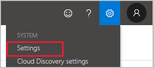
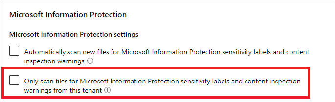
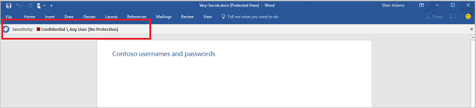
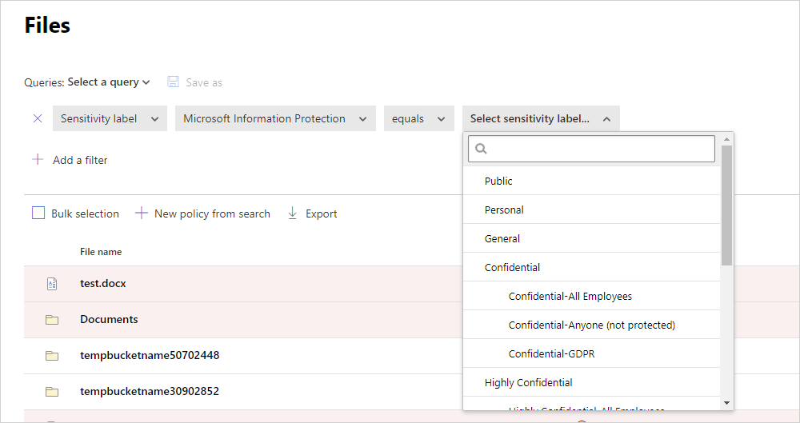

# Classic portal: Integrate Microsoft Purview Information Protection

[!INCLUDE [Banner for top of topics](includes/banner.md)]

Microsoft Defender for Cloud Apps lets you automatically apply sensitivity labels from Microsoft Purview Information Protection. These labels will be applied to files as a file policy governance action, and depending on the label configuration, can apply encryption for additional protection. You can also investigate files by filtering for the applied sensitivity label within the Defender for Cloud Apps portal. Using labels enables greater visibility and control of your sensitive data in the cloud. Integrating Microsoft Purview Information Protection with Defender for Cloud Apps is as easy as selecting a single checkbox.

By integrating Microsoft Purview Information Protection into Defender for Cloud Apps, you can use the full power of both services and secure files in your cloud, including:

- The ability to apply sensitivity labels as a governance action to files that match specific policies
- The ability to view all classified files in a central location
- The ability to investigate according to classification level, and quantify exposure of sensitive data over your cloud applications
- The ability to create policies to make sure classified files are being handled properly

## Prerequisites

> [!NOTE]
> To enable this feature, you need both a Defender for Cloud Apps license and a license for Azure Information Protection Premium P1. As soon as both licenses are in place, Defender for Cloud Apps syncs the organization's labels from the Azure Information Protection service.

- To work with Microsoft Purview Information Protection integration, you must enable the [App connector for Microsoft 365](./connect-office-365.md).

For Defender for Cloud Apps to apply sensitivity labels, they must be published as part of a sensitivity label policy in the Microsoft Purview compliance portal.

Defender for Cloud Apps currently supports applying sensitivity labels from Microsoft Purview Information Protection for the following file types:

- Word: docm, docx, dotm, dotx
- Excel: xlam, xlsm, xlsx, xltx
- PowerPoint: potm, potx, ppsx, ppsm, pptm, pptx
- PDF
  > [!NOTE]
  > For PDF, you must use unified labels.

This feature is currently available for files stored in Box, Google Workspace, SharePoint Online, and OneDrive for Business. More cloud apps will be supported in future versions.

## How it works

You can see the sensitivity labels from Microsoft Purview Information Protection in Defender for Cloud Apps. As soon as you integrate Defender for Cloud Apps with Microsoft Purview Information Protection, Defender for Cloud Apps scans files as follows:

1. Defender for Cloud Apps retrieves the list of all the sensitivity labels used in your tenant. This action is performed every hour to keep the list up to date.

2. Defender for Cloud Apps then scans the files for sensitivity labels, as follows:

    - If you enabled automatic scan, all new or modified files are added to the scan queue and all existing files and repositories will be scanned.
    - If you set a file policy to search for sensitivity labels, these files are added to the scan queue for sensitivity labels.

3. As noted above, these scans are for the sensitivity labels discovered in the initial scan Defender for Cloud Apps does to see which sensitivity labels are used in your tenant. External labels, classification labels set by someone external to your tenant, are added to the list of classification labels. If you don't want to scan for these, select the **Only scan files for sensitivity labels from Microsoft Purview Information Protection and content inspection warnings from this tenant** check box.

4. After you enable Microsoft Purview Information Protection on Defender for Cloud Apps, all new files that are added to your connected cloud apps will be scanned for sensitivity labels.

5. You can create new policies within Defender for Cloud Apps that apply your sensitivity labels automatically.

> [!NOTE]
>
> - Unprotected Labels applied outside of Defender for Cloud Apps can be overridden by Defender for Cloud Apps, but can't be removed. Files with protection outside of Defender for Cloud Apps can be scanned by granting permissions to [inspect content for protected files](content-inspection.md#content-inspection-for-protected-files).
> - Defender for Cloud Apps doesn't support overriding labels for files that were labeled by Defender for Cloud Apps.
> - Defender for Cloud Apps doesn't support removing labels with protection from files that were labeled by Defender for Cloud Apps with the "override user defined labels" option.
> - Defender for Cloud Apps doesn't support removing labels with protection from files that were labeled outside Defender for Cloud Apps.
> - Defender for Cloud Apps doesn't support reading labels of password-protected files.
> - Empty files will not be labeled.
> - Defender for Cloud Apps doesn't support labeling files in a [library that is configured to require checkout](https://support.microsoft.com/office/set-up-a-library-to-require-check-out-of-files-0c73792b-f727-4e19-a1f9-3173899e695b).

## How to integrate Microsoft Purview Information Protection with Defender for Cloud Apps

### Enable Microsoft Purview Information Protection

All you have to do to integrate Microsoft Purview Information Protection with Defender for Cloud Apps is select a single checkbox. By enabling automatic scan, you enable searching for sensitivity labels from Microsoft Purview Information Protection on your Microsoft 365 files without the need to create a policy. After you enable it, if you have files in your cloud environment that are labeled with sensitivity labels from Microsoft Purview Information Protection, you'll see them in Defender for Cloud Apps.

To enable Defender for Cloud Apps to scan files with content inspection enabled for sensitivity labels:

1. In Defender for Cloud Apps, under the settings cog, select the **Settings** page under the **System** heading.

    

1. Under **Microsoft Purview Information Protection**, select **Automatically scan new files for sensitivity labels from Microsoft Purview Information Protection and content inspection warnings**.

    

After enabling Microsoft Purview Information Protection, you'll be able to see files that have sensitivity labels and filter them per label in Defender for Cloud Apps. After Defender for Cloud Apps is connected to the cloud app, you'll be able to use the Microsoft Purview Information Protection integration features to apply sensitivity labels from Microsoft Purview Information Protection (with or without encryption) in the Defender for Cloud Apps portal, by adding them directly to files or by configuring a file policy to apply sensitivity labels automatically as a governance action.

> [!NOTE]
> Automatic scan does not scan existing files until they are modified again. To scan existing files for sensitivity labels from Microsoft Purview Information Protection, you must have at least one **File policy** that includes content inspection. If you have none, create a new **File policy**, delete all the preset filters, under **Inspection method** select **Built-in DLP**. In the **Content inspection** field, select **Include files that match a preset expression** and select any predefined value, and save the policy. This enables content inspection, which automatically detects sensitivity labels from Microsoft Purview Information Protection.

#### Set internal and external labels

By default, Defender for Cloud Apps scans sensitivity labels that were defined in your organization as well as external ones defined by other organizations.

To ignore sensitivity labels set external to your organization, in the [Defender for Cloud Apps portal](https://portal.cloudappsecurity.com/), go to **Settings** and then **Microsoft Purview Information Protection**. Select **Only scan files for sensitivity labels from Microsoft Purview Information Protection and content inspection warnings from this tenant**.

### Apply labels directly to files

1. From the **Files** page under **Investigate**, select the file you want to protect. Select the three dots at the end of the file's row and then choose **Apply sensitivity label**.

    

    >[!NOTE]
    > Defender for Cloud Apps can apply Microsoft Purview Information Protection on files that are up to 30 MB.

2. Choose one of your organization's sensitivity labels to apply to the file, and select **Apply**.

    

3. After you choose a sensitivity label and select **Apply**, Defender for Cloud Apps will apply the sensitivity label to the original file.

4. You can also remove sensitivity labels by choosing the **Remove sensitivity label** option.

For more information about how Defender for Cloud Apps and Microsoft Purview Information Protection work together, see [Automatically apply sensitivity labels from Microsoft Purview Information Protection](use-case-information-protection.md).

### Automatically label files

You can automatically apply sensitivity labels to files by creating a file policy and setting **Apply sensitivity label** as the governance action.

Follow these instructions to create the file policy:

1. Create a file policy.
2. Set the policy to include the type of file you want to detect. For example, select all files where **Access level** doesn't equal **Internal** and where the **Owner OU** equals your finance team.
3. Under governance actions for the relevant app, select **Apply sensitivity label** then select the label type.

    

> [!NOTE]
>
> - The ability to apply a sensitivity label is a powerful capability. To protect customers from mistakenly applying a label to a large number of files, as a safety precaution there is a daily limit of 100 **Apply label** actions per app, per tenant. After the daily limit is reached, the apply label action pauses temporarily and continues automatically the next day (after 12:00 UTC). To raise the limit for your tenant, open a support ticket.
> - When a policy is disabled, all pending labeling tasks for that policy are suspended.
> - In the label configuration, permissions must be assigned to any authenticated user, or all users in your organization, for Defender for Cloud Apps to read label information.

### Control file exposure

- For example, if you labeled the document below with a Microsoft Purview Information Protection sensitivity label:

    

- You can see this document in Defender for Cloud Apps by filtering on the sensitivity label for Microsoft Purview Information Protection in the **Files** page.

    

- You can get more information about these files and their sensitivity labels in the file drawer. Just select the relevant file in the **Files** page and check whether it has a sensitivity label.

    

- Then, you can create file policies in Defender for Cloud Apps to control files that are shared inappropriately and find files that are labeled and were recently modified.

- You can create a policy that automatically applies a sensitivity label to specific files.
- You can also trigger alerts on activities related to file classification.

> [!NOTE]
> When sensitivity labels are disabled on a file, the disabled labels appear as disabled in Defender for Cloud Apps. Deleted labels are not displayed.

**Sample policy - confidential data that is externally shared on Box:**

1. Create a file policy.
2. Set the policy's name, severity, and category.
3. Add the following filters to find all confidential data that is externally shared on Box:

    

**Sample policy - restricted data that was recently modified outside the Customer Data folder on SharePoint:**

1. Create a file policy.
2. Set the policy's name, severity, and category.
3. Add the following filters to find all recently modified restricted files while excluding the Customer Data folder in the folder selection option:

    

You can also choose to set alerts, user notification or take immediate action for these policies.
Learn more about [governance actions](governance-actions.md).

Learn more about [Microsoft Purview Information Protection](/microsoft-365/compliance/information-protection).

## Next steps

> [!div class="nextstepaction"]
> [Control cloud apps with policies](control-cloud-apps-with-policies.md)

[!INCLUDE [Open support ticket](includes/support.md)]
