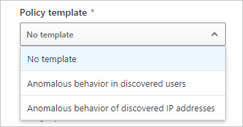
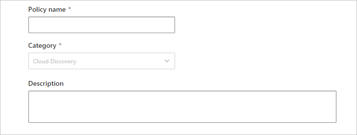

# Classic portal: Cloud Discovery anomaly detection policy

[!INCLUDE [Banner for top of topics](includes/classic-banner.md)]

This article gives you reference details about policies. Explanations for each policy type and fields that can be configured for each policy are listed.

## Cloud Discovery anomaly detection policy reference

A Cloud Discovery anomaly detection policy enables you to set up and configure continuous monitoring of unusual increases in cloud application usage. Increases in downloaded data, uploaded data, transactions, and users are considered for each cloud application. Each increase is compared to the normal usage pattern of the application as learned from past usage. The most extreme increases trigger security alerts.

For each policy, you set filters that enable you to selectively monitor application usage. Filters include an application filter, selected data views, and a selected start date. You can also set the sensitivity, which enables you to set how many alerts the policy should trigger.

1. In the [Defender for Cloud Apps portal](https://portal.cloudappsecurity.com/), go to **Control** > **Policies** > **Shadow IT**.

1. Select **Create policy** and select **Cloud Discovery anomaly detection policy**.

    

This will bring you to the **Create Cloud Discovery anomaly detection policy** page.

For each policy, set the following parameters:

1. Decide if you want to base the policy on a template. One relevant policy template is the **Anomalous behavior in discovered users** template. It alerts when anomalous behavior is detected in discovered users and apps, such as: large amounts of uploaded data compared to other users, large user transactions compared to the user's history. You can also select the **Anomalous behavior of discovered IP addresses** template. This template alerts when anomalous behavior is detected in discovered IP addresses and apps, such as: large amounts of uploaded data compared to other IP addresses, large app transactions compared to the IP address's history.

    

1. Provide a **Policy name** and **Description**.

    

1. Create a filter for the apps you want to monitor by selecting **Select a filter**.
   You can select a filter by **App tag**, **Apps and domain**, **Category**, various **Risk factors**, or **Risk score.** To create additional filters, select **Add a filter**.

    

1. Under **Apply to**, set how you want the usage to be filtered. The usage being monitored can be filtered in two different ways:

    - **Continuous reports** – Select whether to monitor **All continuous reports** (default), or choose **Specific continuous reports** to monitor.

        - When selecting **All continuous reports**, each usage increase is compared to the normal usage pattern as learned from all the data views.
        - When selecting **Specific continuous reports**, each usage increase is compared to the normal usage pattern. The pattern is learned from the same data view as the increase was observed in.

    - **Users and IP addresses** –Every cloud application usage is associated either with a user, an IP address, or both.

        - Selecting **Users** ignores the association of application usage with IP addresses.

        - Selecting **IP addresses** ignores the association of application usage with users.

        - Selecting **Users and IP addresses** (default) considers both associations, but may produce duplicate alerts when there's a tight correspondence between users and IP addresses.

    - **Raise alerts only for suspicious activities occurring after** – Any increase in application usage before the selected date is ignored. However, activity from before the selected date is learned to establish the normal usage pattern.

        

1. Under **Alerts**, you can set the alert sensitivity. There are several ways to control the number of alerts triggered by the policy:

    - The **Select anomaly detection sensitivity** slider – Trigger alerts for the top X anomalous activities per 1,000 users per week. The alerts are triggered for the activities with the highest risk.

    - Select **Create an alert for each matching event with the policy's severity** to set additional parameters for the alert:

        - **Send alert as email** - If you check this box, enter any email addresses that should receive the alert. A maximum of 500 email messages will be sent per email address, per day (resetting at midnight in the UTC time zone.)
        - **Daily alert limit** - You can choose to restrict the number of alerts raised on a single day.
        - **Send alerts to Power Automate** - If you check this box, you can choose a playbook to run actions when an alert is raised.

    - If you select **Save as default settings**, your choices for **Daily alert limit** and email settings will become your organization's default settings. To fill in these default settings for a new policy, select **Restore default settings**.

        

1. Select **Create**.

1. Like with all policies, you can **Edit**, **Disable**, and **Enable** the policy by clicking the three dots at the end of the row in the **Policies** page. By default, when you create a policy it's enabled.

## Next steps

> [!div class="nextstepaction"]
> [Daily activities to protect your cloud environment](classic-daily-activities-to-protect-your-cloud-environment.md)

[!INCLUDE [Open support ticket](includes/classic-support.md)]
