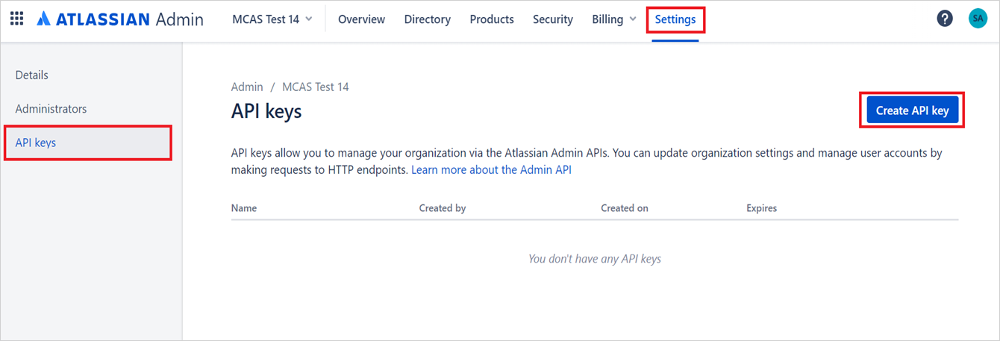
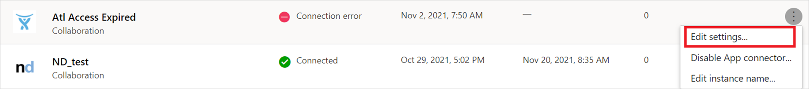

# Classic portal: Connect Atlassian to Microsoft Defender for Cloud Apps

[!INCLUDE [Banner for top of topics](includes/classic-banner.md)]

This article provides instructions for connecting Microsoft Defender for Cloud Apps to your existing Atlassian products using the App Connector APIs. This connection gives you visibility into and control over your organization's Atlassian use.

>[!NOTE]
>The connector will cover all users in your organization that use the Atlassian platform, and will show activities from Confluence, Jira, and specific Bitbucket activities. For more information about Atlassian activities, see [Atlassian audit log activities](https://support.atlassian.com/security-and-access-policies/docs/track-organization-activities-from-the-audit-log/#Auditlogging-Accessauditlogactivities).

## Prerequisites

- The [Atlassian Access](https://www.atlassian.com/software/access#about-atlassian-access) plan is required.
- You must be signed as an Organization admin to Atlassian.

## How to connect Atlassian to Defender for Cloud Apps

### Configure Atlassian

1. Sign in to the Atlassian Admin portal with an admin account.

    

1. Go to **Settings -> API keys** and then **Create API key**. (Atlassian documentation for creating API keys can also be found [here](https://support.atlassian.com/organization-administration/docs/manage-an-organization-with-the-admin-apis/)).

    

1. Give the following values to the API key:

    - **Name:** You can give any name. The recommended name is *Microsoft Defender for Cloud Apps* so you can be aware for this integration.
    - **Expires on:** Set the expiration date as one year from the date of creation (this is the Atlassian maximum time for the expiration date).

        >[!NOTE]
        >According to Atlassian API requirements, you'll need to create every year an API key for this integration.

        

1. After selecting **Create**, copy the **Organization ID** and the **API key**. You'll need it later.

    >[!NOTE]
    >Verify your domain: To see your Atlassian users and their activities in Defender for Cloud Apps, you need to verify your domain. In Atlassian, domains are used to     determine which user accounts can be managed by your organization. You won't see users and their activities if their domains aren't verified in the Atlassian configuration.
    >To verify domains in Atlassian see [Verify a domain to manage accounts](https://support.atlassian.com/user-management/docs/verify-a-domain-to-manage-accounts/).

### Configure Defender for Cloud Apps

1. In the [Defender for Cloud Apps portal](https://portal.cloudappsecurity.com/), select **Investigate** and then **Connected apps**.

1. In the **App connectors** page, select the plus button followed by **Atlassian**.

1. In the pop-up, give the connector a descriptive name, and press **Connect Atlassian**.

    

1. In the next page, enter the **Organization ID** and **API key** you saved before.

>[!NOTE]
>
> - The first connection can take up to four hours to get all users and their activities.
> - The activities that will display are the activities that were generated from the moment the connector is connected.
> - Activities from the "Atlassian Access" audit log are fetched by Defender for Cloud apps. Other activities aren't fetched currently. See [Product Audit Logs](https://support.atlassian.com/security-and-access-policies/docs/track-organization-activities-from-the-audit-log/).
> - After the connector’s **Status** is marked as **Connected**, the connector is live and works.

## Revoke and renew API keys

1. Microsoft recommends using short lived keys or tokens for connecting apps as a security best practice.
1. We recommend refreshing the Atlassian API key every 6 months as a best practice. To refresh the key, revoke the existing API key and generate a new key.
1. To revoke API key, navigate to **admin.atlassian.com** > **Settings** > **API keys**, determine the API key used for integration and select **Revoke**.
1. Recreate an API key in the Atlassian admin portal with the steps described above.
1. Afterwards, go to the Defender for Cloud Apps portal and edit the connector:

    

1. Enter the new generated new **API key** and select **Connect Atlassian**.

>[!NOTE]
>
> By default, the API key is valid for 1 year and expires automatically after a year.

## Rate limits

- 1000 requests per minute (per API key/connector instance)
- For more information about the Atlassian API limitation, see [Atlassian admin REST APIs](https://developer.atlassian.com/cloud/admin/about/#about-the-cloud-admin-rest-apis).

## Limitations

- Activities will be shown in Defender for Cloud Apps only for users with a verified domain.
- The API key has a maximum expiration period of one year. After one year, you'll need to create another API key from the Atlassian Admin portal and replace it for the old API Key in the Defender for Cloud Apps console.
- You won't be able to see in Defender for Cloud Apps whether a user is an admin or not.
- System activities are shown with the **Atlassian Internal System** account name.

## Next steps

> [!div class="nextstepaction"]
> [Control cloud apps with policies](control-cloud-apps-with-policies.md)

[!INCLUDE [Open support ticket](includes/classic-support.md)]
