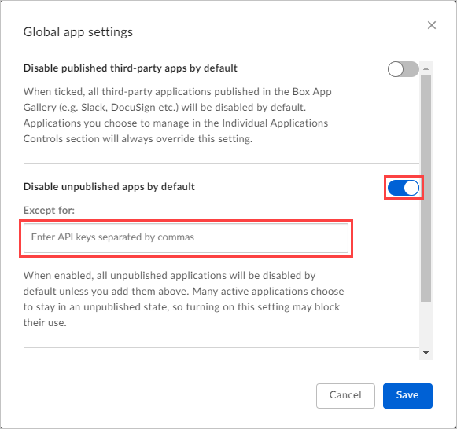

# Classic portal: Connect Box to Microsoft Defender for Cloud Apps

[!INCLUDE [Banner for top of topics](includes/classic-banner.md)]

This article provides instructions for connecting Microsoft Defender for Cloud Apps to your existing Box account using the App Connector APIs. This connection gives you visibility into and control over Box use. For information about how Defender for Cloud Apps protects Box, see [Protect Box](protect-box.md).

## How to connect Box to Defender for Cloud Apps

> [!NOTE]
> Deploying with an account that is not an Admin account leads to a failure in the API test and does not allow Defender for Cloud Apps to scan all of the files in Box. If this is a problem for you, you can deploy with a Co-Admin that has all of the privileges checked, but the API test will continue to fail and files owned by other admins in Box will not be scanned.

1. If you restrict application permission access, follow this step. Otherwise, skip to step 2.

    1. Sign in with an Admin account to your Box account.
    1. Select **Apps** > **Custom apps** > **Settings**.

         

    1. If **Disable unpublished apps by default** is selected, in the **Except for** text box, add the Defender for Cloud Apps API key:

         |Data center|Defender for Cloud Apps API key|
         |----|----|
         |US1|`nduj1o3yavu30dii7e03c3n7p49cj2qh`|
         |US2|`w0ouf1apiii9z8o0r6kpr4nu1pvyec75`|
         |US3|`dmcyvu1s9284i2u6gw9r2kb0hhve4a0r`|
         |EU1|`me9cm6n7kr4mfz135yt0ab9f5k4ze8qp`|
         |EU2|`uwdy5r40t7jprdlzo85v8suw1l4cdsbf`|

        Then select **Save**. For information on how to see which Defender for Cloud Apps data center you're connected to, see [View your data center](network-requirements.md#view-your-data-center).

        

        > [!NOTE]
        > If you are an existing Adallom customer, and your console URL is for Adallom and not Defender for Cloud Apps, use this app serial number: `bwahmilhdlpbqy2ongkl119o3lrkoshc`.

1. In the [Defender for Cloud Apps portal](https://portal.cloudappsecurity.com/), select **Investigate** and then **Connected apps**.

1. In the **App connectors** page, select the plus sign (**+**) button and then select **Box**.

    

1. In the **Box settings** pop-up, select **Follow this link**.

1. The Box sign-in page opens. Enter your credentials to allow Defender for Cloud Apps access to your team's Box app.

1. Box asks you if you want to allow Defender for Cloud Apps access to your team information, activity log, and perform activities as a team member. To proceed, select **Allow**.

1. Back in the Defender for Cloud Apps portal, you should receive a message saying that Box was successfully connected.

1. Make sure the connection succeeded by selecting **Test API**.

    Testing may take a couple of minutes. After receiving a success notice, select **Close**.

Box is now connected to Defender for Cloud Apps.

After connecting Box:

- You'll receive events for the 7 days prior to connection.
- Defender for Cloud Apps will perform a full scan of all files. Depending on how many files and users you have, completing the full scan can take a while.

To enable near real-time scanning, files on which activities are detected are moved to the beginning of the scan queue. For example, a file that is edited, updated, or shared is scanned right away rather than waiting for the regular scan process. Near real-time scanning doesn't apply to files that aren't inherently modified. For example, files that are viewed, previewed, printed, or exported are scanned as part of the regularly scheduled scan.

If you have any problems connecting the app, see [Troubleshooting App Connectors](troubleshooting-api-connectors-using-error-messages.md).

## Next steps

> [!div class="nextstepaction"]
> [Control cloud apps with policies](control-cloud-apps-with-policies.md)

[!INCLUDE [Open support ticket](includes/classic-support.md)]
