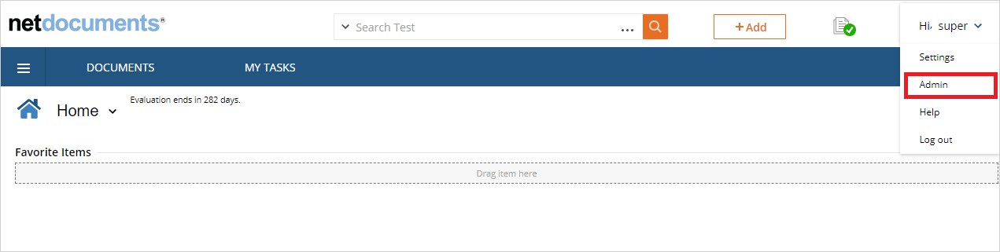
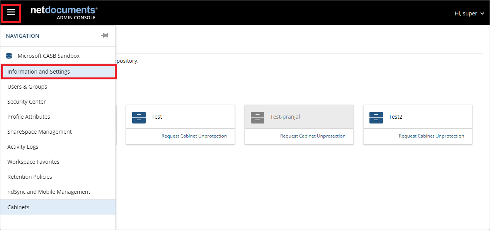
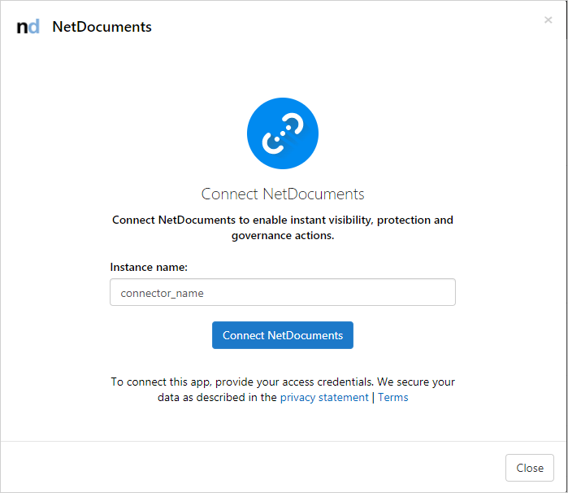

# Classic portal: Connect NetDocuments to Microsoft Defender for Cloud Apps

[!INCLUDE [Banner for top of topics](includes/classic-banner.md)]

This article provides instructions for connecting Microsoft Defender for Cloud Apps to your existing NetDocuments using the App Connector APIs. This connection gives you visibility into and control over your organization's NetDocuments use.

## Prerequisites

- The NetDocuments user used for logging into NetDocuments must be a Full NetDocuments Repository Admin user.

## How to connect NetDocuments to Defender for Cloud Apps

### Configure NetDocuments

1. Sign in to your NetDocuments account with a Full NetDocuments Repository Admin user.

1. Enter the admin portal from the top-right corner.

    

1. Enter the **Information and Settings** section from the top-left corner.

    

1. In this page, you can find your repository ID. Copy and save it. You'll need it later.

    

1. Record the URL of your account (it should be one of URLs in the following list). You'll need this information later.

    | Location       |              URL            |
    | -------------- | --------------------------- |
    | United Kingdom | <https://eu.netdocuments.com> |
    | Australia     | <https://au.netdocuments.com> |
    | Germany        | <https://de.netdocuments.com> |
    | United States or any other location  |   <https://vault.netvoyage.com> |

### Configure Defender for Cloud Apps

1. In the [Defender for Cloud Apps portal](https://portal.cloudappsecurity.com/), select **Investigate** and then **Connected apps**.

1. In the **App connectors** page, select the plus button followed by **NetDocuments**.

1. In the pop-up, give the connector a descriptive name, and press **Connect NetDocuments**.

    

1. In the next screen, enter the following fields:

    - **Repository ID**: the app repository ID that you saved.
    - **Application URL**: the URL that you saved.

1. Select **Connect in NetDocuments**.
1. Make sure the connection succeeded by selecting **Test now**. Testing may take a few minutes. After receiving a success notice, select **Close**.
1. The first connection can take up to four hours to get all users and their activities in the seven days before the connection.
1. After the connector’s **Status** is marked as **Connected**, the connector is live and works.

## Activities limitations

- Login/Logouts activities are not supported by NetDocuments.

## Rate limits

The default rate limit is 100,000 requests per minute.

## Next steps

> [!div class="nextstepaction"]
> [Control cloud apps with policies](control-cloud-apps-with-policies.md)

[!INCLUDE [Open support ticket](includes/classic-support.md)]
