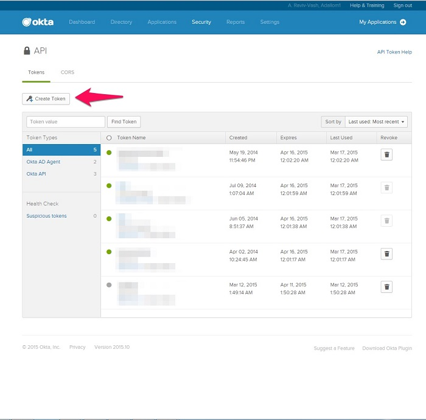
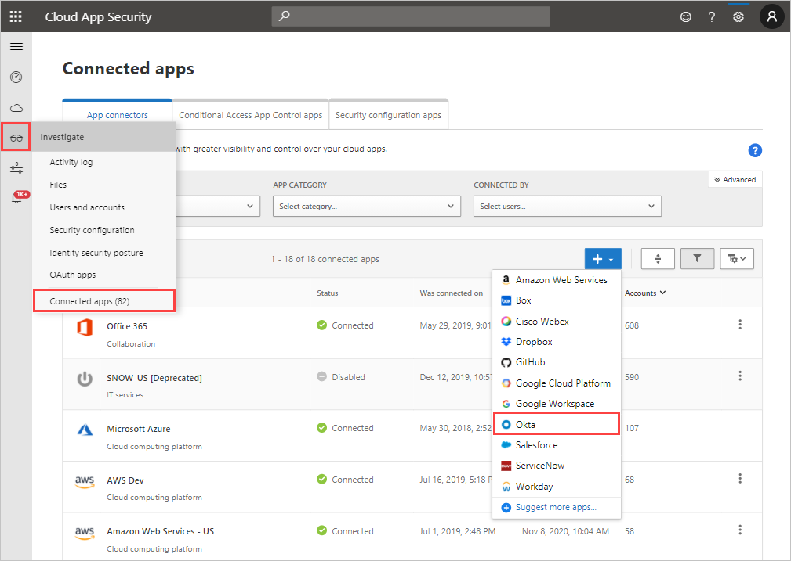

# Classic portal: Connect Okta to Microsoft Defender for Cloud Apps

[!INCLUDE [Banner for top of topics](includes/classic-banner.md)]

This article provides instructions for connecting Microsoft Defender for Cloud Apps to your existing Okta account using the connector APIs. This connection gives you visibility into and control over Okta use. For information about how Defender for Cloud Apps protects Okta, see [Protect Okta](protect-okta.md).

## How to connect Okta to Defender for Cloud Apps

1. It's recommended that you create an admin Service Account in Okta for Defender for Cloud Apps.

    Make sure you use an account with Super Admin permissions.

    Make sure your Okta account is verified.

1. In the Okta console, select **Admin**.

    - Select **Security** and then **API**.

         

    - Select **Create Token**.

         

    - In the **Create Token** pop-up, name your Defender for Cloud Apps token, and select **Create Token**.

         

    - In the **Token created successfully** pop-up, copy the **Token value**.

         

1. In the Defender for Cloud Apps console, select **Investigate** and then **Connected apps**.

1. In the **App connectors page**, select the plus button and then **Okta**.

    

1. In the pop-up, in the **Domain** field, enter your Okta domain and paste your Token into the **Token** field.

1. Select **Connect** to create the token for Okta in Defender for Cloud Apps.

1. Make sure the connection succeeded by selecting **Test API**.

    Testing may take a couple of minutes. After receiving a success notice, select **Close**.

After connecting Okta, you'll receive events for 60 days prior to connection.

If you have any problems connecting the app, see [Troubleshooting App Connectors](troubleshooting-api-connectors-using-error-messages.md).

## Next steps

> [!div class="nextstepaction"]
> [Control cloud apps with policies](control-cloud-apps-with-policies.md)

[!INCLUDE [Open support ticket](includes/classic-support.md)]
