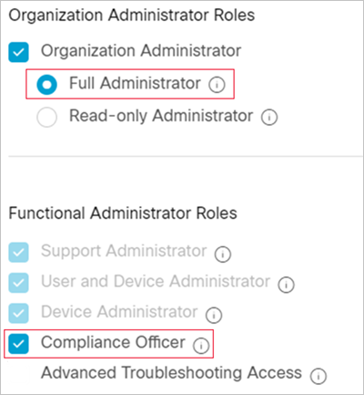
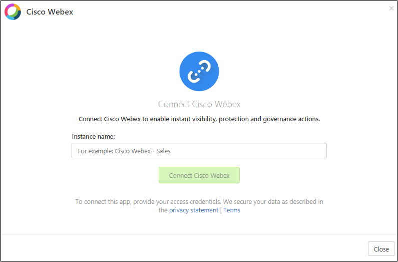

# Classic portal: Connect Cisco Webex Teams to Microsoft Defender for Cloud Apps

[!INCLUDE [Banner for top of topics](includes/classic-banner.md)]

This article provides instructions for connecting Microsoft Defender for Cloud Apps to your existing Cisco Webex account using the connector APIs. This connection gives you visibility into and control over Webex users, activities, and files. For information about how Defender for Cloud Apps protects Cisco Webex Teams, see [Protect Cisco Webex Teams](protect-webex.md).

## Prerequisites

- We suggest that you create a dedicated service account for the connection. This enables you to see that governance actions performed in Webex as being performed from this account, such as delete messages sent in Webex. Otherwise, the name of the admin who connected Defender for Cloud Apps to Webex will appear as the user who performed the actions.
- You must have Full Administrator **and** Compliance Officer roles in Webex (under **Roles and Security** > **Administrator Roles**).

    

## How to connect Webex to Defender for Cloud Apps

1. In the Defender for Cloud Apps console, click **Investigate** and then **Connected apps**.

1. In the **App connectors** page, click the plus button followed by **Cisco Webex**.

    

1. In the pop-up, enter the instance name of this connector.

1. Click **Connect Cisco Webex**. The Webex sign in page opens. Enter your credentials to allow Defender for Cloud Apps access to your team's Webex instance.

1. Webex asks you if you want to allow Defender for Cloud Apps access to your team information, activity log, and perform activities as a team member. To proceed, click **Allow**.

1. Back in the Defender for Cloud Apps console, you should receive a message that Webex was successfully connected.

1. Make sure the connection succeeded by clicking **Test API**.

    Testing may take a couple of minutes. After you receive a success notice, click **Close**.

After connecting Webex, you'll receive events for 7 days prior to connection. Defender for Cloud Apps scans events over the past three months. To increase this, you must have a Cisco Webex pro license and open a ticket with Defender for Cloud Apps support.

If you have any problems connecting the app, see [Troubleshooting App Connectors](troubleshooting-api-connectors-using-error-messages.md).

## Next steps

> [!div class="nextstepaction"]
> [Control cloud apps with policies](control-cloud-apps-with-policies.md)

[!INCLUDE [Open support ticket](includes/classic-support.md)]
