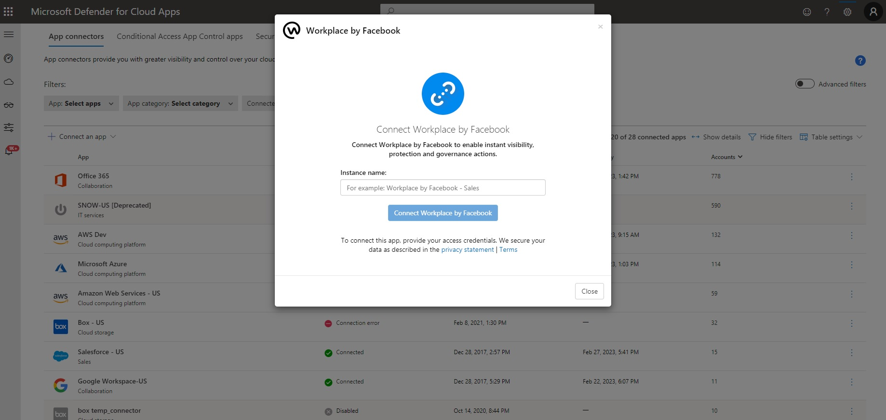

# Classic portal: Connect Workplace to Microsoft Defender for Cloud Apps (Preview)

[!INCLUDE [Banner for top of topics](includes/classic-banner.md)]

This article provides instructions for connecting Microsoft Defender for Cloud Apps to your existing Workplace account using the App Connector APIs. This connection gives you visibility into and control over your organization's Workplace use.

## Prerequisites

- You must be signed-in as a system admin to Workplace by Meta.

   > [!NOTE]
   > A Workplace account can be connected to a single instance of Defender for Cloud Apps. Please make sure that your Workplace account is not connected to any other Defender for Cloud Apps instance.

## How to connect Workplace to Defender for Cloud Apps

1. In the [Defender for Cloud Apps portal](https://portal.cloudappsecurity.com/), select **Investigate** and then **Connected apps**.
1. In the **App connectors** page, select the plus button followed by **Workplace by Meta**.
1. In the pop-up, give the connector a descriptive name, and select **Connect Workplace by Meta**.
   

1. In the next screen, select **Connect Workplace by Meta**:
   

1. You'll be redirected to Workplace by Meta page.

   >[!NOTE]
   >Make sure you are logged into Workplace as System admin.

1. On the Workplace authorization page, make sure to choose the correct organization from the dropdown.

1. In the app consent page, make sure to choose **All groups** and then select **Add to Workplace.**

   > [!NOTE]
   >
   > - The first connection can take up to 4 hours to get all users and their activities.
   > - The activities that will show are the activities that were generated from the moment the connector is connected.
   > - After the connector's **Status** is marked as **Connected**, the connector is live and works.

## Next steps

> [!div class="nextstepaction"]
> [Control cloud apps with policies](control-cloud-apps-with-policies.md)

[!INCLUDE [Open support ticket](includes/classic-support.md)]
