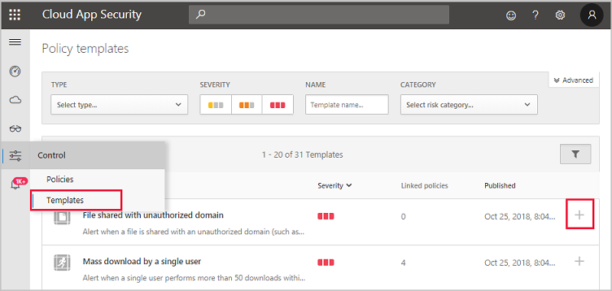
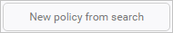
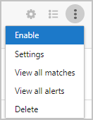

# Classic portal: Control cloud apps with policies

[!INCLUDE [Banner for top of topics](includes/classic-banner.md)]

Policies allow you to define the way you want your users to behave in the cloud. They enable you to detect risky behavior, violations, or suspicious data points and activities in your cloud environment. If necessary, you can integrate remediation work flows to achieve complete risk mitigation. There are multiple types of policies that correlate to the different types of information you want to gather about your cloud environment and the types of remediation actions you may want to take.

For example, if there's a data violation threat that you want to quarantine, you need a different type of policy in place than if you want to block a risky cloud app from being used by your organization.

## Policy types

When you look at the **Policy** page, the various policies and templates can be distinguished by type and icon to see which policies are available. The policies can be viewed together on the **All policies** tab, or in their respective category tabs. The available policies depend on the data source and what you have enabled in Defender for Cloud Apps for your organization. For example, if you uploaded Cloud Discovery logs, the policies relating to Cloud Discovery are displayed.

The following types of policies can be created:

|Policy type icon|Policy type|Category|Use|
|-----|---------|--------|---------|
||Activity policy|Threat detection|Activity policies allow you to enforce a wide range of automated processes using the app provider's APIs. These policies enable you to monitor specific activities carried out by various users, or follow unexpectedly high rates of a certain type of activity. [Learn more](user-activity-policies.md)|
||Anomaly detection policy|Threat detection|Anomaly detection policies enable you to look for unusual activities on your cloud. Detection is based on the risk factors you set to alert you when something happens that is different from the baseline of your organization or from the user's regular activity. [Learn more](anomaly-detection-policy.md)|
||OAuth app policy|Threat detection|OAuth app policies enable you to investigate which permissions each OAuth app requested and automatically approve or revoke it. These are built-in policies that come with Defender for Cloud Apps and can't be created. [Learn more](app-permission-policy.md)|
||Malware detection policy|Threat detection|Malware detection policies enable you to identify malicious files in your cloud storage and automatically approve or revoke it. This is a built-in policy that comes with Defender for Cloud Apps and can't be created. [Learn more](anomaly-detection-policy.md#malware-detection)|
||File policy|Information protection|File policies enable you to scan your cloud apps for specified files or file types (shared, shared with external domains), data (proprietary information, personal data, credit card information, and other types of data) and apply governance actions to the files (governance actions are cloud-app specific). [Learn more](data-protection-policies.md)|
||Access policy|Conditional access|Access policies provide you with real-time monitoring and control over user logins to your cloud apps. [Learn more](access-policy-aad.md)|
||Session policy|Conditional access|Session policies provide you with real-time monitoring and control over user activity in your cloud apps. [Learn more](session-policy-aad.md)|
||App discovery policy|Shadow IT|App discovery policies enable you to set alerts that notify you when new apps are detected within your organization. [Learn more](cloud-discovery-policies.md)|
||Cloud Discovery anomaly detection policy|Shadow IT|Cloud Discovery anomaly detection policies look at the logs you use for discovering cloud apps and search for unusual occurrences. For example, when a user who never used Dropbox before suddenly uploads 600 GB to Dropbox, or when there are a lot more transactions than usual on a particular app. [Learn more](cloud-discovery-anomaly-detection-policy.md)|

## Identifying risk

Defender for Cloud Apps helps you mitigate different risks in the cloud. You can configure any policy and alert to be associated with one of the following risks:

- **Access control:** Who accesses what from where?

    Continuously monitor behavior and detect anomalous activities, including high-risk insider and external attacks, and apply a policy to alert, block, or require identity verification for any app or specific action within an app. Enables on-premises and mobile access control policies based on user, device, and geography with coarse blocking and granular view, edit, and block. Detect suspicious login events, including multi-factor authentication failures, disabled account login failures, and impersonation events.

- **Compliance:** Are your compliance requirements breached?

    Catalog and identify sensitive or regulated data, including sharing permissions for each file, stored in file-sync services to ensure compliance with regulations such as PCI, SOX, and HIPAA

- **Configuration control:** Are unauthorized changes being made to your configuration?

    Monitor configuration changes including remote configuration manipulation.

- **Cloud Discovery:** Are new apps being used in your organization? Do you have a problem of Shadow IT apps being used that you don't know about?

    Rate overall risk for each cloud app based on regulatory and industry certifications and best practices. Enables you to monitor the number of users, activities, traffic volume, and typical usage hours for each cloud application.

- **DLP:** Are proprietary files being shared publicly? Do you need to quarantine files?

    On-premises DLP integration provides integration and closed-loop remediation with existing on-premises DLP solutions.

- **Privileged accounts:** Do you need to monitor admin accounts?

    Real-time activity monitoring and reporting of privileged users and admins.

- **Sharing control:** How is data being shared in your cloud environment?

    Inspect the content of files and content in the cloud, and enforce internal and external sharing policies. Monitor collaboration and enforce sharing policies, such as blocking files from being shared outside your organization.

- **Threat detection:** Are there suspicious activities threatening your cloud environment?

    Receive real-time notifications for any policy violation or activity threshold via email. By applying machine learning algorithms, Defender for Cloud Apps enables you to detect behavior that could indicate that a user is misusing data.

## How to control risk

Follow this process to control risk with policies:

1. Create a policy from a template or a query.

1. Fine-tune the policy to achieve expected results.

1. Add automated actions to respond and remediate risks automatically.

### Create a policy

You can either use the Defender for Cloud Apps policy templates as a basis for all your policies, or create policies from a query.

Policy templates help you set the correct filters and configurations necessary to detect specific events of interest within your environment. The templates include policies of all types, and can apply to various services.

To create a policy from **Policy templates**, perform the following steps:

1. In the console, select **Control** followed by **Templates**.

    

1. Select the plus sign (**+**) at the far right of the row of the template you want to use. A create policy page opens, with the pre-defined configuration of the template.

1. Modify the template as needed for your custom policy. Every property and field of this new template-based policy can be modified according to your needs.
   > [!NOTE]
   > When using the policy filters, **Contains**  searches only for full words – separated by comas, dots, spaces, or underscores. For example if you search for **malware** or **virus**, it finds virus_malware_file.exe but it does not find malwarevirusfile.exe. If you search for *malware.exe*, you find ALL files with either malware or exe in their filename, whereas if you search for **"malware.exe"** (with the quotation marks) you will find only files that contain exactly "malware.exe".  
**Equals** searches only for the complete string, for example if you search for *malware.exe* it finds malware.exe but not malware.exe.txt.

1. After you create the new template-based policy, a link to the new policy appears in the **Linked policies** column in the policy template table next to the template from which the policy was created.
    You can create as many policies as you want from each template and they'll all be linked to the original template. Linking allows you to track all policies built using the same template.

Alternatively, you can **create a policy during investigation**. If you're investigating the **Activity log**, **Files** or **Accounts**, and you drill down to search for something specific, at any time you can create a new policy based on the results of your investigation.

For example, if you're looking at the **Activity log**, and see an admin activity from outside your office's IP addresses.

To create a policy based on investigation results, do the following steps:

1. In the console, select **Investigate** followed by **Activity log**, **Files**, or **Accounts**.

1. Use the filters at the top of the page to limit the search results to the suspicious area. For example, in the Activity log page, select **Activity type** and select **Write Administrators** under Azure operation. Then, under **IP address**, select **Category** and set the value to not include IP address categories you've created for your recognized domains, such as your admin, corporate, and VPN IP addresses.

    

1. In the upper right corner of the console, select **New policy from search**.

    

1. A create policy page opens, containing the filters you used in your investigation.

1. Modify the template as needed for your custom policy. Every property and field of this new investigation-based policy can be modified according to your needs.

    > [!NOTE]
    > When using the policy filters, **Contains**  searches only for full words – separated by comas, dots, spaces, or underscores. For example if you search for **malware** or **virus**, it finds virus_malware_file.exe but it does not find malwarevirusfile.exe.  
**Equals** searches only for the complete string, for example if you search for **malware.exe** it finds malware.exe but not malware.exe.txt.

    

    > [!NOTE]
    > For more information on setting the policy fields, see the corresponding policy documentation:
    >
    > [User activity policies](user-activity-policies.md)
    >
    > [Data protection policies](data-protection-policies.md)
    >
    > [Cloud Discovery policies](cloud-discovery-policies.md)

### Add automated actions to respond and remediate risks automatically

For a list of available governance actions per app, see the [Governing connected apps](governance-actions.md).

You can also set the policy to send you an alert by email when matches are detected.

To set your notification preferences, got to [Customize the portal](general-setup.md)

## Enable and disable policies

After you create a policy, you can enable or disable it. Disabling avoids the need to delete a policy after you create it in order to stop it. Instead, if for some reason you want to stop the policy, disable it until you choose to enable it again.

- To enable a policy, in the **Policy** page, select the three dots at the end of the row of the policy you want to enable. Select **Enable**.

    

- To disable a policy, in the **Policy** page, select the three dots at the end of the row of the policy you want to disable. Select **Disable**.

    

By default, after you create a new policy, it's enabled.

## Policies overview report

Defender for Cloud Apps lets you export a policies overview report showing aggregated alert metrics per policy to help you monitor, understand, and customize your policies to better protect your organization.

To export a log, perform the following steps:

1. In the **Policies** page, select the **Export** button.

1. Specify the required time range.

1. Select **Export**. This process may take some time.

To download the exported report:

1. After the report is ready, go to **Settings** and then **Exported reports**.

1. In the table, select the relevant report from the list of **Policies overview report** and select download.

    

## Next steps

> [!div class="nextstepaction"]
> [Daily activities to protect your cloud environment](classic-daily-activities-to-protect-your-cloud-environment.md)

[!INCLUDE [Open support ticket](includes/classic-support.md)]
