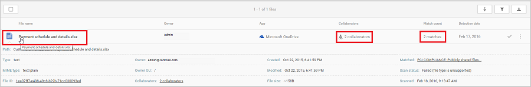
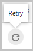
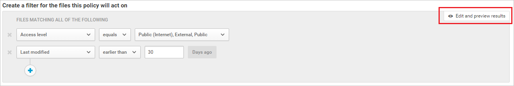
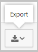

# Classic portal: Governance actions in Microsoft Defender for Cloud Apps

[!INCLUDE [Banner for top of topics](includes/banner.md)]

You can apply governance actions to users' files across your cloud environment. After you've thoroughly investigated and learned about your cloud, you can use governance actions to help protect your organization.

## Use policies to assess risk

After you take a look at your open alerts, go to the Policy center to review policy violations that didn't trigger alerts.

- In the Defender for Cloud Apps dashboard, select **Control** and then **Policies**.

- Select a specific policy to see the **Matching now** list of policy matches that didn't trigger alerts.

- Select the violations one at a time and decide what to do for each. For more information about governance actions, see the following figures:

    If your policy is set to find compliance breaches and someone saves credit card numbers in files on OneDrive, you'll have a match in the policy.

    

- Select the match to see the actual files that breached the policy.

    

    You can select the file itself to get information about the files.

    You can select **Collaborators** to see who has access to this file.

    You can select **Matches** to see the actual credit card numbers.

    

## Apply governance actions

You can apply governance actions from within policies, from inside alerts, and from the **File** log.

At any point, you can review and see the status of all previously applied governance actions by going to the **Settings** cog and choosing **Governance log**. 

For any governance action that failed, choose the **Retry** icon to apply it again. 

Depending on the type of policy, violation, and app, different governance actions are available.

## Move from detection to automatic remediation

After you define and customize your policy filters, you can select automated governance actions that will happen after every violation of your policy.
Because remediation actions use the cloud provider APIs, actions might vary from one app to another.

> [!NOTE]
> Take extra care when you set governance actions. They might lead to irreversible loss of access permissions to your files.
> It's a good idea to narrow down the filters to exactly represent the files that you want to act upon, by using multiple search fields. The narrower the filters, the better.
>
> For guidance, you can use the **Edit and preview results** button in the **Filters** section.

## Migration

Defender for Cloud Apps helps you roll out your migrations by letting you know who in your organization is using which apps and giving you the tools to monitor new app adoption. It can also help you figure out which types of apps you should offer in your organization, by giving you the tools to see what everyone is already using.

### Migrate your users to a new app

Imagine this scenario: you recently bought Microsoft 365, and you want all the users in your organization to stop using all other cloud storage apps and start using OneDrive. Here's what you might want to do:

1. Go to your **Cloud Discovery Dashboard** and under **App categories**, filter apps by **Cloud Storage**. Sort the results by **Users** or **IP addresses**, and check to see which app is most popular.

2. You can see which users are using other apps. You can also drill down into those apps, and notify users that you want them to migrate to OneDrive, as follows:

    1. In your **Cloud Discovery Dashboard**, choose **Dropbox** and then choose the **IP address** or **Users** tab.

    2. Choose the **Export** arrow icon and choose your export options. 

### Find more secure alternatives

The Defender for Cloud Apps service catalog can help you find alternatives that work for your organization, instead of risky apps that your users might be using.

Imagine this scenario: you're considering buying a productivity tool, and you aren't sure if your users would make use of it.

1. Go to the **Cloud Discovery Dashboard**.

2. Under **Categories**, filter apps by **Productivity**.

3. For each app in use, check the **Score** to see if it's safe — and if not, why not.

4. If you decide that you want to buy an enterprise license for the whole organization, you might also want to look at the **Users** column. There, you can see what's already most popular among your users, see if it's trusted, and see what security features it has before making your decision.

## Next steps

To learn how to use and set up policies to control cloud app use, see [Control cloud apps with policies](control-cloud-apps-with-policies.md).

[!INCLUDE [Open support ticket](includes/support.md)]
