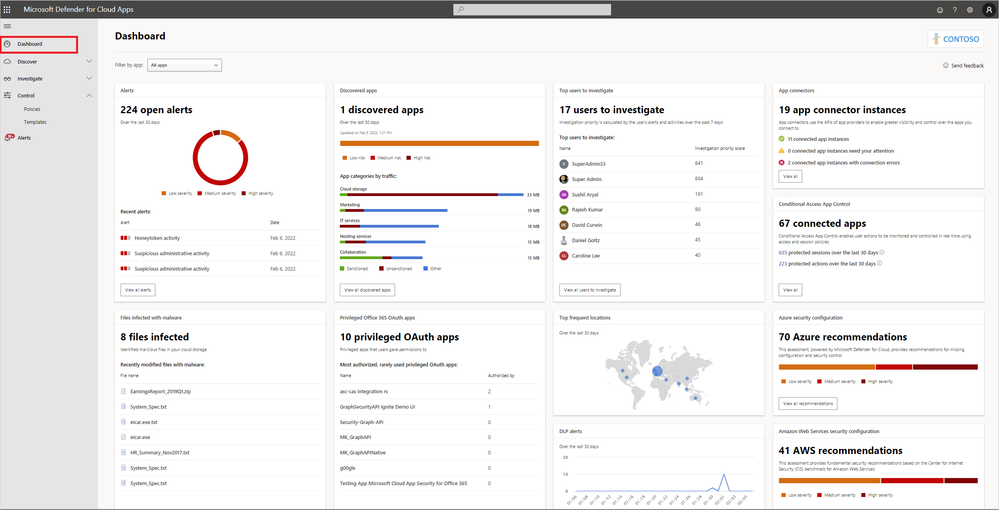

# Classic portal: Working with the dashboard

[!INCLUDE [Banner for top of topics](includes/banner.md)]

This article describes what you should do with Defender for Cloud Apps daily.  

## Check the dashboard

The information presented in the dashboard is an overview of all the most important information about your organization. Each information card provides links to a deeper investigation of the information presented. You can also choose to view the dashboard information for a specific app using the filter provided.

### What can you expect to see in the dashboard?

- **Open alerts**  
Shows the number of open alerts, a graph of the alert status distribution, and recent alerts

- **Discovered apps**  
Shows the number of discovered apps, a graph of the app risk distribution, and the top app categories by traffic.
- **Top users to investigate**  
Shows the number of users to investigate and the users with the highest investigation priority.
- **Conditional Access App Control**  
Shows the number of apps protected by Conditional Access App Control as well as the number of protected sessions and actions over the last 30 days.
- **App connectors status**  
Shows the number of API connected app instances and their status.
- **Files infected with malware**  
Shows the number of files infected with malware.
- **Privileged Microsoft 365 OAuth apps**  
Shows the number of rarely used OAuth apps granted highly privileged permissions.
- **Azure security configuration**  
Shows the number and severity of Azure security configuration recommendations.
- **AWS security configuration**  
Shows the number and severity of AWS security configuration recommendations.
- **DLP alerts**  
Shows a graph of DLP alerts over the last 30 days.

## Next steps

> [!div class="nextstepaction"]
> [Investigate alerts](investigate.md)

[!INCLUDE [Open support ticket](includes/support.md)]
