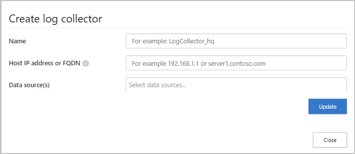
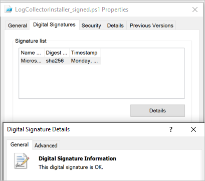
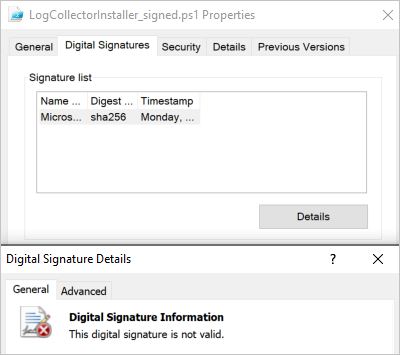

# Classic portal: Configure automatic log upload using on-premises Docker on Windows

[!INCLUDE [Banner for top of topics](includes/banner.md)]

You can configure automatic log upload for continuous reports in Defender for Cloud Apps using a Docker on Windows.

## Prerequisites

* OS:
  * **Windows 10** (fall creators update)
  * Windows Server **version 1709+** (SAC)
  * **Windows Server 2019 (LTSC)**

* Disk space: 250 GB

* CPU cores: 2

* CPU Architecture: Intel® 64 and AMD 64

* RAM: 4 GB

* Set your firewall as described in [Network requirements](network-requirements.md#log-collector)

* Virtualization on the operating system must be enabled with Hyper-V

> [!IMPORTANT]
>
> * Enterprise customers with more than 250 users or more than $10 million USD in annual revenue require a paid subscription to use Docker Desktop for Windows. For more information, see [Docker subscription overview](https://docs.docker.com/subscription/).
> * A user must be signed in for Docker to collect logs. We recommend advising your Docker users to disconnect without signing out.
> * Docker for Windows is not officially supported in VMWare virtualization scenarios.
> * Docker for Windows is not officially supported in nested virtualization scenarios. If you still plan to use nested virtualization, refer to [Docker's official guide](https://docs.docker.com/docker-for-windows/troubleshoot/#running-docker-desktop-in-nested-virtualization-scenarios).
> * For information about additional configuration and implementation considerations for Docker for Windows, see [Install Docker Desktop on Windows](https://docs.docker.com/desktop/windows/install/).

> [!NOTE]
> If you have an existing log collector and want to remove it before deploying it again, or if you simply want to remove it, run the following commands:
>
> ```console
> docker stop <collector_name>
> docker rm <collector_name>
> ```

## Log collector performance

The Log collector can successfully handle log capacity of up to 50 GB per hour. The main bottlenecks in the log collection process are:

* Network bandwidth - Your network bandwidth determines the log upload speed.

* I/O performance of the virtual machine - Determines the speed at which logs are written to the log collector's disk. The log collector has a built-in safety mechanism that monitors the rate at which logs arrive and compares it to the upload rate. In cases of congestion, the log collector starts to drop log files. If your setup typically exceeds 50 GB per hour, it's recommended that you split the traffic between multiple log collectors.

## Set up and configuration

### Step 1 – Web portal configuration: Define data sources and link them to a log collector

1. Go to the **Automatic log upload** settings page.

    1. In the [Defender for Cloud Apps portal](https://portal.cloudappsecurity.com/), select the settings icon followed by **Log collectors**.

    

1. For each firewall or proxy from which you want to upload logs, create a matching data source.

    1. Select **Add data source**.  
    
    1. **Name** your proxy or firewall.  
    
    1. Select the appliance from the **Source** list. If you select **Custom log format** to work with a network appliance that isn't listed, see [Working with the custom log parser](custom-log-parser.md) for configuration instructions.
    1. Compare your log with the sample of the expected log format. If your log file format doesn't match this sample, you should add your data source as **Other**.
    1. Set the **Receiver type** to either **FTP**, **FTPS**, **Syslog – UDP**, or **Syslog – TCP**, or **Syslog – TLS**.

    > [!NOTE]
    > Integrating with secure transfer protocols (FTPS and Syslog – TLS) often requires additional settings or your firewall/proxy.

    f. Repeat this process for each firewall and proxy whose logs can be used to detect traffic on your network. It's recommended to set up a dedicated data source per network device to enable you to:

    * Monitor the status of each device separately, for investigation purposes.
    * Explore Shadow IT Discovery per device, if each device is used by a different user segment.

1. Go to the **Log collectors** tab at the top.

    1. Select **Add log collector**.
    1. Give the log collector a **name**.
    1. Enter the **Host IP address** (private IP address) of the machine you'll use to deploy the Docker. The host IP address can be replaced with the machine name, if there's a DNS server (or equivalent) that will resolve the host name.
    1. Select all **Data sources** that you want to connect to the collector, and select **Update** to save the configuration.
    

1. Further deployment information will appear. **Copy** the run command from the dialog. You can use the copy to clipboard icon, . You'll need this later.

1. **Export** the expected data source configuration. This configuration describes how you should set the log export in your appliances.

    

    > [!NOTE]
    >
    > * A single Log collector can handle multiple data sources.
    > * Copy the contents of the screen because you will need the information when you configure the Log Collector to communicate with Defender for Cloud Apps. If you selected Syslog, this information will include information about which port the Syslog listener is listening on.
    > * For users sending log data via FTP for the first time, we recommend changing the password for the FTP user. For more information, see [Changing the FTP password](log-collector-advanced-management.md#change-the-ftp-password).

### Step 2 – On-premises deployment of your machine

The following steps describe the deployment in Windows. The deployment steps for other platforms are slightly different.

1. Open a PowerShell terminal as an administrator on your Windows machine.

1. Run the following command to download the Windows Docker installer PowerShell script file: `Invoke-WebRequest https://adaprodconsole.blob.core.windows.net/public-files/LogCollectorInstaller.ps1 -OutFile (Join-Path $Env:Temp LogCollectorInstaller.ps1)`

    To validate that the installer is signed by Microsoft, see [Validate installer signature](#optional---validate-installer-signature).

1. To enable PowerShell script execution, run `Set-ExecutionPolicy RemoteSigned`

1. Run: `& (Join-Path $Env:Temp LogCollectorInstaller.ps1)`
This installs the Docker client on your machine.

    :::image type="content" source="media/classic-install-docker.png" alt-text="Docker is installed.":::

    After running the command, the machine will be automatically restarted.

1. When the machine is up and running again, run the same command in PowerShell: `& (Join-Path $Env:Temp LogCollectorInstaller.ps1)`

    :::image type="content" source="media/classic-install-log-collector.png" alt-text="Run PowerShell command again.":::

1. Run the Docker installer. Select **Use WSL 2 instead of Hyper-V (recommended)**:

    :::image type="content" source="media/classic-install-docker-desktop.png" alt-text="Installing Docker desktop.":::

    After the installation is completed, the machine will be automatically restarted again.

1. After the restart is completed, open the Docker client and go through the Docker subscription agreement:

    :::image type="content" source="media/classic-docker-service-agreement.png" alt-text="Accept Docker service agreement.":::

1. If the WSL2 installation isn't completed, the following pop-up message will show up:

    :::image type="content" source="media/classic-wsl2-installation-incomplete.png" alt-text="WSL 2 installation is incomplete.":::

1. Complete the installation by downloading the package as explained in [Download the Linux kernel update package.](/windows/wsl/install-manual)

1. Open the Docker Desktop client again and make sure that it has started:

    :::image type="content" source="media/classic-open-docker-desktop-client.png" alt-text="Open the Docker Desktop client.":::

1. Run CMD as an administrator and type the run command generated in the portal. If you need to configure a proxy, add the proxy IP address and port number. For example, if your proxy details are 192.168.10.1:8080, your updated run command is:

    ```console
    (echo db3a7c73eb7e91a0db53566c50bab7ed3a755607d90bb348c875825a7d1b2fce) | docker run --name MyLogCollector -p 21:21 -p 20000-20099:20000-20099 -e "PUBLICIP='192.168.1.1'" -e "PROXY=192.168.10.1:8080" -e "CONSOLE=mod244533.us.portal.cloudappsecurity.com" -e "COLLECTOR=MyLogCollector" --security-opt apparmor:unconfined --cap-add=SYS_ADMIN --restart unless-stopped -a stdin -i mcr.microsoft.com/mcas/logcollector starter
    ```

    

1. Verify that the collector is running properly with the following command: `docker logs <collector_name>`

You should see the message: **Finished successfully!**


### Step 3 - On-premises configuration of your network appliances

Configure your network firewalls and proxies to periodically export logs to the dedicated Syslog port of the FTP directory according to the directions in the dialog. For example:

```console
BlueCoat_HQ - Destination path: \<<machine_name>>\BlueCoat_HQ\
```

### Step 4 - Verify the successful deployment in the Defender for Cloud Apps portal

Check the collector status in the **Log collector** table and make sure the status is **Connected**. If it's **Created**, it's possible the log collector connection and parsing haven't completed.


You can also go to the **Governance log** and verify that logs are being periodically uploaded to the portal.

Alternatively, you can check the log collector status from within the docker container using the following commands:

1. Log in to the container by using this command: `docker exec -it <Container Name> bash`
1. Verify the log collector status using this command: `collector_status -p`

If you have problems during deployment, see [Troubleshooting Cloud Discovery](troubleshooting-cloud-discovery.md).

### Optional - Create custom continuous reports

Verify that the logs are being uploaded to Defender for Cloud Apps and that reports are generated. After verification, create custom reports. You can create custom discovery reports based on Azure Active Directory user groups. For example, if you want to see the cloud use of your marketing department, import the marketing group using the import user group feature. Then create a custom report for this group. You can also customize a report based on IP address tag or IP address ranges.

1. In the [Defender for Cloud Apps portal](https://portal.cloudappsecurity.com/), under the Settings cog, select Cloud Discovery settings, and then select **Continuous reports**.
1. Select the **Create report** button and fill in the fields.
1. Under the **Filters** you can filter the data by data source, by [imported user group](user-groups.md), or by [IP address tags and ranges](ip-tags.md).

    >[!NOTE]
    >When applying filters on continuous reports, the selection will be included, not excluded. For example, if you apply a filter on a certain user group, only that user group will be included in the report.

    

### Optional - Validate installer signature

To make sure that the docker installer is signed by Microsoft:

1. Right-click on the file and select **Properties**.
1. Select **Digital Signatures** and make sure that it says **This digital signature is OK**.
1. Make sure that **Microsoft Corporation** is listed as the sole entry under **Name of signer**.

    

If the digital signature isn't valid, it will say **This digital signature is not valid**:



## Next steps

> [!div class="nextstepaction"]
> [Modify the log collector FTP configuration](log-collector-advanced-management.md)

[!INCLUDE [Open support ticket](includes/support.md)]
