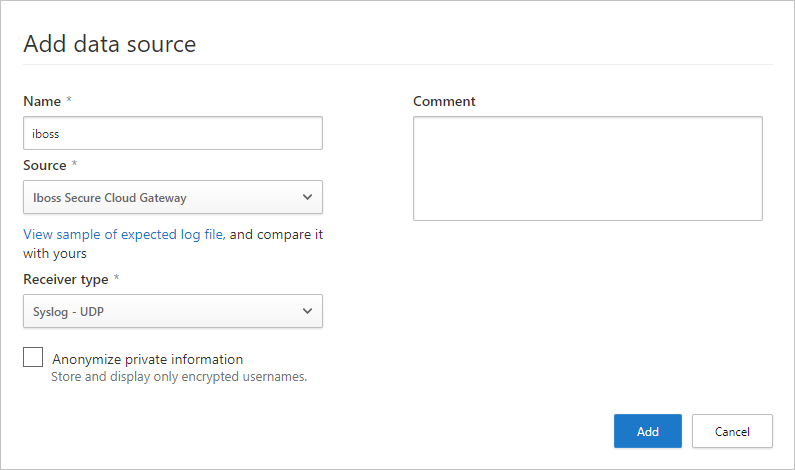

# Classic portal: Integrate Defender for Cloud Apps with iboss

[!INCLUDE [Banner for top of topics](includes/classic-banner.md)]

If you work with both Defender for Cloud Apps and iboss, you can integrate the two products to enhance your security Cloud Discovery experience. iboss is a standalone secure cloud gateway that monitors your organization's traffic and enables you to set policies that block transactions. Together, Defender for Cloud Apps and iboss provide the following capabilities:

- Seamless deployment of Cloud Discovery - Use iboss to proxy your traffic and send it to Defender for Cloud Apps. This eliminates the need for installation of log collectors on your network endpoints to enable Cloud Discovery.
- iboss's block capabilities are automatically applied on apps you set as unsanctioned in Defender for Cloud Apps.
- Enhance your iboss admin portal with the Defender for Cloud Apps risk assessment of the top 100 cloud apps in your organization, which can be viewed directly in the iboss admin portal.

## Prerequisites

- A valid license for Microsoft Defender for Cloud Apps
- A valid license for iboss secure cloud gateway (release 9.1.100.0 or later)

## Deployment

1. In the [Defender for Cloud Apps portal](https://portal.cloudappsecurity.com/), perform the following integration steps:
    1. Select the settings cog and then choose **Cloud Discovery settings**.
    2. Select the **Automatic log upload** tab, and then **Add data source**.
    3. In the **Add data source** page, enter the following settings:

        - Name = iboss
        - Source = iboss Secure Cloud Gateway
        - Receiver type = Syslog - UDP

        

    4. Select **View sample of expected log file**. Then select **Download sample log** to view a sample discovery log, and make sure it matches your logs.

1. Investigate cloud apps discovered on your network. For more information and investigation steps, see [Working with Cloud Discovery](working-with-cloud-discovery-data.md).

1. Any app that you set as unsanctioned in Defender for Cloud Apps will be pinged by iboss once every ten minutes, and then automatically blocked by iboss. For more information about unsanctioning apps, see [Sanctioning/unsanctioning an app](governance-discovery.md#sanctioningunsanctioning-an-app).

1. To configure iboss to send traffic logs to Microsoft Defender for Cloud Apps, contact iboss support.

## Next steps

> [!div class="nextstepaction"]
> [Control cloud apps with policies](control-cloud-apps-with-policies.md)

[!INCLUDE [Open support ticket](includes/classic-support.md)]
