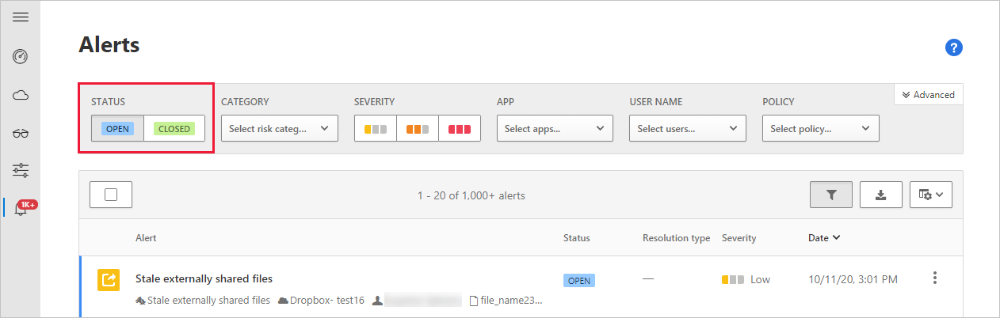

# Classic portal: Monitor alerts in Defender for Cloud Apps

[!INCLUDE [Banner for top of topics](includes/classic-banner.md)]

Alerts are the entry points to understanding your cloud environment more deeply. This article provides a list and description of all alerts.

## Monitoring your alerts

It's a good idea to review all of your alerts. Understanding why an alert is occurring allows you to use them as tools for modifying your policies.

**To view alerts:** In the Microsoft Defender for Cloud Apps portal, select **Alerts**.

- **Dismiss** an alert after you look at it and determine it's not interesting.
  - Enter a **comment** to explain why you dismissed the alert
  - **Send us feedback about this alert** to be reviewed by our security research team for improving the alerts.

- **Resolve** the alert if you investigate it and mitigate the risk.

  - The alert will no longer show up in the alerts table.
  - **Mark as unread** if you started investigating an issue but you want to make sure you remember to continue.
  - **Adjust the policy** that matched the alert to improve future alert matches.
  - Resolving an alert gives you the option to enter a comment and **Send feedback to the Defender for Cloud Apps team**.

## Deployment of our enhanced alert monitoring and management experience

As part of our ongoing improvements to monitoring and managing alerts, the Defender for Cloud Apps Alerts page has been improved based on your feedback. In the enhanced experience, the **Resolved** and **Dismissed** statuses are replaced by the **Closed** status, and closed alerts have one of the following resolution types:

- **True positive**: An alert on a confirmed malicious activity
- **Benign**: An alert on a suspicious but not malicious activity, such as a penetration test or other authorized suspicious action
- **False positive**: An alert on a non-malicious activity

> [!NOTE]
> The enhanced experience only applies to new alerts and does not affect the status of existing (legacy) alerts that were **Resolved** or **Dismissed**.

### Enhanced alert monitoring

In the enhanced alerts page, the **Status** column shows whether an alert is opened or closed and the **Resolution type** column shows the type of resolution used when closing an alert. You can use the **Status** filter to help you identify opened or closed alerts, and then using the **Advanced** filter, you can further investigate closed alerts by **Resolution type** using both enhanced and legacy resolution types.

### Enhanced alert management

When closing alerts, choose one of the following resolution options:

- **Close as true positive**: If the activity is confirmed as malicious
- **Close as benign**: If the activity is suspicious but not malicious activity, such as a penetration test or other authorized suspicious action
- **Close as false positive**: If the activity is confirmed as non-malicious

In the pop-up that appears, provide a reason for closing the alert and fill out the rest of the details as required, and then select **Close alert**.

## Built-in alerts

The alerts generated by anomaly detections listed [here](investigate-anomaly-alerts.md) will be displayed by default.

## Custom Alerts

The following alerts types will be displayed.

|Alert name|AlertID|Description|
|----|----|----|
|Suspicious activity alert|ALERT_SUSPICIOUS_ACTIVITY|Suspicious activities are scored according to how suspicious the anomalous activity is (Is there an inactive account involved? Is it from a new location?) These criteria are all calculated together to provide a risk score based on the following risk factors:  User is administrator  Strictly remote user Anonymous proxy  Entire session is failed logins Numerous failed logins New (admin) IP/ISP/country/user-agent for user/tenant  IP/ISP/country/user-agent used only by (admin) user First (admin) user activity in a while First time this particular administrative activity is performed in a while This particular administrative activity isn't common / was never performed before This IP had only failed logins in the past Impossible travel|
|Suspicious cloud use alert|ALERT_DISCOVERY_ANOMALY_DETECTION|Cloud Discovery anomaly detection checks the pattern of regular behavior and looks for users or apps that are used in an unusual way. |
|Activity policy violation|ALERT_CABINET_EVENT_MATCH_AUDIT|This alert lets you know when a policy match was detected.|
|File policy violation|ALERT_CABINET_EVENT_MATCH_FILE|This alert lets you know when a policy match was detected.|
|Proxy policy violation|ALERT_CABINET_INLINE_EVENT_MATCH|This alert lets you know when a policy match was detected.|
|Field policy violation|ALERT_CABINET_EVENT_MATCH_OBJECT|This alert lets you know when a policy match was detected.|
|New service discovered|ALERT_CABINET_DISCOVERY_NEW_SERVICE|A new app was discovered.|
|Use of personal account|ALERT_PERSONAL_USER_SAGE|Based on file shares and user names, the detection engine searches for personal accounts. |

## Next steps

> [!div class="nextstepaction"]
> [Daily activities to protect your cloud environment](classic-daily-activities-to-protect-your-cloud-environment.md)

[!INCLUDE [Open support ticket](includes/classic-support.md)]
