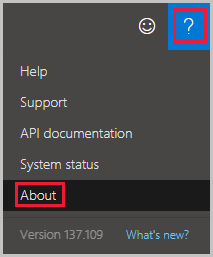
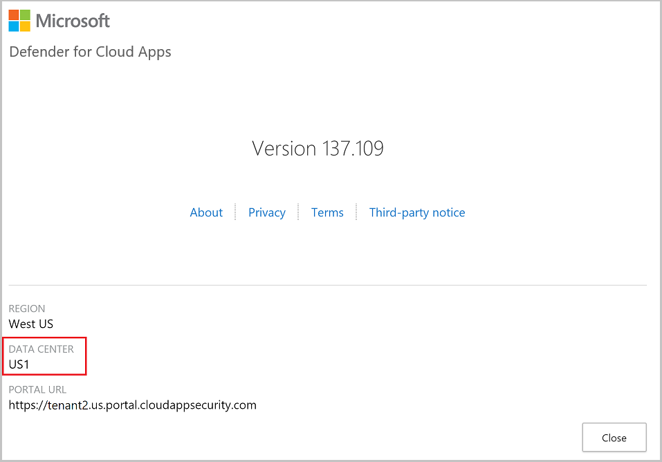

# Classic portal: Network requirements

[!INCLUDE [Banner for top of topics](includes/classic-banner.md)]

This article provides a list of ports and IP addresses you need to allow and allowlist to work with Microsoft Defender for Cloud Apps.

## View your data center

Some of the requirements below depend on which data center you're connected to.

To see which data center you're connecting to, do the following steps:

1. In the [Defender for Cloud Apps portal](https://portal.cloudappsecurity.com/), select the **question mark icon** in the menu bar. Then, select **About**.

    

2. In the Defender for Cloud Apps version screen, you can see the region and the data center.

    

## Portal access

For access to the Defender for Cloud Apps portal, add **outbound port 443** for the following IP addresses and DNS names to your firewall's allowlist:

```ini
portal.cloudappsecurity.com
*.portal.cloudappsecurity.com
cdn.cloudappsecurity.com
https://adaproddiscovery.azureedge.net
*.s-microsoft.com
*.msecnd.net
dev.virtualearth.net
*.cloudappsecurity.com
flow.microsoft.com
static2.sharepointonline.com
dc.services.visualstudio.com
*.blob.core.windows.net
```

For US Government GCC High customers, it's also necessary to add the following DNS names to your firewall's allowlist to provide access for the Defender for Cloud Apps GCC High portal:

```ini
portal.cloudappsecurity.us
*.portal.cloudappsecurity.us
cdn.cloudappsecurity.com
```

Additionally, the following items should be allowed, depending on which data center you use:

|Data center|IP addresses|DNS name|
|----|----|----|
|US1|13.64.26.88, 13.64.29.32, 13.80.125.22, 13.91.91.243, 40.74.1.235, 40.74.6.204, 51.143.58.207, 52.137.89.147, 52.183.75.62, 23.101.201.123, 20.228.186.154|\*.us.portal.cloudappsecurity.com|
|US2|13.80.125.22, 20.36.222.59, 20.36.222.60, 40.74.1.235, 40.74.6.204, 51.143.58.207, 52.137.89.147, 52.183.75.62, 52.184.165.82, 20.15.114.156, 172.202.90.196|\*.us2.portal.cloudappsecurity.com|
|US3|13.80.125.22, 40.74.1.235, 40.74.6.204, 40.90.218.196, 40.90.218.198, 51.143.58.207, 52.137.89.147, 52.183.75.62, 20.3.226.231, 4.255.218.227|*.us3.portal.cloudappsecurity.com|
|EU1|13.80.125.22, 40.74.1.235, 40.74.6.204, 40.119.154.72, 51.143.58.207, 52.137.89.147, 52.157.238.58, 52.174.56.180, 52.183.75.62, 20.71.203.39, 137.116.224.49|\*.eu.portal.cloudappsecurity.com|
|EU2|13.80.125.22, 40.74.1.235, 40.74.6.204, 40.81.156.154, 40.81.156.156, 51.143.58.207, 52.137.89.147, 52.183.75.62, 20.0.210.84, 20.90.9.64|*.eu2.portal.cloudappsecurity.com|
|Gov US1|13.72.19.4, 52.227.143.223|*.us1.portal.cloudappsecurity.us|
|GCC| 52.227.23.181, 52.227.180.126| `portal.cloudappsecuritygov.com`, *.portal.cloudappsecuritygov.com, \*.us1.portal.cloudappsecuritygov.com |

> [!NOTE]
> For portal access, instead of a wildcard (\*), you can choose to open only your specific tenant URL. For example, based on the screenshot above you can open: `tenant2.us.portal.cloudappsecurity.com`

## Access and session controls

Configure your firewall for reverse proxy using the settings relevant to your environment.

### Commercial customers

For commercial customers, to enable Defender for Cloud Apps reverse proxy, add **outbound port 443** for the following IP addresses and DNS names to your firewall's allowlist:

```ini
*.cas.ms
*.mcas.ms
*.admin-mcas.ms
```

Additionally, the following IP addresses, used by our reverse proxy regions, should be allowed for both inbound and outbound connections:

>[!NOTE]
>
> - Inbound IP addresses are used to receive incoming connections from end users by the proxy.
>
> - Outbound IP addresses are used to establish connections from the proxy to the applications.

|  | **IP Addresses** | **DNS Name** |
|--|--|--|
| **Session controls** | Australia Southeast: 40.81.58.184, 40.81.58.180, 20.40.163.96, 20.40.163.88, 40.81.62.221, 40.81.62.206, 20.40.160.184, 20.40.163.130, 20.11.210.40<br /><br />Brazil South: 191.235.123.114, 191.235.121.164, 191.235.122.101, 191.235.119.253, 191.233.23.29, 191.234.216.181, 191.233.21.52, 191.234.216.10, 20.226.100.200<br /><br />Canada Central: 40.82.187.211, 40.82.187.164, 52.139.18.234, 52.139.20.118, 40.82.187.199, 40.82.187.179, 52.139.19.215, 52.139.18.236, 4.205.74.7<br /><br />Central India: 20.193.137.191, 20.193.137.153, 20.193.138.1, 20.193.136.234, 20.193.131.246, 20.193.131.250, 20.193.131.247, 20.193.131.248, 20.219.218.134<br /><br />North Europe: 52.156.205.222, 52.156.204.99, 52.155.166.50, 52.142.127.127, 52.155.181.183, 52.155.168.45, 52.156.202.7, 52.142.124.23, 68.219.99.63<br /><br />Southeast Asia: 40.65.170.125, 40.65.170.123, 52.139.245.40, 52.139.245.48, 40.119.203.158, 40.119.203.209, 20.184.61.67, 20.184.60.77, 20.187.114.178<br /><br />West Europe: 52.157.233.49, 52.157.235.27, 51.105.164.234, 51.105.164.241, 20.229.66.63<br /><br />UK West: 40.81.121.140, 40.81.121.135, 51.137.137.121, 51.137.137.118, 20.90.50.115<br /><br />East US: 104.45.170.196, 104.45.170.182, 52.151.238.5, 52.151.237.243, 104.45.170.173, 104.45.170.176, 52.224.188.157, 52.224.188.168, 20.168.249.164<br /><br />West US 2: 52.156.88.173, 52.149.61.128, 52.149.61.214, 52.149.63.211, 20.190.7.24, 20.190.6.224, 20.190.7.239, 20.190.7.233<br /><br />West US 3: 20.106.103.34<br /><br />France Central: 51.103.95.227                                                                                                | *.mcas.ms<br/>\*.admin-mcas.ms |
| **Access controls** | Australia Southeast: 40.81.63.7, 40.81.59.90, 40.81.62.222, 40.81.62.212, 20.42.228.161, 20.211.237.204<br /><br />Brazil South: 191.235.123.242, 191.235.122.224, 20.197.208.38, 20.197.208.36,191.235.228.36, 104.41.37.185, 20.201.80.33, 104.41.37.185<br /><br />North Europe: 40.67.251.0, 52.156.206.47, 52.155.182.49, 52.155.181.181, 20.50.64.15, 68.219.99.39<br /><br />West Europe: 52.157.234.222, 52.157.236.195, 13.69.81.118, 20.103.48.225, 13.69.81.118<br /><br />Southeast Asia: 40.65.170.137, 40.65.170.26, 40.119.203.98, 40.119.203.208, 20.43.132.128, 20.24.14.233, 20.195.116.193, 20.187.116.207<br /><br />UK West: 40.81.127.139, 40.81.127.25, 51.137.163.32, 20.90.50.109<br /><br />East US: 104.45.170.184, 104.45.170.185, 104.45.170.174, 104.45.170.127, 20.49.104.46, 40.117.113.165, 52.249.211.17, 40.117.113.165 <br /><br /> France Central: 20.111.40.153<br /><br />West US 2: 52.149.59.151, 52.156.89.175, 20.72.216.133, 20.72.216.137,20.115.232.7<br /><br />Canada Central: 20.48.202.161, 4.205.74.15<br /><br />East Asia: 20.187.116.207<br /><br /> West US 3: 20.150.143.88<br /><br />Central India: 20.235.81.243| \*.access.mcas.ms<br/> |
| **SAML proxy** | North Europe: 20.50.64.15<br /><br />East US: 20.49.104.26<br /><br />West US 2: 20.42.128.102 | \*.us.saml.cas.ms \*.us2.saml.cas.ms \*.us3.saml.cas.ms \*.eu.saml.cas.ms *.eu2.saml.cas.ms |

### US Government offerings

For US Government GCC High customers, to enable Defender for Cloud Apps reverse proxy, add **outbound port 443** for the following DNS names to your firewall's allowlist:

```ini
*.mcas-gov.us
*.admin-mcas-gov.us
mcasproxy.azureedge.net
```

Additionally, the following IP addresses, used by our reverse proxy regions, should be allowed for both inbound and outbound connections:

>[!NOTE]
>
> - Inbound IP addresses are used to receive incoming connections from end users by the proxy.
>
> - Outbound IP addresses are used to establish connections from the proxy to the applications.

For **US Government GCC High** customers:

||IP addresses|DNS name|
|----|----|----|
|**Session controls**|US Gov Arizona: 52.244.144.65, 52.244.43.90, 52.244.43.225, 52.244.215.117<br /><br />US Gov Virginia: 13.72.27.223, 13.72.27.219, 13.72.27.220, 13.72.27.222|\*.mcas-gov.us<br/>\*.admin-mcas-gov.us|
|**Access controls**|US Gov Arizona: 52.244.215.83, 52.244.212.197, 52.127.2.97<br /><br />US Gov Virginia: 13.72.27.216, 13.72.27.215, 52.127.50.130|\*.access.mcas-gov.us<br/>\*.access.cloudappsecurity.us|
|**SAML proxy**|US Gov Arizona: 20.140.49.129<br /><br />US Gov Virginia: 52.227.216.80|\*.saml.cloudappsecurity.us|

For **US Government GCC** customers:

||IP addresses|DNS name|
|----|----|----|
|**Session controls**|US Gov Virginia: 52.245.225.0, 52.245.224.229, 52.245.224.234, 52.245.224.228| \*.mcas-gov.ms<br/>\*.admin-mcas-gov.ms|
|**Access controls** |US Gov Arizona: 52.127.2.97<br /><br />US Gov Virginia: 52.245.224.235, 52.245.224.227, 52.127.50.130 | \*.access.mcas-gov.ms|
|**SAML proxy** |US Gov Virginia: 52.227.216.80 | \*.saml.cloudappsecuritygov.com|

## SIEM agent connection

To enable Defender for Cloud Apps to connect to your SIEM, add **outbound port 443** for the following IP addresses to your firewall's allowlist:

|Data center|IP addresses|
|----|----|
|US1|13.64.26.88, 13.64.29.32, 13.80.125.22, 13.91.91.243, 40.74.1.235, 40.74.6.204, 51.143.58.207, 52.137.89.147, 52.183.75.62, 23.101.201.123, 20.228.186.154|
|US2|13.80.125.22, 20.36.222.59, 20.36.222.60, 40.74.1.235, 40.74.6.204, 51.143.58.207, 52.137.89.147, 52.183.75.62, 52.184.165.82, 20.15.114.156, 172.202.90.196|
|US3|13.80.125.22, 40.74.1.235, 40.74.6.204, 40.90.218.196, 40.90.218.198, 51.143.58.207, 52.137.89.147, 52.183.75.62, 20.3.226.231, 4.255.218.227|
|EU1|13.80.125.22, 40.74.1.235, 40.74.6.204, 40.119.154.72, 51.143.58.207, 52.137.89.147, 52.157.238.58, 52.174.56.180, 52.183.75.62, 20.71.203.39, 137.116.224.49|
|EU2|13.80.125.22, 40.74.1.235, 40.74.6.204, 40.81.156.154, 40.81.156.156, 51.143.58.207, 52.137.89.147, 52.183.75.62, 20.0.210.84, 20.90.9.64|
|Gov US1|13.72.19.4, 52.227.143.223|
|GCC| 52.227.23.181, 52.227.180.126|

> [!NOTE]
>
> - If you didn't specify a proxy when you set up the Defender for Cloud Apps SIEM agent, you need to allow http connections on port 80 for the URLs listed on the [Azure TLS certificate changes](/azure/security/fundamentals/tls-certificate-changes#will-this-change-affect-me) page. This is used for checking certificate revocation status when you connect to the Defender for Cloud Apps portal.
> - A genuine Microsoft Defender for Cloud Apps certificate usage is required for the SIEM agent connection.

## App connector

For some third-party apps to be accessed by Defender for Cloud Apps, these IP addresses may be used. The IP addresses enable Defender for Cloud Apps to collect logs and provide access for the Defender for Cloud Apps console.

> [!NOTE]
> You may see these IP addresses in activity logs from the vendor because Defender for Cloud Apps performs governance actions and scans from these IP addresses.

To connect to third-party apps, enable Defender for Cloud Apps to connect from these IP addresses:

|Data center|IP addresses|
|----|----|----|
|US1|13.64.26.88, 13.64.29.32, 13.64.30.76, 13.64.30.117, 13.64.30.118, 13.64.31.116, 13.64.196.27, 13.64.198.19, 13.64.198.97, 13.64.199.41, 13.68.76.47, 13.86.176.189, 13.86.176.211, 13.91.61.249, 13.91.91.243, 13.91.98.185, 13.93.216.68, 13.93.233.42, 40.118.211.172, 104.42.54.148, 104.209.35.177, 40.83.194.192, 40.83.194.193, 40.83.194.194, 40.83.194.195, 40.83.194.196, 40.83.194.197, 40.83.194.198, 40.83.194.199, 40.83.194.200, 40.83.194.201, 40.83.194.202, 40.83.194.203, 40.83.194.204, 40.83.194.205, 40.83.194.206, 40.83.194.207, 13.64.16.134, 13.64.16.130, 13.64.16.131, 13.64.16.136, 13.64.16.133, 13.64.16.137, 13.64.16.132, 13.64.16.129, 13.64.16.138, 13.64.16.135, 20.245.106.190, 20.245.106.217, 20.253.255.143, 20.253.255.153, 20.253.255.130, 20.253.255.157, 20.66.8.42, 20.253.255.134, 20.253.255.128, 20.253.255.146, 20.237.121.229, 20.237.122.187, 20.232.229.26, 20.232.228.132, 20.232.228.47, 20.232.228.143, 20.232.228.80, 20.232.228.94, 20.232.228.153, 20.232.228.85|
|US2|13.68.76.47, 20.36.222.59, 20.36.222.60, 40.67.152.91, 40.67.154.160, 40.67.155.146, 40.67.159.55, 40.84.2.83, 40.84.4.93, 40.84.4.119, 52.184.165.82, 52.232.224.227, 52.232.225.84, 104.42.54.148, 104.46.116.211, 104.46.116.211, 104.46.121.72, 104.46.121.72, 104.46.122.189, 104.46.122.189, 20.57.54.192, 20.57.54.193, 20.57.54.194, 20.57.54.195, 20.57.54.196, 20.57.54.197, 20.57.54.198, 20.57.54.199, 20.57.54.200, 20.57.54.201, 20.57.54.202, 20.57.54.203, 20.57.54.204, 20.57.54.205, 20.57.54.206, 20.57.54.207, 20.85.63.179, 20.85.63.177, 20.85.63.185, 20.85.63.183, 20.85.63.180, 20.85.63.184, 20.85.63.182, 20.85.63.178, 20.85.63.181, 20.85.63.186, 20.96.151.151, 20.96.151.147, 20.96.151.153, 20.96.151.149, 20.96.151.148, 20.96.151.145, 20.96.151.144, 20.96.151.146, 20.96.151.152, 20.96.151.150, 20.96.83.110, 20.96.87.32, 20.7.102.52, 20.22.87.7, 20.7.102.59, 20.7.101.234, 20.7.102.51, 20.7.102.40, 20.7.96.98, 20.7.102.54, 52.154.237.66, 52.154.234.32, 20.12.128.213, 20.12.130.50, 20.12.130.20, 20.221.93.63, 20.12.128.239, 20.221.93.52 ,20.12.128.152, 20.12.130.57|
|US3|13.68.76.47, 40.90.218.196, 40.90.218.197, 40.90.218.198, 40.90.218.203, 40.90.220.190, 40.90.220.196, 51.143.120.236, 51.143.120.242, 104.42.54.148, 52.156.123.128, 52.156.123.129, 52.156.123.130, 52.156.123.131, 52.156.123.132, 52.156.123.133, 52.156.123.134, 52.156.123.135, 52.156.123.136, 52.156.123.137, 52.156.123.138, 52.156.123.139, 52.156.123.140, 52.156.123.141, 52.156.123.142, 52.156.123.143, 20.115.249.168, 20.115.249.160, 20.115.249.161, 20.115.249.169, 20.115.249.164, 20.115.249.166, 20.115.249.165, 20.115.249.170, 20.115.249.163, 20.115.249.167, 20.115.170.133, 20.115.170.129, 20.115.170.131, 20.115.170.128, 20.115.170.135, 20.115.170.137, 20.115.170.132, 20.115.170.136, 20.115.170.130, 20.115.170.134, 20.112.52.85, 20.112.52.87, 20.112.52.80, 20.112.52.83, 20.112.52.81, 20.112.52.82, 20.112.52.86, 20.112.52.88, 20.112.52.84, 20.112.52.89, 20.64.198.145, 20.64.198.151, 20.64.198.149, 20.64.198.146, 20.64.198.147, 20.64.198.150, 20.64.198.148, 20.64.198.153, 20.64.198.144, 20.64.198.152, 20.115.170.117, 20.115.170.112, 20.115.170.113, 20.115.170.120, 20.115.170.114, 20.115.170.121, 20.115.170.116, 20.115.170.115, 20.115.170.118, 20.115.170.119, 20.190.20.133, 20.64.193.51, 20.99.133.17, 20.99.133.32, 20.99.133.43, 20.99.133.83, 20.99.133.218, 20.99.133.64, 20.99.133.71, 20.99.133.63, 20.69.33.38, 20.69.33.177, 20.165.241.40, 20.165.243.11, 20.165.243.57, 20.165.143.180, 20.165.240.158, 20.165.143.148, 20.165.241.61, 20.165.240.156|
|EU1|13.80.22.71, 13.95.29.177, 13.95.30.46, 40.67.219.133, 40.114.217.8, 40.114.217.8, 40.115.24.65, 40.115.24.65, 40.115.25.50, 40.115.25.50, 40.119.154.72, 51.105.55.62, 51.105.179.157, 51.137.200.32, 52.157.232.110, 52.157.233.92, 52.157.233.133, 52.157.238.58, 52.157.239.110, 52.174.56.180, 20.73.240.208, 20.73.240.209, 20.73.240.210, 20.73.240.211, 20.73.240.212, 20.73.240.213, 20.73.240.214, 20.73.240.215, 20.73.240.216, 20.73.240.217, 20.73.240.218, 20.73.240.219, 20.73.240.220, 20.73.240.221, 20.73.240.222, 20.73.240.223, 20.101.177.19, 20.101.177.21, 20.101.177.18, 20.101.177.20, 20.101.177.17, 20.101.177.16, 20.101.177.23, 20.101.177.25, 20.101.177.22, 20.101.177.24, 20.101.177.27, 20.101.177.30, 20.101.177.31, 20.101.177.26, 20.101.177.28, 20.101.177.29, 20.101.250.216, 20.101.251.166, 20.23.198.95, 20.23.198.34, 20.23.198.132, 20.23.198.198, 20.23.198.120, 20.23.198.119, 20.23.198.195, 20.23.198.244, 20.166.184.39, 20.166.184.36, 40.127.213.98, 40.127.213.99, 40.127.213.91, 40.127.213.90, 40.127.213.75, 40.127.213.67, 40.127.213.74, 40.127.213.66|
|EU2|40.81.152.171, 40.81.152.172, 40.81.156.153, 40.81.156.154, 40.81.156.155, 40.81.156.156, 51.105.55.62, 51.137.200.32, 51.145.108.227, 51.145.108.250, 20.58.119.224, 20.58.119.225, 20.58.119.226, 20.58.119.227, 20.58.119.228, 20.58.119.229, 20.58.119.230, 20.58.119.231, 20.58.119.232, 20.58.119.233, 20.58.119.234, 20.58.119.235, 20.58.119.236, 20.58.119.237, 20.58.119.238, 20.58.119.239, 20.108.77.57, 20.108.77.54, 20.108.77.49, 20.108.77.53, 20.108.77.52, 20.108.77.55, 20.108.77.51, 20.108.77.58, 20.108.77.50, 20.108.77.56, 20.26.34.120, 20.108.140.27, 20.108.139.189, 20.108.140.32, 20.108.140.44, 20.108.140.64, 20.108.139.112, 20.108.139.147, 20.108.139.131, 20.108.140.55, 20.108.139.199, 20.108.139.236, 20.108.139.172, 20.108.139.132, 20.108.139.213, 20.108.139.145, 20.26.179.11, 20.26.179.32, 4.234.34.182, 4.234.34.92, 4.234.34.186, 4.234.34.124, 4.234.34.202, 4.234.34.86, 4.234.34.91, 4.234.34.123, 20.254.173.207, 20.254.174.189, 51.11.108.110, 51.11.108.92, 51.11.108.75, 51.11.108.101, 51.11.108.72, 51.11.108.103, 51.11.108.107, 51.11.108.85|
|Gov US1|52.227.138.248, 52.227.142.192, 52.227.143.223, 20.141.237.150, 20.141.168.108, 20.141.229.90, 52.245.229.181, 20.141.169.206, 20.141.66.57, 52.245.248.176, 20.141.83.238, 52.235.172.25, 20.141.65.135, 20.141.168.228, 20.141.228.42, 20.141.229.9, 20.141.169.251, 20.141.70.136, 20.141.225.225|
|GCC|52.227.23.181, 52.227.180.126, 20.141.235.17, 20.141.236.69, 52.245.248.46, 20.141.235.182, 52.245.248.186, 20.141.236.251, 20.141.238.58, 20.141.238.71, 52.245.248.137, 52.245.249.102, 20.141.236.184, 52.245.249.161, 20.141.236.160, 52.245.249.166, 52.245.249.194, 20.141.237.71|

## Mail server

To enable notifications to be sent from the default template and settings, add these IP addresses to your anti-spam allowlist. The Defender for Cloud Apps dedicated email IP addresses are:

- 65.55.234.192/26
- 207.46.50.192/26
- 65.55.52.224/27
- 94.245.112.0/27
- 111.221.26.0/27
- 207.46.200.0/27

If you want to customize the email sender identity, Microsoft Defender for Cloud Apps enables customization by using MailChimp&reg;, a third-party email service. To make it work, in the Microsoft Defender for Cloud Apps portal, go to **Settings**. Select **Mail settings** and review MailChimp's Terms of Service and Privacy Statement. Then, give Microsoft permission to use MailChimp on your behalf.

If you don't customize the sender identity, your email notifications will be sent using all the default settings.

To work with MailChimp, add this IP address to your anti-spam allowlist to enable notifications to be sent: 198.2.134.139 (`mail1.cloudappsecurity.com`)

## Log collector

To enable Cloud Discovery features using a log collector and detect Shadow IT in your organization, open the following items:

- Allow the log collector to receive inbound FTP and Syslog traffic as configured for the data sources.
- Allow the log collector to initiate outbound traffic to the Defender for Cloud Apps portal (for example `contoso.cloudappsecurity.com`) on port 443 and access to port 53 (DNS services).
- Allow the log collector to initiate outbound traffic to the Azure blob storage on port 443:

  | Data center |                        URL                                 |
  |-------------|------------------------------------------------------------|
  |     US1     | `https://adaprodconsole.blob.core.windows.net/`             |
  |     US2     | `https://prod03use2console1.blob.core.windows.net/`         |
  |     US3     | `https://prod5usw2console1.blob.core.windows.net/`          |
  |     EU1     | `https://prod02euwconsole1.blob.core.windows.net/`          |
  |     EU2     | `https://prod4uksconsole1.blob.core.windows.net/`          |
  |   Gov US1   | `https://gprd1usgvconsole1.blob.core.usgovcloudapi.net/`    |
  |     GCC     | `https://gccm1usgvconsole1.blob.core.usgovcloudapi.net/`    |

> [!NOTE]
>
> - If your firewall requires a static IP address access list and does not support allowing based on URL, allow the log collector to initiate outbound traffic to the [Microsoft Azure datacenter IP ranges](https://www.microsoft.com/download/details.aspx?id=56519) on port 443.
> - If you didn't specify a proxy when you set up the log collector, you need to allow http connections on port 80 for the URLs listed on the [Azure TLS certificate changes](/azure/security/fundamentals/tls-certificate-changes#will-this-change-affect-me) page. This is used for checking certificate revocation status when you connect to the Defender for Cloud Apps portal.

## Next steps

> [!div class="nextstepaction"]
> [Daily activities to protect your cloud environment](classic-daily-activities-to-protect-your-cloud-environment.md)

[!INCLUDE [Open support ticket](includes/classic-support.md)]
